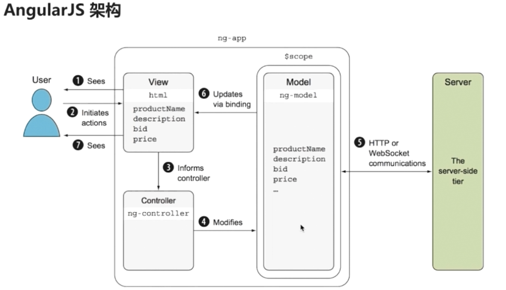

# 开始学习angular

## 学习内容：

* Angular的程序架构--构建快

* 搭建angular 的开发环境
    + angular-cli
    + 一个标准的angular项目的目录结构是什么样的

* 开发在线竞拍程序的Auction的第一个版本，并强化对angular核心component的理解


## Angular的程序架构

  

* angular 本身是一个客户端框架，即开发的也是一个客户端程序，客户端程序需要与服务器做交互，来获取数据，或者像服务器传递一些数据；

* 从图上可以看出，一个angular程序至少要包含一个模块NgModule 至少包含一个组件Parent component;
 
 
 *  组件： 组件是angular应用的基本构建块，可以将一个组件理解为一段带有业务逻辑和数据的Html;类似于html中的tag，component之间可以有父子关系，类似ul 可以包含几个子li ; 组件可以有子组件，子组件又可以包含孙子组件，组件可以去调用服务，也就是service;
 
 * service服务，就是用来封装可以重用的业务逻辑，如获取商品信息的逻辑，在商品详情页需要调用，在订单详情页依旧需要；这时候我们将就可以将获取商品心里的逻辑封装到一个服务里；然后在不同的组件中去调用，service 服务之间也是可以互相调用的，即组件可以调用服务，而服务也是可以去调用服务的，
 
 * 指令： 允许你向html元素上面去添加自定义的行为，如我们写一个自动完成的指令，将指令添加到html元素上则该元素就会有自动完成的功能；
 
 * 模块：用来将应用中的不同部分组织成一个angular框架可以理解的单元方式，我们可以将组件、指令、服务理解成乐高积木中的木块，而模块就类似于一个小塑料袋，"这些小木块可以组建成一个小汽车，我们就将这些小木头块，放到一个小塑料袋中去。。那些木块可以组成一个轮船，我们就将那些木块放到另外一个塑料袋里面"; 对于angular来说 图上的四个组件与两个服务，再加上某一个指令放到一起，可以提供一个登陆注册的功能，我们就可以将这些组件、服务、指令放到一个登陆注册的模块里； 那么如果我们开发下一个程序，而这个程序，也需要登陆与注册的功能，那么我们只需要将登陆与注册模块，引入到下一个程序里就行了；
  
> 总之一句话：组件、模块、与服务都是为了完成某一特定的功能的，模块是用来打包与分发这些功能的；
 
## 搭建Angular开发环境

### 安装Nodejs Angular CLI WebStorm

* 全局安装angular cli 

```
npm install -g @angular/cli

```


* 利用angular cli 初始化一个项目

```
ng new projectName 
```


### 使用Angular CLI 创建并运行Angualr项目

> 命令行工具是按照一定的规则 来生成这些目录的，若改变文件的位置，或重命名文件，有可能会导致命令行其它的功能不能够使用，所以除非明确的知道自己在干什么，否则不要去更改这些文件

#### 第一层目录

* e2e : 端到端的基本测试目录

* src ：应用源代码目录，我们写的所有的代码都应该放到这里面；

* angular-cli.json: nagular 命令行工具的一个配置文件，后期我们会去修改这个文件，因为我们会引入其它的第三方的包 jquery 、 bootstrap ，就是通过修改这个文件实现的；

* karma用于自动化测试，而karma.conf.js是karma的主要配置文件，

* package.json 标准的npm配置文件，列明了当前应用所使用到的第三方的依赖包，

* protractor.conf.js 同样是用来做自动化测试的一个文件， 

* readme.md 包含了标准angular构建工具生成项目的一个说明，包括如何去构建、测试与运行；

* tslint.json 是用来定义typescript代码质量检查规则的一个文件

#### 第二层src目录

* app 包含应用的组件与模块， 我们的绝大多说代码 都是要写在这个目录下面，

* assets 用来存放静态资源的，如图片

* environments 环境配置 angular是支持多环境开发的，我们可以开发环境、测试环境、生产环境共用一套代码，然后将这些环境不同的配置，写在不同的环境配置文件里面，其编译的时候就会根据这个相应的配置文件，将代码编译到相应的目录里面去；


* index.html 整个应用的根html 

```html

<body>
  <app-root>Loading...</app-root>
</body>

```
* main.ts 是整个web应用的入口点，是脚本执行的入口点，angular根据此文件，来启动整个项目

* polyfills.ts 用来导入一些必要的库，目的是为了让angular可以运行在 某些老版本的浏览器里，

* style.css 一个空的csss文件，用来存放全局的一些样式

* test.ts 用于自动化测试

* tsconfig.json typescript编译器的一个配置，按angular的项目标准都已经配好了，不用去改它；

#### 第三层 app目录

> angular的程序 只要要包含一个模块与一个组件，而angular-cli已经帮我们生成出来了

* app.module.ts angular程序的模块文件

* app.component.ts angular程序的组件文件


### 组件 component

> 与组件相关的基本概念：

* @component() 组件元数据装饰器，简称装饰器, 用来告知angualr框架，如何去处理一个typescript类，装饰器包含有多个属性，这这些属性的值，被称之为元数据，angular会根据这些元数据的值，来渲染组件，并去执行组件的逻辑

* Template 我们通过组件自带的模板来定义组件的外观，模板以html 的形式存在，告知angualr 如何来渲染组件，一般来说模板看起来很像html,但是在模板当中我们可以去使用angular的数据绑定语法，来呈现控制器当中的数据

* Controller 控制器就是一个普通的typescript类，其会被component这个装饰器来装饰，controller会包含组件所有的属性书方法，绝大多数的页面逻辑都是写在控制器里面的，控制器通过数据绑定与模板来进行通讯，模板展现控制器的数据，控制器处理模板上面发生的事件，

> 上面介绍的三个概念，称之为组件的必备元素，所有的组件，都必须要包含上述三个元素；


```js
// app.compoment.ts是整个应用的基础，可以将其理解成为一个地基，我们将在其上面，建立起我们的整个应用;

//1. 从angular的核心模块里面 引入了一个叫做Component的装饰器；
import { Component } from '@angular/core';

//2. 用装饰器定义了一个组件  @Component：组件元数据装饰器
// 2.1 组件元数据装饰器，所有的组件都必须使用@component装饰器来注解，@就是装饰器的标志； 
@Component({
  //组件相关的属性一 :slelector如同jquery是一个选择器； selector: 'app-root' 意思是：此组件可以利用html标签<app-root>来调用，
  selector: 'app-root',
  //组件相关的属性二:  templateUrl 指定了一个html文件，作为组件的模板，最终在html文件中，在<app-root>这个tag的位置，展示指定template html里面的内容，若没有模板，一个组件就不能称之为组件，模板是一个组件的必备属性（如同boostrap中的组件，都依赖于固定的模板），模板定义了用户最终看到的页面布局与内容
  templateUrl: './app.component.html',
  //组件相关的属性三: styleUrls 指向了一组css文件，可以在css中编写这个组件 模板中要用到的样式
  styleUrls: ['./app.component.css']
})
//3、 AppComponent就是一个标准的typescript标准类 ，这个类里面一点框架的痕迹都没有，就是没有出现一点angualr的字样，实际上其就是一个普通的typescript类，我们需要告诉angular这个AppConponent是一个组件，而我们若想实现这一点，需要将一些元数据 附加到这个类上，而在typescript中我们利用@component装饰器将元数据附加到这个类上，装饰器中的属性就叫做元数据，；


export class AppComponent {
// 定义了一个组件的控制器(一个被@component装饰器装饰的typescript类，其包含于模板相关的所有属性与方法，与页面相关的大部分逻辑都是编写在这一个控制器当中的)；
// 这个控制器只有一个属性：title， 这个属性的值，最终会展示到模板html中的页面里 <h1>{{title}}</h1> ；
// 组件相关的属性四: 数据绑定，数据绑定就是让模板的各个部分，即html的各个部分，对控制器的相应部分，相互作用的一个机制；我们向html中添加绑定标记，来告诉angular,如何将二者（模板与控制器）联系起来， <h1>{{title}}</h1>是最常见将组件中的值，绑定到模板中的方法，叫做插值表达式，在实际的运行时，angular会利用AppComponent中的title属性和值，替换掉{{title}}; 后期会频繁的使用该语法，来在模板中显示数据； 还有其它三种形式绑定： 属性绑定、事件绑定、双向绑定、
  title = 'app';
}

// 结论： 通过装饰器@component将元数据附加到一个标准的typescript类AppComponent上面，angular就知道了，我们要将这个typescript类变成angualr框架中的一个组件；@Component：组件元数据装饰器，会告诉angular,如何将指定的typescript类 处理成一个 angular框架内的组件，
```

* 输入属性 @inputs() 是用来接收外部传入的数据的，其使得父组件可以直接传递数据给子组件；angular程序实际上就是‘组件树’ 而这个输入属性，允许我们在组件树中传递数据，

* 提供器 providers  是用来做依赖注入的，

* 生命周期钩子 LifeCycle Hooks  从一个组件从创建到销毁的过程中，有多个钩子，被用来 触发和执行 各种业务逻辑 ； 例如 在一个组件被实例化之后，执行一段初始化的逻辑，从后台读取一串数据，进到组件里面，

* styles 样式表 组件可以关联一些样式表文件，来提供一系列组件专用的样式，但是这个可选的，没有样式表，只用模板也是可以的；

* Animations 动画  angular提供一个动画包 来方便我们去创建 与 组件相关的动画效果，

* @Outputs 输出属性 与@Inputs()相对，用来定义其它组件可能会感兴趣的事件，或者用来在组件之间 共享数据； 


### 模块modules

```js
import { BrowserModule } from '@angular/platform-browser';
import { NgModule } from '@angular/core';
import { FormsModule } from '@angular/forms';
import { HttpModule } from '@angular/http';

import { AppComponent } from './app.component';

@NgModule({
  declarations: [
    AppComponent
  ],
  imports: [
    BrowserModule,
    FormsModule,
    HttpModule
  ],
  providers: [],
  bootstrap: [AppComponent]
})
export class AppModule { }
```

>  与component类似 module也是一个带着装饰器的 typescript类，在这个类里面，最上面是import 引入 模块需要的东西，然后利用@NgModule这样一个装饰器，声明了一个module; 

* 首先利用declarations 声明了，模块中包含有什么（现在模块中指包含一个组件AppComponent ）， 注意在 元数据declarations: 后面只能声明 组件、指令、管道 ； 

* 其次利用了imports属性，声明了 若想要 应用正常运转 还需要什么东西，也就是module AppModule  所依赖的其它模块module(此处声明了三个angualr框架中提供的模块 BrowserModule、FormsModule、HttpModule)，其中BrowserModule是开发web应用的一个必选依赖，因为最终我们的应用是跑在浏览器里面，FormsModule 是处理表单的模块，HttpModule模块 提供http服务的； 当我们引用了某一个模块之后，就可以使用该模块所提供的组件、指令、服务

* providers 用来声明 模块中提供了什么服务

* bootstrap 声明了模块的主组件是什么

## Angular的启动过程

> 要了解angualr的启动过程需要能清除三个问题： 1、启动时加载了那个页面？ 2、启动时加载了那些脚本？ 3、这些脚本做了什么事情？

1. 启动时加载了那个页面？

2. 启动时加载了那些脚本？

3. 这些脚本做了什么事情？

```js
// .angular-cli.json 中

  "apps": [
    {
      "root": "src",
      "outDir": "dist",
      "assets": [
        "assets",
        "favicon.ico"
      ],
      //index 默认指向 src/index.html 该页面是angualr应用启动是加载的页面，
      "index": "index.html",
      // main 默认指向 src/main.ts文件 是angualr应用启动是加载的脚本，负责引导angular应用启动，
      "main": "main.ts",
      "polyfills": "polyfills.ts",
      "test": "test.ts",
      "tsconfig": "tsconfig.app.json",
      "testTsconfig": "tsconfig.spec.json",
      "prefix": "app",
      "styles": [
        "styles.css"
      ],
      "scripts": [],
      "environmentSource": "environments/environment.ts",
      "environments": {
        "dev": "environments/environment.ts",
        "prod": "environments/environment.prod.ts"
      }
    }
  ],

```


### main.ts 整个angular应用的启动，主入口，整个angular应用是从这里开始运行的

```js
// 从angular的核心模块core中导入 enableProdMode 方法 ，此方法用来关闭angular的开发者模式，
import { enableProdMode } from '@angular/core';

// 从模块platform-browser-dynamic 导入一个platformBrowserDynamic 方法，而这个方法会告诉浏览器，应该使用那个模块来启动浏览器；
import { platformBrowserDynamic } from '@angular/platform-browser-dynamic';

// 导入angular-cli 生成的主模块
import { AppModule } from './app/app.module';

// 导入环境配置
import { environment } from './environments/environment';


// 若当前是生产环境，就去调用enableProdMode() 去关闭angular的开发者模式，
if (environment.production) {
  enableProdMode();
}

// 调用bootstrapModule()传入AppModule作为启动模块，来启动应用
platformBrowserDynamic().bootstrapModule(AppModule)
  .catch(err => console.log(err));
```

* 当angular知道要用AppModule模块作为启动模块的时候，其会首先加载这个模块；然后angular会分析AppModule 需要依赖那些模块，并加载相关的模块(如BrowserModule);而在加载相关模块的同时，期又会去分析，相关模块又会依赖那些模块，以此类推 直到加载完所有的依赖； 


```js
// app.nodules.ts 即main.ts中指定的启动模块

@NgModule({
  declarations: [
    AppComponent
  ],
  imports: [
    BrowserModule
  ],
  providers: [],
  bootstrap: [AppComponent]
})
export class AppModule { }

```

* 当所有模块以及依赖都加载完毕，angular会在index.html中，寻找启动模块AppModule所指定的主组件AppComponent 对应的 `selector selector: 'app-root',` ; 选择器找到后，angular会利用主组件 指定的模板内容`app.component.html`，替换掉selector指定的标签，整个过程完成之前 页面会展示 <app-root> 标签中的内容`loadinng...` 

```js
// app.component.ts
import { Component } from '@angular/core';

@Component({
  selector: 'app-root',
  templateUrl: './app.component.html',
  styleUrls: ['./app.component.css']
})
export class AppComponent {
  title = 'app';
}

```


 


