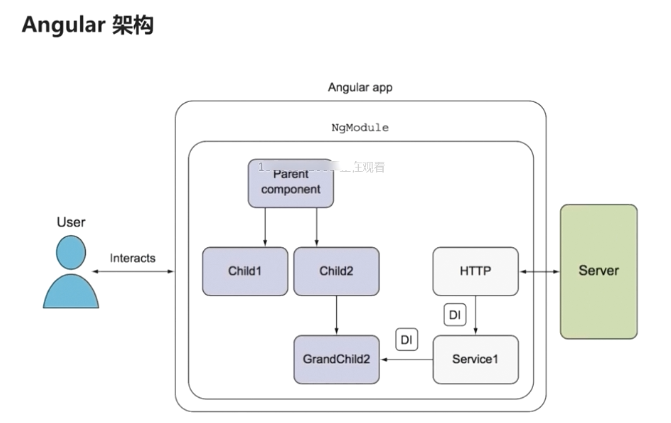
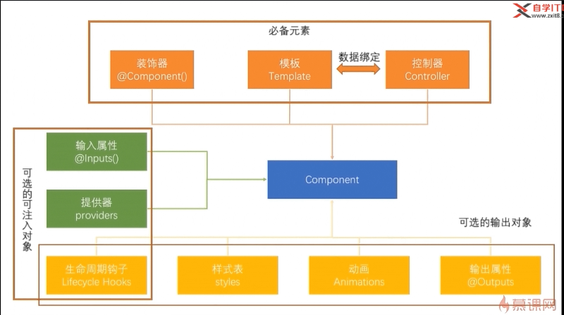
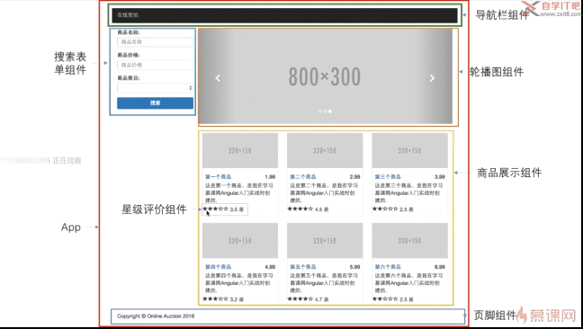

# 开始学习angular

## 学习内容：

* Angular的程序架构--构建快

* 搭建angular 的开发环境
    + angular-cli
    + 一个标准的angular项目的目录结构是什么样的

* 开发在线竞拍程序的Auction的第一个版本，并强化对angular核心component的理解


## Angular的程序架构

  

* angular 本身是一个客户端框架，即开发的也是一个客户端程序，客户端程序需要与服务器做交互，来获取数据，或者像服务器传递一些数据；

* 从图上可以看出，一个angular程序至少要包含一个模块NgModule 至少包含一个组件Parent component;
 
 
 *  组件： 组件是angular应用的基本构建块，可以将一个组件理解为一段带有业务逻辑和数据的Html;类似于html中的tag，component之间可以有父子关系，类似ul 可以包含几个子li ; 组件可以有子组件，子组件又可以包含孙子组件，组件可以去调用服务，也就是service;
 
 * service服务，就是用来封装可以重用的业务逻辑，如获取商品信息的逻辑，在商品详情页需要调用，在订单详情页依旧需要；这时候我们将就可以将获取商品信息的逻辑封装到一个服务里；然后在不同的组件中去调用，service 服务之间也是可以互相调用的，即组件可以调用服务，而服务也是可以去调用服务的，
 
 * 指令： 允许你向html元素上面去添加自定义的行为，如我们写一个自动完成的指令，将指令添加到html元素上则该元素就会有自动完成的功能；
 
 * 模块：用来将应用中的不同部分组织成一个angular框架可以理解的单元方式，我们可以将组件、指令、服务理解成乐高积木中的木块，而模块就类似于一个小塑料袋，"这些小木块可以组建成一个小汽车，我们就将这些小木头块，放到一个小塑料袋中去。。那些木块可以组成一个轮船，我们就将那些木块放到另外一个塑料袋里面"; 对于angular来说 图上的四个组件与两个服务，再加上某一个指令放到一起，可以提供一个登陆注册的功能，我们就可以将这些组件、服务、指令放到一个登陆注册的模块里； 那么如果我们开发下一个程序，而这个程序，也需要登陆与注册的功能，那么我们只需要将登陆与注册模块，引入到下一个程序里就行了；
  
> 总之一句话：组件、模块、与服务都是为了完成某一特定的功能的，模块是用来打包与分发这些功能的；
 
## 搭建Angular开发环境

### 安装Nodejs Angular CLI WebStorm

* 全局安装angular cli 

```
npm install -g @angular/cli

```


* 利用angular cli 初始化一个项目

```
ng new projectName 
```


### 使用Angular CLI 创建并运行Angualr项目

> 命令行工具是按照一定的规则 来生成这些目录的，若改变文件的位置，或重命名文件，有可能会导致命令行其它的功能不能够使用，所以除非明确的知道自己在干什么，否则不要去更改这些文件

#### 第一层目录

* e2e : 端到端的基本测试目录

* src ：应用源代码目录，我们写的所有的代码都应该放到这里面；

* angular-cli.json: nagular 命令行工具的一个配置文件，后期我们会去修改这个文件，因为我们会引入其它的第三方的包 jquery 、 bootstrap ，就是通过修改这个文件实现的；

* karma用于自动化测试，而karma.conf.js是karma的主要配置文件，

* package.json 标准的npm配置文件，列明了当前应用所使用到的第三方的依赖包，

* protractor.conf.js 同样是用来做自动化测试的一个文件， 

* readme.md 包含了标准angular构建工具生成项目的一个说明，包括如何去构建、测试与运行；

* tslint.json 是用来定义typescript代码质量检查规则的一个文件

#### 第二层src目录

* app 包含应用的组件与模块， 我们的绝大多说代码 都是要写在这个目录下面，

* assets 用来存放静态资源的，如图片

* environments 环境配置 angular是支持多环境开发的，我们可以开发环境、测试环境、生产环境共用一套代码，然后将这些环境不同的配置，写在不同的环境配置文件里面，其编译的时候就会根据这个相应的配置文件，将代码编译到相应的目录里面去；


* index.html 整个应用的根html 

```html

<body>
  <app-root>Loading...</app-root>
</body>

```
* main.ts 是整个web应用的入口点，是脚本执行的入口点，angular根据此文件，来启动整个项目

* polyfills.ts 用来导入一些必要的库，目的是为了让angular可以运行在 某些老版本的浏览器里，

* style.css 一个空的csss文件，用来存放全局的一些样式

* test.ts 用于自动化测试

* tsconfig.json typescript编译器的一个配置，按angular的项目标准都已经配好了，不用去改它；

#### 第三层 app目录

> angular的程序 只要包含一个模块与一个组件，而angular-cli已经帮我们生成出来了

* app.module.ts angular程序的模块文件

* app.component.ts angular程序的组件文件


### 组件 component

> 与组件相关的基本概念：

* @component() 组件元数据装饰器，简称装饰器, 用来告知angualr框架，如何去处理一个typescript类，装饰器包含有多个属性，这这些属性的值，被称之为元数据，angular会根据这些元数据的值，来渲染组件，并去执行组件的逻辑

* Template 我们通过组件自带的模板来定义组件的外观，模板以html 的形式存在，告知angualr 如何来渲染组件，一般来说模板看起来很像html,但是在模板当中我们可以去使用angular的数据绑定语法，来呈现控制器当中的数据

* Controller 控制器就是一个普通的typescript类，其会被component这个装饰器来装饰，controller会包含组件所有的属性方法，绝大多数的页面逻辑都是写在控制器里面的，控制器通过数据绑定与模板来进行通讯，模板展现控制器的数据，控制器处理模板上面发生的事件，

> 上面介绍的三个概念，称之为组件的必备元素，所有的组件，都必须要包含上述三个元素；



```js
// app.compoment.ts是整个应用的基础，可以将其理解成为一个地基，我们将在其上面，建立起我们的整个应用;

//1. 从angular的核心模块里面 引入了一个叫做Component的装饰器；
import { Component } from '@angular/core';

//2. 用装饰器定义了一个组件  @Component：组件元数据装饰器
// 2.1 组件元数据装饰器，所有的组件都必须使用@component装饰器来注解，@就是装饰器的标志； 
@Component({
  //组件相关的属性一 :slelector如同jquery是一个选择器； selector: 'app-root' 意思是：此组件可以利用html标签<app-root>来调用，
  selector: 'app-root',
  //组件相关的属性二:  templateUrl 指定了一个html文件，作为组件的模板，最终在html文件中，在<app-root>这个tag的位置，展示指定template html里面的内容，若没有模板，一个组件就不能称之为组件，模板是一个组件的必备属性（如同boostrap中的组件，都依赖于固定的模板），模板定义了用户最终看到的页面布局与内容

  // 这一点的理解参考官方文档：angular components are a subset of derictives. unlike derictives, components always have a templete and only one component can  be instantiated in a template.  是directive的子集，即component要实现的目的是与derictive一样的，类似于angularjs的指令直接标注到element上面，与bootstrap的组件。只不过component换了一种形式，用selector指定要标注的位置；
  templateUrl: './app.component.html',
  //组件相关的属性三: styleUrls 指向了一组css文件，可以在css中编写这个组件 模板中要用到的样式
  styleUrls: ['./app.component.css']
})
//3、 AppComponent就是一个标准的typescript标准类 ，这个类里面一点框架的痕迹都没有，就是没有出现一点angualr的字样，实际上其就是一个普通的typescript类，我们需要告诉angular这个AppConponent是一个组件，而我们若想实现这一点，需要将一些元数据 附加到这个类上，而在typescript中我们利用@component装饰器将元数据附加到这个类上，装饰器中的属性就叫做元数据，；


export class AppComponent {
// 定义了一个组件的控制器(一个被@component装饰器装饰的typescript类，其包含于模板相关的所有属性与方法，与页面相关的大部分逻辑都是编写在这一个控制器当中的)；
// 这个控制器只有一个属性：title， 这个属性的值，最终会展示到模板html中的页面里 <h1>{{title}}</h1> ；
// 组件相关的属性四: 数据绑定，数据绑定就是让模板的各个部分，即html的各个部分，对控制器的相应部分，相互作用的一个机制；我们向html中添加绑定标记，来告诉angular,如何将二者（模板与控制器）联系起来， <h1>{{title}}</h1>是最常见将组件中的值，绑定到模板中的方法，叫做插值表达式，在实际的运行时，angular会利用AppComponent中的title属性和值，替换掉{{title}}; 后期会频繁的使用该语法，来在模板中显示数据； 还有其它三种形式绑定： 属性绑定、事件绑定、双向绑定、
  title = 'app';
}

// 结论： 通过装饰器@component将元数据附加到一个标准的typescript类AppComponent上面，angular就知道了，我们要将这个typescript类变成angualr框架中的一个组件；@Component：组件元数据装饰器，会告诉angular,如何将指定的typescript类 处理成一个 angular框架内的组件，
```

* 输入属性 @inputs() 是用来接收外部传入的数据的，其使得父组件可以直接传递数据给子组件；angular程序实际上就是‘组件树’ 而这个输入属性，允许我们在组件树中传递数据，

* 提供器 providers  是用来做依赖注入的，

* 生命周期钩子 LifeCycle Hooks  从一个组件从创建到销毁的过程中，有多个钩子，被用来 触发和执行 各种业务逻辑 ； 例如 在一个组件被实例化之后，执行一段初始化的逻辑，从后台读取一串数据，进到组件里面，

* styles 样式表 组件可以关联一些样式表文件，来提供一系列组件专用的样式，但是这个可选的，没有样式表，只用模板也是可以的；

* Animations 动画  angular提供一个动画包 来方便我们去创建 与 组件相关的动画效果，

* @Outputs 输出属性 与@Inputs()相对，用来定义其它组件可能会感兴趣的事件，或者用来在组件之间 共享数据； 


### 模块modules

```js
import { BrowserModule } from '@angular/platform-browser';
import { NgModule } from '@angular/core';
import { FormsModule } from '@angular/forms';
import { HttpModule } from '@angular/http';

import { AppComponent } from './app.component';

@NgModule({
  declarations: [
    AppComponent
  ],
  imports: [
    BrowserModule,
    FormsModule,
    HttpModule
  ],
  providers: [],
  bootstrap: [AppComponent]
})
export class AppModule { }
```

>  与component类似 module也是一个带着装饰器的 typescript类，在这个类里面，最上面是import 引入 模块需要的东西，然后利用@NgModule这样一个装饰器，声明了一个module; 

* 首先利用declarations 声明了，模块中包含有什么（现在模块中指包含一个组件AppComponent ）， 注意在 元数据declarations: 后面只能声明 组件、指令、管道 ； 

* 其次利用了imports属性，声明了 若想要 应用正常运转 还需要什么东西，也就是module AppModule  所依赖的其它模块module(此处声明了三个angualr框架中提供的模块 BrowserModule、FormsModule、HttpModule)，其中BrowserModule是开发web应用的一个必选依赖，因为最终我们的应用是跑在浏览器里面，FormsModule 是处理表单的模块，HttpModule模块 提供http服务的； 当我们引用了某一个模块之后，就可以使用该模块所提供的组件、指令、服务

* providers 用来声明 模块中提供了什么服务

* bootstrap 声明了模块的主组件是什么

## Angular的启动过程

> 要了解angualr的启动过程需要能清除三个问题： 1、启动时加载了那个页面？ 2、启动时加载了那些脚本？ 3、这些脚本做了什么事情？

1. 启动时加载了那个页面？

2. 启动时加载了那些脚本？

3. 这些脚本做了什么事情？

```js
// .angular-cli.json 中

  "apps": [
    {
      "root": "src",
      "outDir": "dist",
      "assets": [
        "assets",
        "favicon.ico"
      ],
      //index 默认指向 src/index.html 该页面是angualr应用启动是加载的页面，
      "index": "index.html",
      // main 默认指向 src/main.ts文件 是angualr应用启动是加载的脚本，负责引导angular应用启动，
      "main": "main.ts",
      "polyfills": "polyfills.ts",
      "test": "test.ts",
      "tsconfig": "tsconfig.app.json",
      "testTsconfig": "tsconfig.spec.json",
      "prefix": "app",
      "styles": [
        "styles.css"
      ],
      "scripts": [],
      "environmentSource": "environments/environment.ts",
      "environments": {
        "dev": "environments/environment.ts",
        "prod": "environments/environment.prod.ts"
      }
    }
  ],

```


### main.ts 整个angular应用的启动，主入口，整个angular应用是从这里开始运行的

```js
// 从angular的核心模块core中导入 enableProdMode 方法 ，此方法用来关闭angular的开发者模式，
import { enableProdMode } from '@angular/core';

// 从模块platform-browser-dynamic 导入一个platformBrowserDynamic 方法，而这个方法会告诉浏览器，应该使用那个模块来启动浏览器；
import { platformBrowserDynamic } from '@angular/platform-browser-dynamic';

// 导入angular-cli 生成的主模块
import { AppModule } from './app/app.module';

// 导入环境配置
import { environment } from './environments/environment';


// 若当前是生产环境，就去调用enableProdMode() 去关闭angular的开发者模式，
if (environment.production) {
  enableProdMode();
}

// 调用bootstrapModule()传入AppModule作为启动模块，来启动应用
platformBrowserDynamic().bootstrapModule(AppModule)
  .catch(err => console.log(err));
```

* 当angular知道要用AppModule模块作为启动模块的时候，其会首先加载这个模块；然后angular会分析AppModule 需要依赖那些模块，并加载相关的模块(如BrowserModule);而在加载相关模块的同时，期又会去分析，相关模块又会依赖那些模块，以此类推 直到加载完所有的依赖； 


```js
// app.nodules.ts 即main.ts中指定的启动模块

@NgModule({
  declarations: [
    AppComponent
  ],
  imports: [
    BrowserModule
  ],
  providers: [],
  bootstrap: [AppComponent]
})
export class AppModule { }

```

* 当所有模块以及依赖都加载完毕，angular会在index.html中，寻找启动模块AppModule所指定的主组件AppComponent 对应的 `selector selector: 'app-root',` ; 选择器找到后，angular会利用主组件 指定的模板内容`app.component.html`，替换掉selector指定的标签里面的内容，整个过程完成之前 页面会展示 <app-root> 标签中的内容`loadinng...` 

```js
// app.component.ts
import { Component } from '@angular/core';

@Component({
  selector: 'app-root',
  templateUrl: './app.component.html',
  styleUrls: ['./app.component.css']
})
export class AppComponent {
  title = 'app';
}

```


* 当前建立起来的开发环境，会自动的检测 src 目录下面的改变，任何对src目录下文件的改变，都会使服务器自动加载修改后的文件，而后自动去刷新页面，整体的效果类似于browser-sync,以后这个扩展可以不使用了；


## Angular 开发准备工作

### 如何设置第三方的依赖，即在auction的项目中我们会用到bootstrap与jquery这两个第三方的库，所以在正式的开发之前，我们需要将这些类库引入到我们的项目之中，一般情况下 若想在anguular项目中使用第三方类库，需要做三步：

1. 将第三方类库安装到本地 

```
// 在当前项目auction的根目录 下，利用npm工具进行安装；
npm install jquery --save
npm install bootstrap --save

```

2. 将安装的本地类库，引入到我们的项目之中，通过修改angular-cli.json来实现

```json
// angular-cli.json中
 "apps": [
    {
      "root": "src",
      "outDir": "dist",
      "assets": [
        "assets",
        "favicon.ico"
      ],
      "index": "index.html",
      "main": "main.ts",
      "polyfills": "polyfills.ts",
      "test": "test.ts",
      "tsconfig": "tsconfig.app.json",
      "testTsconfig": "tsconfig.spec.json",
      "prefix": "app",
      // 其中styles与scripts就是用来配置 第三方库的位置，将要引得第三方css与js文件路径，添加到下面两个字段里面，就可以了，
      "styles": [
        "styles.css",
        "node_modules/bootstrap/dist/css/bootstrap.css"
      ],
      "scripts": [
        "node_modules/jquery/dist/jquery.js",
        "node_modules/bootstrap/dist/js/bootstrap.js"
      ],
      //加了上面三行之后，bootstrap与jquery就被加到我们的项目里面去了；
      "environmentSource": "environments/environment.ts",
      "environments": {
        "dev": "environments/environment.ts",
        "prod": "environments/environment.prod.ts"
      }
    }
  ],;
```

3. 安装引入的类库的 类型描述文件，以便typescript可以正确识别；

>  虽然现在我们已经将jquery与bootstrap引到我们的项目中去了，但jquery与bootstrap本身就是javascript里面的东西，所以就不能直接运用到typescript里面， 我们需要将jquery与bootstrap的类型描述文件，同样引入也安装到本地的库里面去，在项目里，其才能正常的使用; 装类型描述文件的意义是能让typescript代码认识jquery与bootstrap; 这样我们就可以在typescript代码中去调用jquery的东西了； 至此我们就可以使用jquery的方法与bootstrap的样式了；

```
// 安装jquery 与 bootstrap的类型描述文件，即在姓名前面加上@types/ 
npm install @types/jquery --save-dev
npm install @types/bootstrap --save-dev
```

## 正式开发Angular项目

### Angular项目的开发思路

> angular框架的设计目标中，最主要的是帮助开发人员很方便的开发出克重用的组件，即angular的很多特性都是为这个目标来服务的，所有我们在开发过程中，也要用一种组件化的思路，来思考我们要解决的问题，例如我们auction的主页面，可以分为7个组件来开发；


 

### 利用angular-cli 生成基本的组件代码
1. app.component.ts组件，angular-cli帮我们生成的，是整个应用的地基，是最大的一个组件；

2. 导航栏组件

3. 页脚组件

4. 搜索表单组件

5. 轮播图组件

6. 商品展示组件

7. 星级评价组件


* angular-cli 提供了自动生成组件的功能；

```text
//因为app.component.ts组件在项目生成的时候已经生成了，所以只需要将其余六个组件生成就可以了；
//意思是在 auction项目下生成一个 叫navbar的组件
ng g component navbar
ng g component footer
ng g component search
ng g component carousel
ng g component product
ng g component starts
```

```text
  ng g component stars
  create src/app/stars/stars.component.html (24 bytes)
  create src/app/stars/stars.component.spec.ts (621 bytes)
  create src/app/stars/stars.component.ts (265 bytes)
  create src/app/stars/stars.component.css (0 bytes)
  update src/app/app.module.ts (816 bytes)
  //每执行一次组件生成命令 都会同时生成4个文件，并且会更新app.module.ts模块，将我们新生成的组件，注册到模块之中，
```

### 编写app.component组件；

* 首先更改一下app组件的html文件

```html
<!--因为每一个组件都可以利用其selector声明的标签来引入-->
<app-navbar></app-navbar>

<div class="container">
  <div class="row">
    <div class="col-md-3">
      <app-search></app-search>
    </div>
    <div class="col-md-9">
      <div class="row">
        <app-carousel></app-carousel>
      </div>
      <div class="row">
        <app-product></app-product>
      </div>
    </div>
  </div>
</div>

<app-footer></app-footer>

```

### 编写navbar组件

```html
<!--navbar.component.html中-->
<nav class="navbar navbar-inverse navbar-fixed-top">
  <div class="container">
    <div class="navbar-header">
      <button type="button" class="navbar-toggle" data-toggle="collapse" data-target=".navbar-ex1-collapse">
        <span class="icon-bar"></span>
        <span class="icon-bar"></span>
        <span class="icon-bar"></span>
      </button>
      <a href="#" class="navbar-brand">在线竞拍</a>
    </div>
    <div class="collapse navbar-collapse navbar-ex1-collapse">
      <ul class="nav navbar-nav">
        <li><a href="#">关于我们</a></li>
        <li><a href="#">联系我们</a></li>
        <li><a href="#">网站地图</a></li>
      </ul>
    </div>
  </div>
</nav>
```
```css
/*最外层的styles.css中*/
/*由于navbar 通过navbar-fixed-top 给固定到了顶部，且脱离了标准文档流，故其会将后面的内容挡住，此处在全局的css样式中，为body 增加一个默认的margin就行了。*/
body {
  padding-top: 70px;
}
```

### 编写footer组件

```html
<!--footer.component.html中-->
<div class="container">
  <hr>
  <footer>
    <div class="row">
      <div class="col-lg-12">
        <p>angular is a very good framework!</p>
      </div>
    </div>
  </footer>
</div>

```

### 编写search组件

```html
<!--search.component.html中-->
<form action="" name="searchForm" role="form">
  <div class="form-group">
    <label for="productTitle">商品名称</label>
    <input type="text" id="productTitle" placeholder="商品名称" class="form-control">
  </div>
  <div class="form-group">
    <label for="productPrice">商品价格</label>
    <input type="number" id="productPrice" placeholder="商品价格" class="form-control">
  </div>
  <div class="form-group">
    <label for="productCategory">商品类别</label>
    <select  id="productCategory"  class="form-control"></select>
  </div>
  <div class="form-group">
    <button type="submit" class="btn btn-primary btn-block"> 提交</button>
  </div>
</form>
```

### 编写carousel组件

> 学会使用用图片占位符http://via.placeholder.com/350x150 后面的尺寸多少就能生成多大的图片； http://placehold.it/320x150 这个也可以使用


```html
 <!--http://via.placeholder.com/350x150-->
 <div class="carousel slide" data-ride="carousel ">
   <!--索引-->
   <ol class="carousel-indicators">
     <li class="active"></li>
     <li></li>
     <li></li>
   </ol>
    <!--item-->
   <div class="carousel-inner">
     <div class="item active">
       
     </div>
     <div class="item">
       
     </div>
     <div class="item">
       
     </div>
   </div>
   <!--注意下面a链接 href属性值的写法-->
   <a class="left carousel-control" href="javascript:$('.carousel').carousel('prev')" role="button">
     <span class="glyphicon glyphicon-chevron-left" aria-hidden="true"></span>
   </a>
   <a class="right carousel-control" href="javascript:$('.carousel').carousel('next')" role="button">
     <span class="glyphicon glyphicon-chevron-right" aria-hidden="true"></span>
   </a>
 </div>
 <!--<h1>我是一个轮播图</h1>-->
```

### 编写product组件

> 商品列表组将，相比较前面写的组件就比较复杂一点了，其复杂之处在于，其在首页展示的商品信息，并非是直接在页面上面写死的，而是根据后台服务返回的数据来决定的，我们会在服务器通讯处，了解如何从后台去获取数据；此处我们利用一个数组来模拟从服务端获取的数据；

> 因为是使用typescript来写程序，所以需要向外暴露一个对象，来封装产品信息，

```typescript
// product.component.ts中
import { Component, OnInit } from '@angular/core';

@Component({
  selector: 'app-product',
  templateUrl: './product.component.html',
  styleUrls: ['./product.component.css']
})
export class ProductComponent implements OnInit {
  //2、需要在ProductComponent控制器里面，去声明一个数组，来存储页面中将要展示商品的数据；
  private products: Array<Product>;

  constructor() { }
  //3、在ngOnInit方法里面去初始化数组，ngOnInit是组件生命周期的其中一个钩子，这个方法会在组件被实例化之后，调用一次，用来初始化组件里面的数据；
  ngOnInit() {
   this.products = [
         new Product(1, '第一个商品', 1.99, 3.5, '我是第一个商品，看清楚没有', ['电子产品', '硬件设施']),
         new Product(2, '第二个商品', 2.99, 2.5, '我是第二个商品，看清楚没有', ['电子产品']),
         new Product(3, '第三个商品', 3.99, 3.5, '我是第三个商品，看清楚没有', [ '硬件设施']),
         new Product(4, '第四个商品', 4.99, 4.5, '我是第四个商品，看清楚没有', ['图书', '硬件设施']),
         new Product(5, '第五个商品', 5.99, 1.5, '我是第五个商品，看清楚没有', [ '图书']),
         new Product(6, '第六个商品', 6.99, 2.5, '我是第六个商品，看清楚没有', ['电子产品', '硬件设施']),
   ];

  }

}
//1、下面的类描述了我们产品所包含的信息；
// 因为是使用typescript来写程序，所以需要向外暴露一个对象，这个对象里面封装了所有的产品信息，
export class Product{
//  在对象里面有一个构造函数
  constructor(
    //下面的数据分别对应商品的id 名称 价格 评分 描述 类别
    public id: number,
    public title: string,
    public price: number,
    public rating: number,
    public desc: string,
    public categories: Array<string>
  ){
  }
}
```

```html
<!--这个缩略图是写死的，若我们想让其与后台的数据绑定起来，需要用到 ngFor指令-->
<!--*ngFor="let product of products" products与product.component组件中的products是绑定在一块的，ngFor指令的意思是，我们要去循环 products这个属性，然后将每次循环的元素 放入一个叫product的变量里， 这样后面的html中就可以使用product这个变量，利用插值表达式 显示出product里面所绑定的属性-->
<div *ngFor="let product of products" class="col-lg-4 col-md-4 col-sm-4">
  <div class="thumbnail">
    
    <div class="caption">
      <h4 class="pull-right">{{product.price}}</h4>
      <h4><a href="">{{product.title}}</a></h4>
      <p>{{product.desc}}</p>
    </div>
    <div>
      <app-stars></app-stars>
    </div>
  </div>
</div>

<!--angular 看到 *ngFor="let product of products" 指令之后，就会去循环products数组，根据数组中元素的个数，生成相应数量的模板代码（指令加在那个标签上，那个标签就会连同其子节点生成n次）-->
<!--*ngFor 用来循环一个数组，在页面中反复的生成一段html-->
```

> *ngFor 指令 所表现出来的思想是angualr框架比较核心的一个思想，就是数据绑定，也就是数据驱动，即我们的页面长什么样子，是由后台的数据来决定的，其与jquery的一个明显的区别是，jquery要操作页面的dom, 如在页面生成六个缩略图，jquery肯定是先拿到六个缩略图外面的父节点，将其转换为jquery对象，然后生成六个缩略图的html 并插入到父节点里面，这属于操作页面的dom元素； 而在angualr里面，我们是不需要做这些dom操作的，我们要做的是声明一个包含所需数据的一个属性 `this.products=[...]`然后将模板与数据绑定起来，然后根据数据的变化，来呈现相应的页面， 如我们现在若想再增加一个缩略图只需要向products数组里面 再推一个缩略图的对象数据，这时候页面就会多出一个缩略图，我们不需要去前台的页面里面，去搜索某一个元素，然后去页面里面插入一段html代码，在angular中永远不要这么去做，而我们要做的永远是去操作后台的数据，通过后台数据的变化去改变我们的前台页面；  我们学angular就是学如何通过操作后台的数据，去操作前台的页面；这样我们才可以真正写出一个angular程序，而不是说用了angular的技术，就是写angular程序，这只是表面的；核心就是数据驱动页面；

```typescript
 this.products.push(new Product(7, '第六个商品', 6.99, 2.5, '我是第六个商品，看清楚没有', ['电子产品', '硬件设施']));
```  

### 编写stars组件

> 会根据当前商品星级的分数来显示实心的星星与空心的星星； 而若想实现星级评价需要首先解决六个问题：

1. 如何显示一颗星星 - 直接利用bootstrap 提供的图标类

```html
<span class="glyphicon glyphicon-star "></span>
```

2. 如何显示一颗空心的星星

```html
<span class="glyphicon glyphicon-star glyphicon-star-empty"></span>
```

3. 如何显示5颗星星，利用数据驱动页面的思想，若想在前台显示五颗星星需要在后台，包含五个元素的数据；

```html
<span *ngFor="let star of stars" class="glyphicon glyphicon-star glyphicon-star-empty"></span>
```

4. 解决上面生成的5颗星星里面有的是实心，而有的是空心；解决这个问题，需要了解angular的一个概念--属性绑定；

> 属性绑定是数据绑定的一种，如 `` 中src的属性不是写死的，而是和后台的一个属性绑定起来的，

```typescript
export class ProductComponent implements OnInit {
  //  此处在组件上定义一个属性；
  private imgUrl = 'http://placehold.it/320x150';
  }
```
 
```html
//html 标签的属性通过下面的方式，与后台组件绑定在一起；
 
<!--这样就将img标签的src属性与后台组件的imgUrl绑定在了一起，即将html标签的一个属性，与控制器上面的属性，做绑定就叫做属性绑定-->
```
> 而如何解决5颗星中，有的是空心，有的是实心，就需要用到属性绑定中的特例---样式绑定

```html
<span *ngFor="let star of stars" class="glyphicon glyphicon-star "             ="star"></span>

 <!--[class.glyphicon-star-empty]="star"   glyphicon-star-empty前面有class,意思是说class后面绑定的东西是一个css样式，它的值要绑定到当前star循环变量里，-->
 
 <!--上面的样式绑定的含义是span这个标签是否会出现glyphicon-star-empty 这个css样式，是由star这个属性决定的，若star为 true则span 就会多出一个glyphicon-star-empty样式，如果star为false则其就不会有这样一个样式，-->
```

5. 如何将商品的星级评价的数值传递给星级评价组件，因为我们现在的stars组件，并不知道商品真正的星级评分是几分，知道这个信息的是product组件， 即如何将product组件中的信息，传递给星级评价组件，这就需要用到组件的另外一个概念，输入属性；

```typescript
// stars.component.ts中
import { Component, OnInit, Input} from '@angular/core';
// import {Input} from '@angular/compiler/src/core';
//注意在@angular/core中引入 input 而不是在@angular/compiler/src/core 去引入；后则后面写的代码， 都会报错，这是一个bug ;自己乱试的结果；

export class StarsComponent implements OnInit {
  //声明一个属性rating 用来接收产品组件传递过来的星级评价的数值，默认值是0；
  //而要想使product组件将商品的信息，传递给star组件，需要在接受信息的属性上面加上一个装饰器；
  //input装饰其的意思是，星级评价的rating属性值，应该由其父组件传递给它；
  @Input()
  private rating: number = 0;
  private stars: boolean[];
  constructor() { }

  ngOnInit() {
    this.stars = [false, false, true, true, true];
  }

}
```

```html
<!--product.component.html中-->
<div *ngFor="let product of products" class="col-lg-4 col-md-4 col-sm-4">
  <div class="thumbnail">
    
    <!---->
    <div class="caption">
      <h4 class="pull-right">{{product.price}}</h4>
      <h4><a href="">{{product.title}}</a></h4>
      <p>{{product.desc}}</p>
    </div>
    <div>
    <!--这句话的意思是 子组件app-stars 的rating属性，应该由当前product的rating属性传进去，-->
      <app-stars [rating]="product.rating"></app-stars>
    </div>
  </div>
</div>
```

6. 如何根据商品的星级，来决定商品是空心的还是实心的，因为当前空心与否是写死的；

```typescript
export class StarsComponent implements OnInit {
  @Input()
  private rating = 0;
  private stars: boolean[];
  constructor() {}

  ngOnInit() {
    this.stars = [];
    for (let i = 1; i <= 5; i++){
      //注意这个boolean值的生成方式，若传入的rating为3.5 则前面三个i 都会是false 后面两个为true;
      //即其会根据父组件传入的rating值的大小，而生成不同的数组，前台根据不同的boolean去生成相应的实心的货空心的星星； 
      this.stars.push(i > this.rating);
    }
    // this.stars = [false, false, true, true, true];
    // this.rating = 0;
  }

}


```

## angular-cli中的几个概念

### wiki--Build

1. --vendor-chunk : https://segmentfault.com/q/1010000009276145/a-1020000009279643/revision : webpack build后生成的app、vendor、manifest三者有何职能不同？

> CommonsChunkPlugin 抽取的是公共部分而不是"经常变动的部分";2,观察了一下，webpack应该是会在最后一个（manidest）CommonsChunkPlugin产出的chunk注入webpackJsonp的定义,以及异步加载相关的定义,而就是这个会涉及到所有entry及chunk的md5,所以会"经常变动"，同时vue-cli默认的vendor是打包node_module下的所有依赖，会很大，在生产环境，过大的文件要尽量利用缓存来加快载入速度，但“经常变动”不利于缓存，所以为了将entry(这里可认为是app.js)的变动隔离在vendor之外，vue-cli在vendor之后多做了一个manifest的chunk,这样entry只要不引入新的node_modules里的包就不会影响到vendor了.ps:所以其实跟编译次数没什么关系,所有文件每次打包都会再编译一次的,重点是大文件，缓存，变动代码的拆分.

> `app.js`：基本就是你实际编写的那个app.vue(.vue或.js?),没这个页面跑不起来.
`vendor.js`:vue-cli全家桶默认配置里面这个chunk就是将所有从node_modules/里require(import)的依赖都打包到这里，所以这个就是所有node_modules/下的被require(import)的js文件
`manifest.js`: 最后一个chunk，被注入了webpackJsonp的定义及异步加载相关的定义(webpack调用CommonsChunkPlugin处理后模块管理的核心,因为是核心,所以要第一个进行加载,不然会报错).

> 精简:由于默认的vendor的打包策略导致这个chunk很大,按照默认配置这基本没什么好精简了,要精简的话基本要针对项目实际来修改各个chunk的打包策略(尽量减少包的大小来提速首屏加载)

> 优化:单页面基本就跟精简同个道理吧,多页面的话感觉还是自定义一下vendor的打包策略,毕竟不一定所有页面都会用到全量的第三方依赖，适当减少vendor的体积能提高不少加载速度.


2. Bundling : https://www.genuitec.com/module-bundling-webpack-introduction/ 打包的意思

3. tree-shaking : https://www.zhihu.com/question/41922432 

> Tree-shaking 是无用代码移除（DCE, dead code elimination）的一个方法，但和传统的方法不太一样。Tree-shaking 找到需要的代码，灌入最终的结果；传统 DCE 找到执行不到的代码，从 AST 里清除。（在我看来传统的这种方式更应该被称为 tree-shaking，即摇一下把 AST 中的 dead branch 给抖下来。）

4. UglifyJS 代码压缩工具

5. -prod : production 生产环境的缩写

6. Service Worker ：https://www.jianshu.com/p/0e2dee4c77bc  https://www.2cto.com/kf/201701/588402.html这个就比较牛了，打开了一扇门；

> 原生App拥有web应用通常所不具备的离线体验，定时的默默更新，消息通知推送等功能。而新的Service Worker标准让在web app上拥有这些功能成为可能。

> 一个Service Worker是一段运行在浏览器后台进程里的脚本，他独立于当前页面，提供了那些不需要与web页面交互的功能在网页背后悄悄执行的能力。在将来，基于它可以实现消息推送，静静更新以及地理围栏等服务，但是目前它首先要具备的功能是拦截和处理网络请求的功能，包括可编程的消息缓存管理能力。 `ionic 有专门的篇幅进行研究`；

7. 国外angular 好的学习网站： https://scotch.io/tutorials?hFR%5Bcategory%5D%5B0%5D=Tutorials&dFR%5B_tags%5D%5B0%5D=angular

8. hot module replacement（HMR） : 模块热替换 交换, 添加, 或者删除模块, 同时应用持续运行, 不需要页面刷新. 理解起来类似于 usb热插拔 更换模块不需要去刷新页面，这是webpack中的一个概念，而angular-cli中也有实现的方式https://segmentfault.com/a/1190000003872635；

```ts
// Code coverage reports allow us to see any parts of our code base that may not be properly tested by our unit tests.

// one of the best ways to keep your project bug free is through a test suite, but it's easy to forget to run tests all the time.
// That's where Contonuous integration servers come in. You can set up your project repository so that your tests run on every commit and pull request.

// This practice will allow you to ensure that serving the contents of your dist dir will be closer to how your application will behave when it is deployed.

// I personally like creating Sass files for project variables and for project mixins, this way , we can bring in any variables/mixin we'll need quickly and easily.


```

9. Continuous Integration : 持续集成 http://blog.csdn.net/inter_peng/article/details/53131831 

> 持续集成的出现是为了配合敏捷开发（相对于瀑布开发）的速度和效率而产生的一个用于编译、测试、发布、部署的工具。开发人员的每一次代码提交，都自动地把Repository中所有代码Check out到一个空目录，并且自动运行所有Test Case。如果成功则接受这次提交，否则告诉所有人，这是一个失败的Revision。
> 不管是哪一个持续集成工具，它本质上只不过是一个定时器，时间一到，做你脚本里让它去做的事。如果，想要扩展持续集成的作用，则需要将这个工具与其他的工具结合，才能显示出持续集成的本色。

10. Angular Material:   https://material.angular.io/

> Material Design，中文名：材料设计语言，是由Google推出的全新的设计语言，谷歌表示，这种设计语言旨在为手机、平板电脑、台式机和“其他平台”提供更一致、更广泛的“外观和感觉”。

> 由 Google 倡导，以 Material Design 为方法论，做出来的一套横跨智能手机、平板、web、汽车以及可穿戴设备的整体 UI 风格，就是 Google Design

11. angular flex : angular 所使用的流式布局 https://github.com/angular/flex-layout

>  迫切需要更新的知识：flex流式布局、sass(biitstrap默认)、bootstrap4、Material、 d3(solaredge) 正式的项目开始之前，起码先会使用；这些东西都是cli 所支持的东西，不使用太可惜了；

12. font awesome 与iconfont 一样的东东；

13. i18n（其来源是英文单词 internationalization的首末字符i和n，18为中间的字符数）是“国际化”的简称。在资讯领域，国际化(i18n)指让产品（出版物，软件，硬件等）无需做大的改变就能够适应不同的语言和地区的需要。对程序来说，在不修改内部代码的情况下，能根据不同语言及地区显示相应的界面。 在全球化的时代，国际化尤为重要，因为产品的潜在用户可能来自世界的各个角落。通常与i18n相关的还有L10n（“本地化”的简称）。 i18next是一个用来支持应用国际化的javascript库。 

14. AOT：Ahead-of-Time Compilation  http://blog.csdn.net/liuborama/article/details/53998811 http://blog.mgechev.com/2016/08/14/ahead-of-time-compilation-angular-offline-precompilation/ 

> Just-in-Time (JiT) vs Ahead-of-Time (AoT)


## 使用scss来开发angular程序

> https://scotch.io/tutorials/using-sass-with-the-angular-cli

### scss环境的搭建 

```bash

  // 初始化项目的时候，直接去配置 scss是sass的升级版；
  ng new my-sassy-app --style=scss | --style=less | --style=sass

  // 将当前环境改为 scss环境 
  // 命令执行后 angular-cli.json 中 defaults.styleExt 的value值 会被设成scss;
  ng set defaults.styleExt scss  

```

```ts

  // set extension of css files of current project to extension of scss;
  // when the name of files above change , we need revise the reference of those file by changing the extension of css to scss in angular-cli.json and components;
  @Component({
    selector: 'app-root',
    templateUrl: './app.component.html',
    styleUrls: ['./app.component.scss']
  })

```

### angular-cli 1.6 不再使用 tilde 破折号 指示相对路径 

> 所以上述网站中的教程，都需要替换成relative的形式： https://github.com/angular/angular-cli/issues/9061

```ts
// Version ~ 1.5.4
// A tilde in the fa-font-path works fine:

// Checkout branch https://github.com/yogeshgadge/demo-app2/tree/tilde-works-in-version-154

$fa-font-path: "~font-awesome/fonts" !default;
@import "~font-awesome/scss/font-awesome";

```

```ts
// Version 1.6.3

//  This does not work
// $fa-font-path: "~font-awesome/fonts" !default;
// `must be relative`
$fa-font-path: "../node_modules/font-awesome/fonts" !default;
// This is not good for library applications that depend on (say font-awesome) because now that tilde does not work in $fa-font-path it is no longer portable i.e. there has to be a manual step for every application to reset $fa-font-path according to where they are are importing any scss.

// One ugly workaround may be to adjust the location of your scss files so that the distance from node_modules to the source is same as the distance in the npm distribution.

// My question is why did we take out this functionality/feature?

```


 


