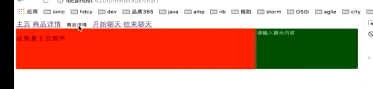

# 使用Angular Route导航

spa页面中，浏览器不会跳转，会永远停留在index.html中，只是将页面中的一部分的内容给替换掉，angular应用就是spa应用，在angular应用中使用路由器来实现，根据用户的操作，来改变页面的内容，而不会去重新加载页面这样一个特性，在现阶段我们可以将路由器理解为，控制整个应用视图状态的对象，每一个应用都有一个路由器，我们需要配置路由器，来使其满足特定的需求， 路由器的另外一个作用就是为每一个视图，分配一个单独的url; 这样我们就可以利用url使应用跳转到没有一个特定的视图状态 ， 比如说某个指定商品的详情页，其会有一个由路由器分配的特殊的url; 这样我们就可以利用url 直接跳到某个商品的详情页中，但是我们展示的页面 仍然是index.html;

视图状态，我们可以将spa理解为一组视图状态的集合， 在auction页面中顶部nav 与 左侧的search 与 底部的footer 我们希望 不管应用处于什么样的视图状态，上述的组件都是一直显示的，在剩下的区域里面有两个组件，一个是carousel组件，一个是product组件，我们希望根据用户的操作，在上述两个区域里面，去显示不同的内容。为了实现这一目标，我们需要将现在放置carousel组件与product组件的区域，定义成为一个“插座”，然后通过配置路由器，让在线拍卖应用在不同的视图状态中，在“插座”上显示不同的组件，`按照单页的规定，在一个插座上面，只能展示一个组件`，而前面我们并没有将carousel组件与product组件封装在一起，所以 我们会`先封装一个home组件，来作为carousel组件与product组件的父组件`，还会`开发一个商品的详情组件来展示商品的详情信息；然后会配置路由器，让应用在这两个视图状态间切换`，

## 了解路由的基础知识

### 路由相关对象的介绍

1. Routes : 路由配置，保存着具体某个URL对应某个组件， 以及在某个RouterOutlet中展示组件；  
2. RouterOutlet : 在Html中标记路由内容呈现的位置的占位符指令；

> 其实这就是我们前面描述中的插座，其用来指示路由配置的组件，展示在一个什么位置；

3. Router : 负责在运行时执行路由的对象，可以通过调用其navigate()和navigateUrl()方法来导航到一个指定的路由；
4. RouterLink : 在Html中声明路由导航用到的指令； 

> router 与 routerLink的作用都是一样的，都是用来是我们的应用导航到某个路由上面，不同的是router是在控制器当中使用的，通过编程调用方法来导航的，而RouterLink是在html 模板中使用的，其是用在a标签上，当用户点击a标签时，使应用导航到某个特定的路由上面；

5. ActivateRoute : 在当前激活的路由对象，保存着当前的路由信息，如路由地址，路由参数等；

### 路由对象在整个angular应用中的位置


1. 我们的angualr应用是由一些组件组成的，而每一个组件，都有其自身的模板与控制器，我们的应用在启动时 首先会展示app组件模板； 所有的组件都会被封装到一个模块了，而路由的配置 也就是Routers对象，就是存在于模块中的；

2. routers对象有一组配置信息组成，每个配置信息都至少包含两个属性：path属性 用来指定浏览器中的url, component属性用来指定相应的组件，如：`path: /user, component: A || path: /older,component:B`--- 当我们的浏览器地址是 /user时，我们的应用展示的是A 组件； 当我们的浏览器地址是/older的时候，我们的应用展示的B组件；

3. 而appComponent的组件模板app.component.html里面，可能会包含很多的内容，如有很多的div, 而当我们的浏览器地址切换到 /user是，我们的组件应该展示到app.component.html中的额什么位置？ 值就应该在app的组件模板app.component.html中使用 RouterOutlet指令，来指定组件A的位置，我们将RouterOutlet写在什么位置，组件componentA 就会展示在什么位置; 

4. 如果我们想显示B组件的话，可以在页面上通过一个链接，来改变浏览器的地址，而RouterLink指令就是用于在模板中生成这样一个链接； 另外我们也可以通过在组件控制器app.component.ts中，调用Router对象的navigate()方法，来改变浏览器的地址，从而实现路由的转换；

5. 最后，我们在路由时可以通过url的地址，来传递一些数据，而这些数据就会保存在ActivateRouter这样一个对象之中， 如通过组件A 路由到组件B时， 我们可以通过组件B 中的ActivateRoute 对象，来获取url中携带的参数； 这就是我们的路由对象在angular应用中的位置；

### 路由对象的针对性案例

> 下面的小案例，会包含路由的全部知识，因为在线竞拍的场景，一般只会涉及到一个知识点最常用部分，下面是为route知识点，量身设计的一个小案例，用以展示该知识点所有的细节；
```
//利用angular-cli 生成一个新的项目,注意指令后面添加了一个routing参数；
ng new router --routing 
// 增加--routing 参数，生成的src/app 文件夹里面，会多生成一个app-routing.module.ts
```

#### app-routing.modulet.ts--当前应用的路由配置模块，看清楚是一个模块而不是一个组件；

```typescript
// app-routing.module.ts中
import { NgModule } from '@angular/core';
import { Routes, RouterModule } from '@angular/router';

const routes: Routes = [];

@NgModule({
  imports: [RouterModule.forRoot(routes)],
  exports: [RouterModule]
})
export class AppRoutingModule { }
```
> app-routing.module.ts向外暴露一个appRoutingModule模块，而这个模块会在app.module.ts中由imports 导入；然后我们的app应用 现在就知道，应该使用什么样的路由配置，来路由了；这就是app模块与app-routing模块之间的关系；

```
// app.module.ts中
@NgModule({
  imports: [
    BrowserModule,
    AppRoutingModule
  ],
```

1. 利用cli工具生成两个组件: home组件与product组件，我们要实现的目的是 当我们在页面上点’主页‘的链接时，显示的是home组件的内容，而当我们在页面上点击’商品详情‘的链接时，就会显示product的组件内容；

2. 在app-routing.module.ts模块中，配置应用的路由；

```typescript
import { NgModule } from '@angular/core';
import { Routes, RouterModule } from '@angular/router';

  //HomeComponent组件的名字是红色的，这是因为我们现在是在利用typescript来编程，而typescript是有类型检查的，现在就是不知道HomeComponent该如何去编译它，所以我们需要做一个import的动作，将HomrComponent类的定义引入到当前编辑的组件里面来，利用wenstorm的快捷键 alt + enter 直接引入；
const routes: Routes = [
    //即当我们的路径为空的时候，我们希望展示的是home组件的内容；当我们的路径是product的时候，我们希望展示的是product组件里面的内容； 
      {path: '', component: HomeComponent},
      // 注意书写的格式 组件的名称前面，要用component来声明；
      {path: 'product', component: ProductComponent}
    
// 这里面有一点需要注意的是，path后面的字符串不能配成 '/' 开头，因为angular的路由器会帮我们解析与生成url,不用'/'开头是为了在多个视图见导航的时候，可以自由的去使用相对路径与绝对路径；
// 路由配置的就是 Routers类型，就是上面提到的路由相关的5个对象之一；它里面其实就是一组路由对象，每个对象最起码有两个属性，一个是路由对象的路径path,一个是路由对象的组件component, 而我们在Routers里面每配一组route对象，angular就会知道，当我们导航的某一个路径上面是，应用应会显示那个组件；
];

@NgModule({
  imports: [RouterModule.forRoot(routes)],
  exports: [RouterModule]
})
export class AppRoutingModule { }
```

3. 在app.component.html 中配置RouteOutlet指令对象

```html
<!--在 app.component.html中-->
<!--利用angular-cli初始化项目的添加 routing参数, 会自动将RouterOutlet的指令添加到 app.component.html中-->
<router-outlet></router-outlet>

<!--router-outlet的作用 ，其实就类似于一个插座，用来指示当前导航到每一个路由的时候，将路由对应的组件的内容显示在哪个地方，-->
```
4. 在app.component.html中运用RouterLink

```html
<!--在app.component.html中-->

<!--注意1.此处不同于在配置Routes对象，所有的路径，必须要以'/'开头，因为我们后面还要说明 子路由，通过'/'或'./'我们可以指明，我们要导航的是一个根路由或者是一个子路由，如现在这种以'/'开头的写法，就是说明我们要导航的是一个跟路由，angular就会找在app-routing.module.ts中，在Routes对象上面配置的`根路径`(在Routes对象上面配置的路径，叫根路由)，将根路径对应的组件，展示出来， -->
<a [routerLink]="['/']">主页</a>

<!--注意点2.就是 routerLink 的参数 是一个数组而不是一个字符串，这是因为我们可以在路由的时候，去传递一些参数，用字符串的时候，就能传一个参数，如果将参数放到一个数组里面，以后其它的参数同样可以传到数组里面，等于是留个接口-->
<a [routerLink]="['/product']">商品详情</a>

<router-outlet></router-outlet>
```

```html
<!-- 在浏览器解析的html中-->
<app-root _nghost-c0="" ng-version="5.1.1">
<a _ngcontent-c0="" ng-reflect-router-link="/" href="/">主页</a>
<a _ngcontent-c0="" ng-reflect-router-link="/product" href="/product">商品详情</a>

<router-outlet _ngcontent-c0=""></router-outlet>
<!--我们可以看到，组件是显示到router-outlet标签后面的， router-outlet这个插座的作用就是，用来指示在何处去显示组件的内容，一般‘插座’的下面直接跟上显示内容，-->
<app-home _nghost-c2="">
    <p _ngcontent-c2="">
      这里是主页组件
    </p>
</app-home>
</app-root>
```

5. 在代码中通过Route对象来导航，实际效果类似于RouterLink 不过是利用代码触发的形式，而不是需要用户点击链接的形式；

```html
<!--app.component.html中-->
<h2>{{title}}</h2>

<!--数据绑定的第三种形式： 事件绑定， 下面这句话的意思的button控件的 click事件，要由组件对象的toProductDetails()方法来处理，所以下面就要在app.component.ts控制器中，去写toProductDetails()这个方法；-->
<input type="button" value="商品详情" (click)="toProductDetails()" >

<a [routerLink]="['/']">主页</a>
<a [routerLink]="['/product']">商品详情</a>

<router-outlet></router-outlet>

```

```typescript
import { Component } from '@angular/core';
import {Router} from '@angular/router';

@Component({
  selector: 'app-root',
  templateUrl: './app.component.html',
  styleUrls: ['./app.component.css']
})
export class AppComponent {
  title = 'dh_solar';
    
  // 这个方法中我们需要用到一个路由对象--Router，这个对象是从其构造函数中来， 利用下面依赖注入的方式，拿到一个ROuter类的实例对象router;
   constructor(private router: Router){
  
    }
  toProductDetails(){
    // router.navigate()方法中的参数 与[routerLink] 中的参数一样，导航的方法也是借助一个数组，在前面routerLink中传什么，则后台router.navigate()方法中也传什么，效果都是一样的； 
    this.router.navigate(['/product']);
  }
}
```

6. 当用户输入一个不存在的路径时，会出现什么情况，

```
//浏览器会报错！这个时候，我们就需要利用一个通配符来解决这个问题， 我们再去生成一个组件code404组件，即当我们在页面上输入一个不存在的地址之后，就会显示这个code404组件里面的内容
Error: Cannot match any routes. URL Segment: 'produc'
```

> 生成一个显示错误内容的组件

```
ng g component code404
```

> 配置路由模块

```typescript
import { NgModule } from '@angular/core';
import { Routes, RouterModule } from '@angular/router';
import {HomeComponent} from './home/home.component';
import {ProductComponent} from './product/product.component';
import {Code404Component} from './code404/code404.component';

const routes: Routes = [

  {path: '', component: HomeComponent},
  {path: 'product', component: ProductComponent},
  // 通过这样一个配置，当用户访问一个不存在的地址时，页面将会展示Code404组件里面的内容，此处有一点需要注意，路由器使用‘先匹配者优先’的策略来匹配路由，所以我们在配置路由时，具体的路由 如 '/product'路由 应该写在最前面，而通配符路由 '**' 则应该写在最后面，在前面找不到其它路由的时候，才会去匹配这个路由， 所以一定要将通配符路由放在最后面；这种处理方式，自己很熟悉，与写express 框架的路由处理方式是一样的；
  {path: '**', component: Code404Component}
];
``` 

7. 上面4个路由对象的使用总结：Routes 用来去定义路由， RouterOutlet 这个插座用来指示 路由组件展示的位置，用Router 与 RouterLink 来导航到指定的路由 ，还剩下最后一个对象RouterActivate

#### 利用ActivateRoute 在路由时传递数据；

1. 在查询参数中传输数据；类似 `/product?id=1&name=2`

```
/product?id=1&name=2 ==> ActivatedRoute.queryParams[id]
//使用上述的方式传递数据，在路由的目标组件中，通过ActivatedRoute的queryParams参数来获取路由传递的参数
```

2. 在路由的路径中传递数据

```
{path: /product/:id} == > /product/1 ==> ActivatedRoute.params[id]
//使用这种方式，在定义路由的路径时，就要指定参数的名字，然后在实际的路径中携带这个参数，使用这种方式的时候，在路由的目标组件中 我们可以通过ActivatedRoute的params参数来获取携带的参数；
```

3. 在路由的配置中去传递数据，

```
{path: /product, comment: ProductComponent, data[{isProd:true}]} ==> ActivatedRoute.data[0][isProd]
//在上述的路由配置中，我们可以使用data这个参数，来配置一些静态的数据，data参数本身是一个数组，在数组中我们可以去定义多个对象，而每个对象当中又可以定义任意个属性，当我们这样定义路由的数据的时候，在此路由的目标组件中我们可以通过ActivatedRoute.data拿到data参数所定义的数组，然后从中通过数组下标获取指定的对象，然后访问其中的属性，获得我们在路由中所传递的数据；  
```

> 上面我们了解到如何通过路由在一个预先定义好的‘插座‘下面如何去显示不同的组件，但是在通常的情况下，我们不只要显示组件，还要传一些数据给组件，比如当我们导航到商品详情页的时候，我们需要传递一个'id'给商品详情组件，以便组件可以根据’id‘来展示某个特定的商品信息，angular 提供了上述3种，在路由时传递数据的方式；

#### 在查询参数中传递数据

1. 在路由时传递参数
```html
<!-- 在app.component.html中 在路由时传递参数-->
<h2>{{title}}</h2>

<input type="button" value="商品详情" (click)="toProductDetails()" >

<a [routerLink]="['/']">主页</a>
<!--[queryParams] 指定一个对象，我们将我们要传递的参数以键值对的方式，放到这个对象里面， 如下面的链接，当我们点击商品详情链接的时候，就会带一个id=1的参数传过去-->
<a [routerLink]="['/product']" [queryParams]="{id:1}">商品详情</a>

<router-outlet></router-outlet>
```

2. 接收路由传递的参数

> 如何在商品详情组件上去接收这个参数，需要利用路由5个对象中的最后一个对象ActivatedRoute当前激活的路由对象，

```typescript
import { Component, OnInit } from '@angular/core';

@Component({
  selector: 'app-product',
  templateUrl: './product.component.html',
  styleUrls: ['./product.component.css']
})
export class ProductComponent implements OnInit {
    //声明一个productId属性 来接受传过来的id；
    private productId: number;
   constructor(private routeInfo: ActivatedRoute)  { }

  ngOnInit() {
       //将路由传过来的ｉｄ参数，接收过来，并赋值给ProductComponent对象的productId属性；
       this.productId = this.routeInfo.snapshot.queryParams['id'];
  }
}
```

> 在组件模板中，通过插值表达式，将productId显示出来；

```html
<p>
  这里是商品详情组件
</p>

<p>{{productId}}</p>
```

#### 在路由的路径(url)中传递数据,一般需要做三步

1. 修改路由配置中的path属性，使其可以携带参数，
```
//app-routing.module.ts中
const routes: Routes = [
  {path: '', component: HomeComponent},
  //这样整个路由就分为了两部分，前半部分是固定的字符串 'product/' 后面是一个变量 id
  {path: 'product/:id', component: ProductComponent},
  {path: '**', component: Code404Component}
];
```

2.修改路由连接的参数，来传递数据；

```html
//在app.component.html中
<h2>{{title}}</h2>

<input type="button" value="商品详情" (click)="toProductDetails()" >

<a [routerLink]="['/']">主页</a>

<!--[routerLink] 对象可以接受多个参数，都写在数组里面就可以了，-->
<a [routerLink]="['/product',1]" >商品详情</a>

<router-outlet></router-outlet>
```

3. 修改product组件，使其获取数据的方式，与传递数据的方式对应；

```typescript
import { Component, OnInit } from '@angular/core';
import {ActivatedRoute} from '@angular/router';

@Component({
  selector: 'app-product',
  templateUrl: './product.component.html',
  styleUrls: ['./product.component.css']
})
export class ProductComponent implements OnInit {

  private productId: number;
  constructor(private routeInfo: ActivatedRoute)  { }

  ngOnInit() {
    // this.productId = this.routeInfo.snapshot.queryParams['id'];
    this.productId = this.routeInfo.snapshot.params['id'];
    // 此时我们就拿到了从url传递过来的数据；
 }

}
```

#### 参数快照 与 参数顶略

```typescript
import { Component } from '@angular/core';
import {Router} from '@angular/router';

@Component({
  selector: 'app-root',
  templateUrl: './app.component.html',
  styleUrls: ['./app.component.css']
})
export class AppComponent {
  title = 'dh_solar';
  constructor(private router: Router) {

  }
  toProductDetails() {
      //通过router对象的navagate()方法来导航，对应在a链接中通过传递数组中参数的方式一样，此处我们也将要携带的数据传入数组之中；实际上这样的效果，与点击链接的效果是一样的，
    this.router.navigate(['/product',2]);
  }
}

```

> 但是按上面的方式进行设置会有一个bug


之所以为产生这样一个现象，是因为我们每次从home组件，路由到product组件的时候，商品详情的组件会被创建，创建过程中其 construct()方法会被调用，其的onInit()方法会被调用一次； 但是，但我们从商品详情组件，路由到商品详情组件的时候， 由于商品详情组件，在我们点击按钮的时候，已经被创建了，所以其不会再次去创建，即onInit方法 不会执行 即this.productId 一直保存的是，第一次创建时，被赋予的值；解决这个bug的方法就称为’参数订阅‘，而而我们现在使用的就是参数快照snapshot(快照的意思) , 所以snapshot.params[] 叫做参数快照

```
//product.component.ts中
  ngOnInit() {
    //this.productId = this.routeInfo.snapshot.params['id']; 参数快照
    this.routeInfo.params.subscribe((params: Params) => this.productId = params['id']);
    // 参数订阅，使用参数订阅，在商品详情之间互相点的时候，虽然product组件，没有被重新创建，但因为订阅了路由中的参数，所以每次都能接收到 变化后的值；然后利用变化后的值，重新填充模板，
 }
```

> 结论： 获取路由参数的时候，一定要注意，如果我们确定一个组件 不会从自身路由到自身，就可以使用参数快照的方式来获取参数，反之若不确定 就要使用参数订阅的方式来获取参数；

### 重定向路由 : 当用户访问一个特定的地址是，将其重定向到另一个指定的地址；

```
// 如当用户访问我们的主页时，我们可以立即将其路由到商品列表页中去；
www.aaa.com ==> www.aaa.com/products

//假如一个组件，其路由地址是x, 后来感觉x地址不合适，就将路由地址改成y, 但是可能我们的用户已经收藏了x地址，所以我们就希望，当用户访问 老的x 地址的时候，能访问到新的 在y路由地址上的组件， 这个时候我们就可以利用重定向路由，将x地址 重定向到y这个地址上去；这就是重定向路由；
www.aaa.com/x ==> www.aaa.com/y
```

```typescript
import { NgModule } from '@angular/core';
import { Routes, RouterModule } from '@angular/router';
import {HomeComponent} from './home/home.component';
import {ProductComponent} from './product/product.component';
import {Code404Component} from './code404/code404.component';

const routes: Routes = [
    //在以往的设置中，HomeComponent组件对应的路由是一个空的字符串，但这其实是一个不太好的习惯，更好的做法是`{path: 'home', component: HomeComponent},`即路由的名字与组件的名字保持一致，但是如果我们直接这样配当我们访问locllhost:4200的时候，就会报页面不存在，因为空字符串无法匹配到我们配置的任何一个路由，除了通配符；这意味着应用在启动的时候，其不会去启动任何一个组件，用户必须点击导航区触发路由，然后才会去显示一些东西来，我们希望能我们进来的额时候直接显示HomeComponent组件里面的动容，但是我们的地址栏访问的地址仍然是locallhost:4200这样一个地址；要实现这个技术，我们就要用到重定向的技术；
  // {path: '', component: HomeComponent},
 
   {path: '', redirectTo: '/home', pathMatch: 'full' },
   {path: 'home', component: HomeComponent},
   {path: 'product/:id', component: ProductComponent},
   {path: '**', component: Code404Component}
];

@NgModule({
  imports: [RouterModule.forRoot(routes)],
  exports: [RouterModule]
})
export class AppRoutingModule { }

```

## 子路由-- 插座之间的嵌套（父子）关系

### 子路由的语法
```
{path: 'home', component: HomeComponent}

//当我们想配置子路由的时候，只需要在组件的路由上加上一个children属性，其是一个数组，在数组里，我们可以继续配置这种标准的路由， 当我们将路由配置成如下的形式的时候，当我们去访问home这个路由的时候，我们回去战术HomeComponent组件的模板，同时组件模板RouteOutlet的指定的位置 会展示XxxComponentb 组件的模板， 而当我们去访问/home/yyy的时候，屏幕上依旧会展示HomeComponent组件的模板，但在其模板RouteOutlet指定的位置，会展示YyyComponent组件的模板；这就是子路由的语法；
{path: 'home', component: HomeComponent,
    children: [
        {path: '', component: XxxComponent},
        {path: '/yyy', component: YyyComponent}
    ]
}
```

### 在案例中去实现子路由

1. 新建两个组件，来显示商品的详细信息，与销售员的信息；

```
// 商品详情组件
ng g component productDesc
// 销售人员信息
ng g component sellerInfo
```
2. 我们的目的是在主路由'product/:id' 下面显示连个子路由，分别用来显示 商品详情与销售人员的信息；首先要在app-routing模块中配置`product/:id`路由； 在指定SellerInfoComponent自组件的路由时，我们需要要向目标组件的控制器中，传递一个参数，目的是传不同的id ，seller-info.component.ts中 获取的数据是不一样，然后其在模板中渲染的数据也有所不同；

```
// app-routing.module.ts中

{path: 'product/:id', component: ProductComponent, children: [
    {path: '', component: ProductDescComponent},
     // 注意子路由的配置 是相对于当前主路由的配置来的， 即如果我们想显示SellerInfoComponent组件的内容，浏览器的地址栏应该是 /product/3/seller/2的形式
    {path: '/seller/:id', component: SellerInfoComponent}
]}

```

3.  在父组件的模板中product.component.html中，利用’插座‘<router-outlet> 来指定，子组件显示的位置；

```html
<!--点击商品描述链接的时候，我们希望显示’商品描述‘组件，注意指定的路径不能是'/'了，因为'/'是找根路由，即会走{path:'', ..} 这个路径，而我们 目的是在当前 'product/:id' 路由下面，走到它的子路由下面， 我们就需要写 './' 意思是 当前这个链接 要指向当前html 所在的控件的路由的子路由，而子路由的路径是一个空字符串 -->
<a [routerLink]="['./']">商品描述</a>
<a [routerLink]="['./seller', 99]">销售员信息</a>

<!-- 这个插座就是用来描述 产品详细信息组件，与销售员信息组件的插座-->
<router-outlet></router-outlet>
```

4. 自组件seller-info-component.ts获取路由中传递的数据；

```
// 设一个变量，用来接收路由中传递的数据；
private sellerId: number;
// 实例化ActivatedRoute 类的实例， 实例中包含 路由中携带的数据；
construct(private routeInfo: ActivatedRoute) {} 

// 在钩子 ngOnInit()中，将路由数据 赋值给sellerId, 路由每被激活一次，SellerInfoComponent就会被创建一次，相应的ngOnInit()就会被执行一次， 而又由于SellerInfoComponent这个组件，不会从自身路由到自身所以我们此处采用的是参数快照的形式；
ngOnInit() {
    this.sellerId = this.routerInfo.snapshot.params['id'];
}
```

5. 在sellerInfo 插件的模板中，利用插值表达式 来接收 组件传来的数据；

```html
<p>
  销售人员的ID: {{sellerId}}
</p>
```

###  子路由需要注意的地方

1. 查看生成的代码之后就会知道，会有两处router-outlet ,第一个是写在app.component.html里面的，在这个route-outlet下面显示的是product.component.html组件模板； 而在这个模板里面又有一个route-outlet ，实际上这地方就形成了一个route-outlet的父子关系，即插座的父子关系，而这个父子关系是一直可以嵌套下去的，这个嵌套可以是无限制的，

2. 所有的路由相关信息，谁是谁的父路由，那个组件显示在哪个组件的里面，都是在app.routing.module.ts这个路由模块中配置的， 所有的组件本身 如 productDescComponent 与 sellerInfoComponent根本不知道任何与路由相关的信息， 也就是说 上面两个组件我们可以嵌套在商品的详情页product.component 组件里面来显示，我们也可以单独拿出去做一个主路由，只要我们在app-routing.module.ts中去配置成主路由，则这个组件 就可以作为一个主路由来显示，这个也是大家要注意的一点： `路由信息 都是在模块中的，组件本身并不知道任何路由信息，`

3. 子路由 形成的就是一个`插座的父子关系`；


 
## 辅助路由-- 插座之间的（兄弟）关系

### 辅助路由的语法：声明一个辅助路由需要三步：

1. 在组件的模板上面 除了 ’主插座‘ 之外，我们还要声明一个带有name 属性的插座；、

```html
<router-outlet></router-outlet>
<router-outlet name="aux"></router-outlet>
```

2. 在路由配置中，我们需要配置，指定name名称的’插座‘上面可以显示那些组件 

```
{path: 'xxx', component: XxxComponent, outlet: 'aux'}
{path: 'yyy', component: YyyComponent, outlet: 'aux'}
```

3. 导航的时候我们需要指定 ，当路由到某一个地址的时候，在辅助的路由上面 需要显示那个组件；

```html
<!--当我们点击Xxx链接的时候，我们的主插座会导航到'/home', 我们的辅助插座aux上面， 会显示’xxx‘ 路径对应的组件； 按照上面的路由配置，显示的就是XxxComponent组件； 这样在我们的页面上看来，  <router-outlet>主插座，就会显示'/home' 对应的组件， 辅助插座<router-outlet name="aux">就会显示 'xxx'对应的组件XxxComponent-->
<a [routerLink] = "['/home', {outlets: {aux: xxx}}]">Xxx</a>
<a [routerLink] = "['/product', {outlets: {aux: yyy}}]">Yyy</a>
```

> 前面的例子中，在某一个组件的模板上面，只有一个插座，而辅助路由则会允许定义多个插座’ 并同时控制，每一个插座上面显示的内容，--- 假如我们在在线拍卖系统中，想加入一个即时聊天的功能，让用户与我们的客服实时进行沟通，这个功能可以在任何的页面中去使用，不管是商品列表页 还是商品详情页，下面我们就用辅助路由来实现这个功能；

### 辅助路由应用实例

#### 案例说明


* 目的在任何的页面上我们都需要有一个聊天控件，来随时聊天；
有两个链接--开始聊天与结束聊天，通过这两个链接，控制聊天组件的显示与隐藏，但不管聊天的组件显示与否， 我们商品的详情与主页的路由都是独立跳转，也就是说 同一个页面中的两块内容，是由两组链接分别控制的； 其不会因为主的路由跳走了，另外一块内容 就会刷新，或者消失，其永远都在那显示，除非点击结束聊天将其关掉；

#### 实现步骤

1. 在app组件的模板上再定义一个插座来显示聊天面板；

```html
<!--app.component.html中-->
<h2>{{title}}</h2>

<input type="button" value="商品详情" (click)="toProductDetails()" >

<a [routerLink]="['/home']">主页</a>
<a [routerLink]="['/product',1]" >商品详情</a>

<router-outlet></router-outlet>
<router-outlet name="aux"></router-outlet>
```

2. 单独开发一个聊天室组件，只显示在新定义的插座上；

```
ng g component chat
```

```html
<!--chat.component.html  中-->
<textarea name="" id="" cols="30" rows="10" class="chat" placeholder="请输入聊天内容"></textarea>
```

```css
/*chat.component.css中*/ 
.chat {
  background: green;
  height: 100px;
  width: 30%;
  float: left;
  box-sizing: border-box;
}
```

> 改造主页组件 与 商品详情组件 分别利用一个盒子 将两个组件 的 模板内容整体包起来，然后通过设置css属性，使其浮动在页面左侧，并且占页面宽度的70%；然后聊天组件会占页面的30%； 这也是一种angular 主页 这很重要， 因为在牵涉到 页面的布局方式； 

```html
<!-- product.component.html中-->
<div class="product">
  <p>
    这里是商品详情组件
  </p>
  <p>商品的ID：{{productId}}</p>
  <a [routerLink]="['./']">商品描述</a>
  <a [routerLink]="['./seller', 99]">销售员信息</a>
  <router-outlet></router-outlet>
</div>
```

```css
/*product.component.css中*/
.product{
  background: yellow;
  height: 100px;
  width: 70%;
  float: left;
  box-sizing: border-box;
}
```

```html
<!-- home.component.html中-->
<div class="home">
  <p>
    这里是主页组件
  </p>
</div>
```

```css
/*home.component.css中*/
.home{
  background: red;
  height: 100px;
  width: 70%;
  float: left;
  box-sizing: border-box;
}

```


3. 通过路由参数来控制新插座是否显示聊天面板；（通过路由的配置 与 路由的参数来决定聊天组件是否显示；）

```
// 路由配置： app-routing.module.ts中；
 {path: '', redirectTo: '/home', pathMatch: 'full' },
// 辅助路由配置的方式与主路由的配置方式类似，只不过其要多一个配置outlet, 即指明当前的路由要显示在哪一个‘插座上面’，其它的没有定义outlet属性的路由，都会显示没有name属性的‘主插座’上面，
  {path: 'chat', component: ChatComponent, outlet: 'aux'},
  {path: 'home', component: HomeComponent},
```

```html
<!--路由参数配置 app.component.html中-->
<a [routerLink]="['/home']">主页</a>
<a [routerLink]="['/product',1]" >商品详情</a>

<!--控制辅助路由的链接，其[routerLink]就不是一个具体的地址，而是一个对象，对象中有一个outlets属性，而ourlets属性又是一个对象，在对象中我们就可以指明 name为 aux 的插座 对应的路径为 'chat' -->
<a [routerLink]="{outlets:{aux:'chat'}}" > 开始聊天</a>
 
<!--当我们 点击结束聊天是， name 为aux的插座 对应的路由为null-->
<a [routerLink]="{outlets:{aux:null}}" > 结束聊天</a>

<router-outlet></router-outlet>
<router-outlet name="aux"></router-outlet>
```

>  最终的效果是:主路由与辅助路由之间是独立变化的；； 主页与商品详情页 是独立的，即不管我们导航到那个页面上，辅助路由的区域是单独存在的，即我们随时可以跟我们的客服去聊天； 

> 在这种路由参数配置中`<a [routerLink]="{outlets:{primary: 'home',aux:'chat'}}" > 开始聊天</a>` 若我们指定 辅助插座的路径`<router-outlet name="aux"></router-outlet>` 可以利用 `routerOutletName: 'path'`的形式 如： `aux:'chat'` ; 若指定主插座的的路径 可以利用`primary: 'path'` primary 就引用到主插座； 如下的形式：点击开始聊天， 主插座的内容会变，辅助插座 同样会变；

```html
<a [routerLink]="{outlets:{primary: 'home',aux:'chat'}}" > 开始聊天</a>
```

## 路由守卫

### 路由守卫介绍

> 现在我们已经可以通过控制路由来控制页面的视图状态了，下面让我们来考虑一些特殊的场景，在这些场景中，只有当用户满足了特殊的条件之后才会被允许进入或者离开一个路由，比如：`1、只有当用户已经登录并拥有某些权限的时候，才能进入某些路由；`  ; `2、一个由多个表单组件组成的向导，例如注册流程，用户只有在当前路由的组件中填写了，满足要求的信息才可以导航到下一个路由（点击下一步）；`  ; `3、当用户未执行保存操作而试图离开当前导航时提醒用户；` 这些场景 都是用户 满足某一个场景之后，才会被允许 进入或者离开某个路由，angular的路由系统 提供了一些钩子，来帮助我们控制，进入或离开路由； 我们可以使用这些钩子，来实现前面我们所描述的场景，我们称这些钩子为路由护卫，也叫路由守卫； 在我们的课程里，我们将介绍三种 路由守卫：

1. CanActivate : 处理导航到某路由的情况；但不满足指定的要求的时候，就不能导航到指定的路由，

2. CanDeactivate : 处理从当前路由离开的情况； 若不满足这个守卫的要求，就不能从当前路由离开；

3. Resolve : 在路由激活之前获取路由数据；这样在进入路由的时候，就可以立刻将这些数据展示给用户；

### 登陆守卫CanActivate案例：只有登陆过的用户，才能进入产品信息路由；

> 为了案例简单，我们不会去真实的去调用一个登陆服务，只是通过一个随机数，来判断一下；

1. 新建 src/app/guard/login.guard.ts

```typescript
import {CanActivate} from '@angular/router';

// 这个类实现angular 框架提供的一个接口，实现了Angular框架的接口CanActivate
export class LoginGuard implements CanActivate {
  // 实现了一个方法canActivate()这个方法 要返回一个布尔值， angular会根据返回的布尔值true或false来决定当前的路由请求，是通过 或者是不通过；
  canActivate() {
    // 声明一个变量loggedIn用来表示当前的用户 是否已经登陆了,此处利用一个随机数来模拟,大于0.5的视为未登陆状态；否则视为已经登陆；
    const loggedIn: boolean = Math.random() < 0.5;
    if (!loggedIn) {
      console.log('用户为未登录状态');
    }
    return loggedIn;
  }
}

// 这样我们就完成了一个路由守卫，守卫的名字为登陆守卫，
```

2. 修改路由配置，将路由守卫加到产品信息的路由上，

```typescript
import { NgModule } from '@angular/core';
import { Routes, RouterModule } from '@angular/router';
import {HomeComponent} from './home/home.component';
import {ProductComponent} from './product/product.component';
import {Code404Component} from './code404/code404.component';
import {ProductDescComponent} from './product-desc/product-desc.component';
import {SellerInfoComponent} from './seller-info/seller-info.component';
import {ChatComponent} from './chat/chat.component';
import {LoginGuard} from './guard/login.guard';

const routes: Routes = [

  {path: '', redirectTo: '/home', pathMatch: 'full' },
  {path: 'chat', component: ChatComponent, outlet: 'aux'},
  {path: 'home', component: HomeComponent},
  {path: 'product/:id', component: ProductComponent, children: [
      {path: '', component: ProductDescComponent},
      {path: 'seller/:id', component: SellerInfoComponent}
      //1. canActivate 属性的值可以是一个数组，这就意味着其可以接受多个路由守卫 当应用试图进入到此路由时，这个数组中指定的所有的守卫，会被依次去调用，若一旦有其中一个守卫返回为false 则路由请求，会被拒绝掉；我们现在只有loginGuard这一个守卫
    ], canActivate: [LoginGuard]},
  //2. 我们在这地方只是指定了，路由护卫的类型，是LoginGuard这个类，但是谁来实例化这个类；angular将会使用依赖注入的机制来实例化这个类，依赖注入是后面的内容，现在我们只要在该模块@NgModule装饰器中的参数对象的providers属性中声明一下LoginGuard就可以了；
  {path: '**', component: Code404Component}
];

@NgModule({
  imports: [RouterModule.forRoot(routes)],
  exports: [RouterModule],
   // 3. 此处声明一下LoginGuard类；
  providers: [LoginGuard]
})
export class AppRoutingModule { }
```

### 离开守卫canDeactivate的案例：提醒用户 执行保存操作之后，才能离开当前页面，

1. 新建src/app/guard/unsaved.guard.ts

```typescript
// 这个守卫确保当前用户执行保存操作之后，才能离开当前的页面；

import {CanDeactivate} from '@angular/router';
import {ProductComponent} from '../product/product.component';

// CanDeactivate接口与CanActivate接口的区别是，CanDeactivate这个接口，有一个泛型-- 指定当前组件的类型，
// 因为我们要保护的组件是ProductComponent组件，所以泛型 写ProductComponent; 同样其也有一个方法需要实现--canDeactivate()这个方法中的第一个参数，方法的第一个参数，就是泛型指定的组件，这样会将当前要保护的组件的信息 传递进来；
// 因为我们是想要离开，根据要保护组件的状态-- 组件中会有很多属性，同样我们可以在要保护组件中写一些方法，我们可以根据组件的某一个属性，或者去调用组件的方法，用以判断，当前的用户 是否可以离开；这就是其中的使用逻辑
// 此处我们不写那么复杂，
export class UnsavedGuard implements CanDeactivate<ProductComponent> {
    canDeactivate(component: ProductComponent) {
      // 当用户试图离开ProductComponent组件的时候，提示就会跳出来，若用户点击确认，则用户会离开当前，若用户点否，即方法返回的是false则会继续留在当前页面；
      return window.confirm('你还没有保存，确定要离开么');
    }
}
```

2. 修改路由配置，将路由守卫加到产品信息的路由上，与配置canActivate守卫一样，先为指定路由添加一个属性canDeactivate , 属性值是一个数组； 将自定的守卫类放在数组里面； 同样要放到$NgModule装饰器的配置对象的provider属性里面；

```
  {path: 'product/:id', component: ProductComponent, children: [
      {path: '', component: ProductDescComponent},
      {path: 'seller/:id', component: SellerInfoComponent}
    ], canActivate: [LoginGuard],
    canDeactivate: [UnsavedGuard]
  },
  
  @NgModule({
    imports: [RouterModule.forRoot(routes)],
    exports: [RouterModule],
    providers: [LoginGuard,UnsavedGuard]
  })
```

### resolve守卫

1. resolve守卫想要解决的问题：

*　当我们想进入一个路由，如商品详情路由的时候，我们进去之后，一般的传统办法是 进路由的时候 ，让路由上带着参数（如商品的ID）, 然后在组件内部，我们获取路由上传递的数据（拿到商品的ID)， 在onInit()钩子里面，利用ID 去拼接一个字符串，发送一个http请求，去拿到商品的信息；
*  而若在一个真正的程序中，我们去发送一个http请求，而这个请求很有可能返回是有延迟的，导致组件的模板，无法立刻显示出来；在这种情况下，直到数据返回之前，在模板中所有需要用插值表达式显示控制器上某一个值的地方都是空的，而这种用户体验，肯定不是最好的一种用户体验；resolve守卫就是用来解决上面所说的问题；
 
2. resolve守卫解决问题的方式
 使用resolve守卫我们可以在预先进入路由之前，去服务器上面去读数据，然后将需要的数据都读取完毕之后，带着数据进入路由里面，这样立刻就能将数据在模板中显示出来；
 
 #### 具体使用resolve守卫
 
 1. 新建src/app/guard/

## 在在线拍卖系统项目中去添加路由；


