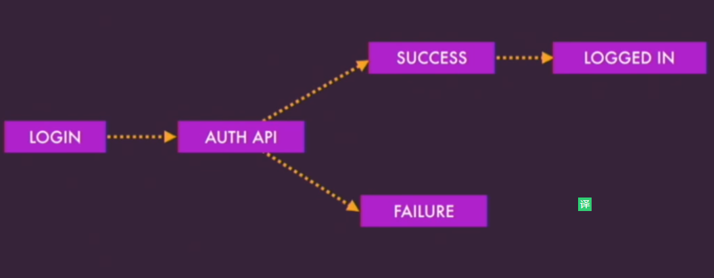

# Authentication with NgRx

> https://www.youtube.com/watch?v=46IRQgNtCGw

I'm excited to give a talk about a frequently asked question when using ngrx which is authenication . Authenication is a critical piece when managing access to your application from handing initial login to checking each page during navigation . Ngrx provides an architecture to handle this process with structure and predictablility . So let's us look at soe of the goals we want to cover when building using authenication with ngrx 

## Goals 

1. Handle authenication lifecycle from logging in checking pages and logging out 

2. Manage state for authenicated user when a man is the state for the authenicated user which includes capture any information about user that's returned from the backend 

3. Provide shared user information across components , since store is a global state container we can use it to share with components and services across our app 

## Benefits of using ngrx for authenication 

1. Great example of shared state

> One of the questions we see most that also comes up is what goes in the store and this authenication is a great example of shared state. Authenication is shared throughout the app it can be changed from different areas of that like if you're logging out and you can also hydrate this state when you're using it on mobile or server-side rendering 

2. Independent of anthenication schema 

3. Reduce API calls 

4. Can be package and shared 

## Actions 

1. Descriptive

> The first thing when building an authenication engine within ngrx are Actions . Actions are ,meant to be decriptive ,action described unique events in your application and provide context to where those actions came from .  

2. Spicific 

> Actions are specific because we're capturing certain events and we don't want then to be too generic 

3. Cause state changes 

> These state changes are handled by reducers to transition from one state to the next 

4. trigger side effects 

> Side effects are where we connect with external resource and also provide actions back to the store 


## Action Categories

1. Auth

> It's good to break these actions into a few categories . The first being the Auth category which is where we capture actions for handling the authenicated user including logging and logging out 

2. Authenication API

> We also group authenication API into category and this are requests and reponses that come back from the backend 

3. Login Page 

> We also capture actions about the specific UI events that happen on the login page when the user interact were clicking buttons or other interactions that may occur 

Actions determine flow for UI events writing these actions upfront allow you to map out entire user flows before even writing reducers or effects  




## States

> Two state we're going to cover here are the login page and authenication sate 

1. Login page State

```ts
// Login page is described as an interface  
interface LoginPageState {
    // which can be used to form( 构建) or disable the display spinners while the request is being processed  
    pending: boolean; 
    // error property is to display that relevant information back to the user in case of a failure 
    error: string | null;
}

```

2. Authenication state

```ts
// Here is a user model that would contain what would be returned back from the API upon successful authenication 
interface UserModel {
    id: string;
    name: string;
    email: string;
}

// The AuthState capture the user who wants to authenication is sucessful and would hold any addtional information about the current user . You notice in the AuthState that there isn't an explicit about being logged in and the we'll talk about that further . So now we have models and authenicaiton information into the store and how do we get that out of the store --- selctors  

interface AuthState {
    user: UserModel | null;
}

```

## Selectors

> Selectors fall into teo categories , selectors that get and selectors that derive

1. selctor that get 

> Selectors are pure functions that are used to get simple and complex pieces of state . We use these selectors when we inject store to select to connect state to your components . In order to get the authenicated user with store we use a function that provide that state and we get the user property 

```ts
const selectAuthUser = (state: AuthState) => state.user;

```

2. selector that derive

> Derive state is state that we can get insight from through existing information we already have whether the user is loggin or not can be derived from the user information that we already have using selector . So this way you don't have to add extra information into your sate because that information is already there 

```ts 
const selectIsLoggedIn =  createSelector(selectAuthUser, user => !!user);

``` 

## State changes 

> We model state changes through pure reducer functions and these reducer functions are easy to test because for given input you get a consistent output without side effects . Here we're going to visualizing the state transitions going from authenicated user to an authenicated state . We will receive a login success action that we have our reducer and then we would transition to an authenicated state


With the login page we would so the same state transitions . When the user click the login button we go from a pendding state and in the case of a failure we will return a LOGIN FAILURE action and we would capture that action with an error message to display to the user


## Side effects

> Side effects are where you connect your actions to external requests , these also provide relevant data back to the store based on the result of those requests  . Here we're going to process the authenication from login and handle logging out

1. handle loggin action

```ts
@Effect()
login$ = this.actions$
    .ofType('[Login Page] Login')
    .pipe(
        exhaustMap(auth => 
            this.authService
                .login(auth)
                .pipe(
                    map(user => new LoginSuccess({user})),
                    catchError(error => of(new LoginFailure(error)))
                ),
        )
    )


```

2. handle loggin out action

> Another question is how to handle dialogues . When user click a logout button you don't immediately log them out , you want to confirm their intent first , so here we're using an effect to prompt the user to confirm logging out , using an angular material dialog service based on the users feed back . If they confirm that action we map it to a new action and start a new state transition to logout the user . If they cancel or dismiss the prompt then we could just consider an empty side effect . 

```ts
@Effect()
logoutConfirmation$ = this.actions$.ofType('[Auth] confirm Logout')
    .pipe(
        exhaustMap(()=>
            this.dialogService.open(LogoutPromptCompoent)
            .afterClosed()
            .pipe(
                map(confirmed => {
                    if(confirmed) {
                        return new LogoutConfirmed();
                    } else {
                        return new LogoutCancelled();
                    }
                })
            )
        )
    )

```


