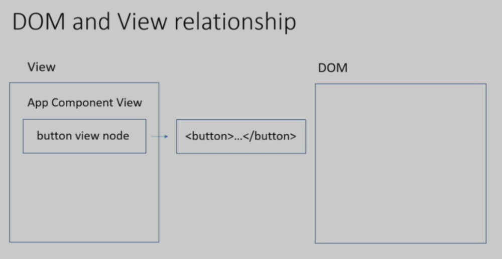
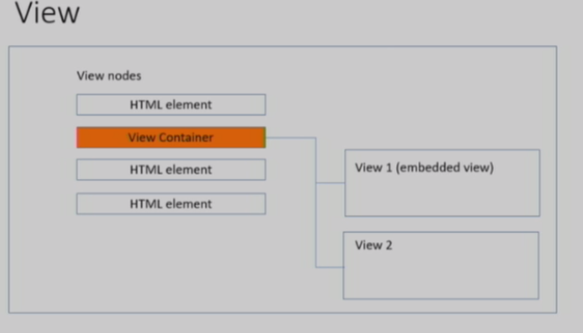
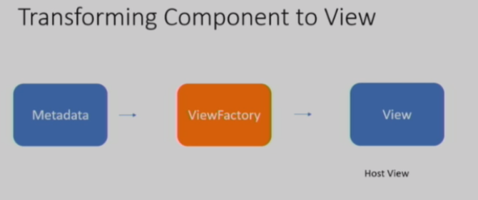

# Implementing advanced DOM manipulation scenarios

> https://www.youtube.com/watch?time_continue=1036&v=vz9cNCkaPsY

## Dom  operations categories

1. Modifying Dom element properties

* classList.add()
* setAttribute()
* style.setProperty()

2. Modifying Dom hierarchy

* createrElement()
* Remove()
* appendChild()
* removeChild()

> In angular there are specific tools for each of these type of operations. Will start with the tools that angular peovides for us with working with existing elements peoperties 


## Modifying Dom element properties 

###. task 1 (t1a branch)

```ts
/* app.component.ts */

import { Component } from '@angular/core';

@Component({
  selector: 'app-root',
  template: `<span #el>I want to be green</span>`,
  styles: ['[highlight] {color: green}']
})
export class AppComponent {
}

```

The task is we have one span element in the Dom and what we want is we want to change the dont coler of the span element and and to do that we need to simply add the highlight attribute . Because we have styles that when any element has highlight attribute the color is  applied to it . 

So the task here will be get hold of the span element inside the coponent and add the attribute to it . 

2. solution concept

* What we need to know to accomplish this task? In angular how do we get access to dom elements we use something called template reference variables and @viewChild() of your children queries 

```ts
@Component({
    ...
    template: '<span #e1> I want to be green </span>',
})
export class AppComponent implements AfterVIewInit {
    // we use view child query here and pass in the name of the reference to get hold of this span element and what is return is something called elementRef which is simply an abstraction around native Dom elements . We need it because angular runs on other platforms where there is no native Dom , but we need something to work with and that's why we elementRef here 
    @ViewChild('e1')
    span: ElementRef;
    ...
    // then we can use nativeElement property to get access to this native Dom element 
    this.span.nativeElement
}


```

* The nest question is when can we use `this.span.nativeElement` , we can do that inside AfterVIewInit lifecycle hook  

3. solution steps 

* Use @ViewCHild query and template reference to get HTML element

```ts
<span #e1> I want to be  green </span>

...
@ViewCHild('e1') span: ElementRef;

```

* Use `setAttribute` method of a native Dom element to add an attribute

```ts
this.span.nativeElement.setAttribute()

```

3. solution

```ts

import { AfterViewInit, Component, ElementRef, ViewChild } from '@angular/core';

@Component({
  selector: 'app-root',
  template: `<span #el>I want to be red</span>`,
  styles: ['[highlight] {color: red}']
})
export class AppComponent implements AfterViewInit {
  @ViewChild('el') span: ElementRef;

  ngAfterViewInit() {
    this.span.nativeElement.setAttribute('highlight', '');
  }
}


```

There is one problem with our solution now and the problem is that we mixing together rendering  and presentation logic . 

What is presentation logic ? because presentation logict defines how business data should be presentated to a user . For example a set of task can be split into two columns with all tasks in left column and completed tasks in right column . So the presentation logic would define two arrays with different set of tasks . 

What is rendering logic ? THe rendering logic actually manipulates the Dom . It arranges dom node in a particular order , so that we can actually can see these tasks . In here we working directly with the dom , so we're using rendering logic , but right now it's implemented inside the component . But the general recommendation is to put presentation logic into components adn rendering logic into directives .

Okay we can use data binding mechanism to communicate between components and directives , so what we need to do this will be our next task

### task 1b (t1b branch) change color by adding an attribute #1b

We need to implement a directive that will do exactly tha same work we've done inside the component that will set the attribute on a dom element 

So what do we need  to know ? If we put this rendering logic into component , we need to use @ViewChild() of your child queies and template references to get a hold of the Dom element . If we use  a directive we don't to do that because we can inject a dom element that the directive is applied to  directly into the directives constructor , so we don't longer need to use @ViewChild or template references  


1. concepts 

* ElementRef injection into a constructor

```ts
@Directive({...})
export class AddAtrributeDirective implements OnInit {
    constructor(private element: ElementRef) {

    }
}

```

The second things is that need to communicate to the directive what attribute needs to be added ? We can use data binding mechanism for this purpose . SO we need to define an `@input() addAttribute` inside the directive . when we will be referencing our directive in a components template we can pass in the attribute name . Then in the directive ngOnInit lifecycle hook where we can get access to all inputs . so in the lifecycle we can use element's setAttribute method to do the same kind of work we did inside a component

* @Inputs to pass a directive parameter & NgOnInit

```ts
/* add-attribute.directive.ts */
import { Directive, ElementRef, Input } from '@angular/core';

@Directive({
  selector: '[addAttribute]'
})
export class AddAttributeDirective {
  @Input() addAttribute;

  constructor(private element: ElementRef) {
  }

  ngOnInit() {
    this.element.nativeElement.setAttribute(this.addAttribute, '');
  }
}


```

```ts
/* app.component.ts */
import { Component } from '@angular/core';

@Component({
  selector: 'app-root',
  // when we will be referencing our directive in a components template we can pass in the attribute name 
  template: `<span [addAttribute]="'highlight'">I want to be red</span>`,
  styles: ['[highlight] {color: red}']
})
export class AppComponent {
}

```

2. steps

* Add input parameter to the directive

```ts
export class AddAttributeDirective implements OnInit {
    @Input() addAttribute;
}

```

* Inject an ElementRef into a constructor

```ts
constructor (private element: ElementRef) {}

```

* Use `setAttribute` method to add an attribute in NgOnInit lifecycle hook

* Apply the directive to the `span` element

```ts
template: `<span [addAttribute] ="highlight" >..</span>`

```

3. conlusion

```ts
/* app.component.ts */

import { Component } from '@angular/core';

@Component({
  selector: 'app-root',
  template: `<span [addAttribute]="'highlight'">I want to be red</span>`,
  styles: ['[highlight] {color: red}']
})
export class AppComponent {
}

```

```ts
/* add-attribute.directive.ts */

import { Directive, ElementRef, Input } from '@angular/core';

@Directive({
  selector: '[addAttribute]'
})
export class AddAttributeDirective {
  @Input() addAttribute;

  constructor(private element: ElementRef) {
  }
 
  ngOnInit() {
    this.element.nativeElement.setAttribute(this.addAttribute, '');
  }
}

```

## Correct minset 

* Put presentation logic into components 
* Put rendering logic into directives
* Use dataj-binding mechanism for communication

### Benefits

What are benefit s of our split in presentation and render logic ? The first one is that if we put presentation logic in two components this logic anc be reused on platforms other than dom . For example nativescript they have their own implementation of the rendering layer . And if we put a rendering logic into directives angain we can reuse it , we can applu this directive we jsut implemented to any components template . The third benefit is that you always know where to look for, if you got an error right , if you suspect that it's something messes up with the dom you go into directive   


But there is another problem however with our solution here and the problem is that we're using the native steAttribute method , so we kind of expect that there's going to be Dom element there but what is we run inside the `web workers` which don't have native dom. In angular to eork around this problem we have something called renderer which is the service that makes changes to existing dom element properties safe its platform independent . It has all the methods that we have on Dom elements setAttribute() etc .

```bash
Renderer
# makes direct DOM access safe (platform independent)

Dom element modification methods
# setAttribute
# removeAttribute
# addClass
# removeClass
# setStyle
# removeStyle

```

What we need to do is that we need to replace the logic that we have just implement and instead of calling setAttribute() directly on the native Dom element we need to call this method on the renderer and then pass in the elementRef 


### task 1c (t1c branch) change color by adding an attribute #1c

1. Concepts

Renderer2 service injection into a constructor

```ts
@Directive({...})
export class AiDAddAttributeDirective implements OnInit {
    construct(private renderer: Renderer2) {}

    ..
    renderer.setAttribute(elementRef, attribute, value)
}

```

2. steps 

* Inject ElementRef & Renderer2 into a constructor of a directive

```ts
 constructor(private renderer: Renderer2) {}
```

* Use `SetAttribute` method of the Renderer to add an attribute

```ts
renderer.setAttribute(elementRef, attribute, value)

```

3. conclusion

```ts
/* add-attribute.directive.ts */

import { Directive, ElementRef, Input, OnInit, Renderer2 } from '@angular/core';

@Directive({
  selector: '[addAttribute]'
})
export class AddAttributeDirective implements OnInit {
  @Input() addAttribute;

  constructor(private element: ElementRef, private renderer: Renderer2) {
  }

  ngOnInit() {
    this.renderer.setAttribute(this.element.nativeElement, this.addAttribute, '');
  }
}


```


## Task 2 Remove a child Dom Node

Inside the appComponent we have a child component inside which is Dom element . WHat wee need to do is when the button is clicked ,inside the `remove()` method , we need to remove the <a-comp #c><a-com> from the dom . Kind of the way you do with jquery , that you just remove the dom element from the dom .

1. get a hold to the child element we want to remove

How we can do that ? I'm using a @ViewChildren() query and templete  reference to get access to the dom element.

What the type of @ViewChildren() here ? The type is QueryList. It means that child component variable will contain reference to all elements marked with the template reference . However since there is only one element inside the Dom in the template , we can use the first property of the query list to get access to the component child dom element . `this.childComps.first` will give you access to the elementRef specific to  <a-com>. then we know that to get access to the native element we need to use native element `this.childComps.first.nativeElement` 

The above is how we can get a hold to the child element 

2. inject the Renderer2

If we look at the removeChild() of the renderer we will be using Renderer2 , so we need to inject it `constructor(private r: Renderer2){}` . The renderer has a removeChild method . If we inspect the signature for the method it takes two nodes the parent node and the child node . SO we already know how to access to the child node which will be the second node parameter . 
So how we get the parent node ？ What the parent node of this is a component which is the host element of the current component exactually and it turn out that in a simliar way to the directive we can inject the host element of the component into the constructor.  
What we will do is on top of the Renderer2 we will inject the host Element like this `constructor(renderer: Renderer2, host: ElementRef)` and then we can pass it as a parent node , again don't forget nativeElement and this code ` renderer.removeChild(this.host.nativeElement, this.childComps.first.nativeElement) ` will go inside the remove method . so once the button is clicked this node is executed and the child component is removed from the Dom   


```ts
import { AfterViewChecked, Component, ElementRef, QueryList, ViewChildren } from '@angular/core';

@Component({
  selector: 'app-root',
  template: ` 
    <button (click)="remove()">Remove child component</button>
    <a-comp #c></a-comp>
  `
})
export class AppComponent implements AfterViewChecked {
  @ViewChildren('c', {read: ElementRef}) childComps: QueryList<ElementRef>;

  ngAfterViewChecked() {
    console.log('number of child components: ' + this.childComps.length);
  }

  remove() {
  }
}

```

2. Steps 

* Use @ViewChildren query and template reference to get an HTML element ;

* Inject host ElementRef & Renderer2 into a constructor  ` constructor (private hostElement: ElementRef, private renderer: Renderer2){} ` 

* Use the `removeChild` method of the renderer to remove a child component  ` renderer.removeChild(this.hostElement.nativeElement, ...) ` 

* Remomeber to use `nativeElement` property

> 关于ElementRef 的自己的理解， 对于一个指令当我们的构造函数中去注入 ElementRef 的时候，我们实际上得到的是 指令所用node 的 引用；而当我们在component 中注入这个类的时候，由于组件 不会作用于其他的标签，其自己就是一个标签，所以注入的 ElementRef 指的就是 组件的 selector 所对应的node 了； 其实不管对于 directive 还是 component 其实 ElementRef 差不多指的是同样一个东西；


3. Question why do we use the @ViewChildren instead of @ViewChild ?

* we can also use the @ViewChild if we know that we have only one element to manipulate

4. solution 

```ts
// app.Component.ts
import { AfterViewChecked, Component, ElementRef, QueryList, ViewChildren } from '@angular/core';

@Component({
  selector: 'app-root',
  template: ` 
    <button (click)="remove()">Remove child component</button>
    <a-comp #c></a-comp>
  `
})
export class AppComponent implements AfterViewChecked {
  @ViewChildren('c', {read: ElementRef}) childComps: QueryList<ElementRef>;


  constructor (private renderer: Rernderer2, private hostElement: ElementRef) {}

  ngAfterViewChecked() {
    console.log('number of child components: ' + this.childComps.length);
  }

  remove() {
    this.renderer.removeChild(
      this.hostElement.nativeElement,
      this.childComps.first.nativeElement

    )
  }
}


```


When we click the button the <a-cmp> child component will be removed from the dom tree. but the browser console will still console  ` number of child components 1 ` . The result is because angular does not work with dom directly . It has a concept known as view this is the data strutrue that is created for every components and it holds references to the dom elements found in a component template . Below is the diagram which is illustates this . You can see the the view on the left and the button element on the right in the dom and you see it references it inside the view . The problem is that if we work directly with the dom and remove the button element from the dom , the button view node that sides inside the view is not affected . 



When we move the button node from the dom , it still is inside the view and the reference is retained and that's the problem . So angular stil thinks that there is a hierarchy of views there is a parent app component inside of A component and inside of the B component 

* Component view 

```ts
@Component({
  selector:'aid-app',
  template: ` <button> ..</button> `
})
export class AidAppComponent {}

// When angular create and initiates a component , it create the view for the component and the view is only an abstration that binds together component class and the dom nodes wich is HTML dom nodes created for this component 

const AppComponentInstanceView = {
  component: new AiDAppComponent(),
  nodes: [
    renderElement: HTMLButtonElement
  ]
}


```

What if we have child components? Then we get the hierachy of views 

> every component has a dom repredentation which we call host element . 

> For every component angulat create the view . So in the component nested situation , the angular will still create a view for the child view .  In the host component view we will has a reference to the child component view . 

The change detection runs on this herarchy of these views and every single lifecycle hook or @viewChildren query also runs on the hierachy view .

```ts
@Component({
  selector: 'aid-app',
  template: `
    <aid-a-comp></aid-a-comp>
  `
})

export class AiDAppComponent {}

// If we have a child component  inside the host component . then inside the host element view instance we will have a componentView which is reference to the Dom Element which is created by the child component  

const AppComponentInstanceView = {
  component: new AiDAppComponent (),
  nodes: [{

      renderElement: HTMLAiDComponentElement,
      componentView: AiDAComponentInstanceView
    }
  ]
}

```

* The question can be what type of nodes can we delete ?

> Like Jquery plugin , it's not safe to remove every single dom. The general rule is that if you create the dom node , you can delete it . If jquery plugin add some nodes , then they can remove then safe , because angular does not know anything about these dom nodes , so there will be no harm done . However if the nodes created by the angular , it's not safe to delete them without using the tools provided by the framework and there is a tool that angular provide foe us to work directly with the higharchy of the views and the tools is known as `viewContainer`

The viewContainer is the tools that we need to usr if we want to work with the views . 


* ViewContainer

 

If you imagine Dom nodes , one of these nodes can act as a container for other views . so here you can see that the second dom node or view node act as a container for other views . So we can put as many views as we like inside this container and this container implements methods that allow us to manipulate these views to create them , add them to the view container or remove them from a view container. 

> The main purpose for view container is to hold the other views and to privide an API for you to manipulate these views 


* View Container (ViewContainerRef) 

> `Makes Dom hierarchy changes safe` which is the view container's purpose . As you may expect there is something called structure of directive in angular which like NgIf, NgFor .... All these directive are based on the view container . Because there is no other way in angular to work with the views . ( The NgStyle , NgClass directives also use Renderer under the hook to make these directive platform independent )


> API
  + Create
  + Destrory
  + Manipulate

## How do we work with the view container ?

There are a few things we need to do . First we need to define the node that act as the view container . It can be every dom node in a component simple. But usually <ng-container> is use to be the view container . <ng-container> is just html element that angular specific that can act as view container .

To turn the code into a view container , we need to use @ViewChild or @ViewChildren query , but the importanf part is we need to pass the   `{ read: ViewContainerRef }` type , that's what actually turns dom node of view node into a ViewContainer 

* Initializing a view container

```bash
<ng-container #viewContainer> </ng-container>

# the second part `read: ViewContainerRef` is what turn dom node into ViewContainer
@ViewChild('viewContainer', {read: ViewContainerRef}): vc

```
* Creating an embeded view

> Then we will have a reference to ViewContainer which we can use to create views , to destory views or move the views anything  

>There are two type of views in angular , the embeded view and the host views . Usually we work with embeded view that are created using templates right 

```bash

# Here we are passing a TemplateRef into a createEmbededView method to create the view and add it to the view container . So actually the mthod do two steps which are create view and add the view to the view container;
viewContainer.createEmbededView(TemplateRef)

```

* Working with templates

> The last thing is how to get access to a template ? because we need a template to pass in inside the createEmbededView method to create the view . That is easy , because we have <ng-template> tag in angular , that we can wrap all dom nodes that we want to be part of a template , then we can use a @ViewChild query to get access to the template , and it will return us the templateRef, we will have two ways to do that:

``` ts
<ng-template #t> <span>I am span element</span> </ng-template>

// the first way
// we pass a {read: TemplateRef} variable , so it's simliar to how you pass view container. You see angular sees a dom node, but it doesn't know wich one from it .  We pass the read parameter and you say to angular , ` I want it to be a view container or I want it to be a template 
@ViewChild('t', {read: TemplateRef}) template: TemplateRef;

// The second way to get access to template 
@ViewChild(TemplateRef) template: TemplateRef; 

```

### Steps 

1. Wrap Dom nodes into `ng-template` tag 
2. Query the template using ViewChild/ ViewChildren query 
3. Initialize a View Container using { read: ViewContainerRef} parameter
4. Use `createEmbededView` method to create and render a view from a template , the method is excuted in ngAferterViewInit life cycle;
5. Check the View is created and the component is rendered
6. Remove the view when clicked a button using `remove` method of a view container
7. Verify that the child components length is 0;


### conclusion

> 当处理  属性 样式 类的处理的时候我们去使用 Renderer2 去操作； 而处理节点的增删改查的时候，我们去使用 ViewContainer 去操作

```ts
// app.component.ts
import {
  AfterViewChecked,
  AfterViewInit,
  Component,
  ElementRef,
  QueryList,
  TemplateRef,
  ViewChild,
  ViewChildren,
  ViewContainerRef
} from '@angular/core';

@Component({
  selector: 'app-root',
  template: `
    <button (click)="remove()">Remove child component</button>
    <ng-container #vc></ng-container>
    <ng-template>
      <a-comp #c></a-comp>
    </ng-template>
  `
})
export class AppComponent implements AfterViewInit, AfterViewChecked {
  @ViewChildren('c', {read: ElementRef}) childComps: QueryList<ElementRef>;
  @ViewChild('vc', {read: ViewContainerRef}) viewContainer: ViewContainerRef;
  @ViewChild(TemplateRef) template: TemplateRef<null>;

  ngAfterViewInit() {
    this.viewContainer.createEmbeddedView(this.template);
  }

  ngAfterViewChecked() {
    console.log('number of child components: ' + this.childComps.length);
  }

  remove() {
    this.viewContainer.remove();
  }
}

```


### The different between the view contianer's remove method and the clear method

The difference is that clear method remove everything , every single view in the container and remove method remove the view that you specify using the index as a parameter , so actually remove method takes index parameter . But since we didn't pass an index , it will remove the last embeded view 


## T4 Dynamic components rendering 

> Sometimes people ask why do we need dynamic components ? In this case demonstrates it , We don't know which component to render and here I only have two component , but we can have hundreds components from which you can choose . So we can't add them to the HTML inside ng-if , so every single component inside wrapped inside ngif . then they control it using the state of a component which is solution that only have one or two component , but if you have hundreds , you can't add this . In that case we need to use the dynamic component .

```ts

import { Component } from '@angular/core';
import { AComponent } from './a.component';
import { BComponent } from './b.component';

@Component({
  selector: 'app-root',
  template: `
    <button (click)="show('a')">Show A component</button>
    <button (click)="show('b')">Show B component</button>
  `
})
export class AppComponent {
  show(type) {
    const component = type === 'a' ? AComponent : BComponent;
  }
}

```

1. The view container which can hold two types of views , the first type of view which is embeded view means this view should always be part of a view container . the second type of view is the host view which can also be a part of view container , but it can also be stand alone . So if we think about it , the app component , the route component is dynamic component and it is the host view and it's attached directly to the dom , it's not part of a view container . That's is the difference between the host view  and the embeded view.

2. When we work with dynamic components and use the different API provided by the view container whch is createComponent instead of createEmbededView , the view container will create host views 

3. The input data for host views is different. For host view the input data is component factory  



4. We have metadate which is what we defined with a component decorator , then the angular compile will turn this template into viewFactory , the viewFactory is used as an input data for the view .  the viewFactory is something that is used to create the view 

5. How we get the viewFactory ?

> We use something called ComponentFactoryResolver which is the service provided by angular that we can use to get a factory generated by compiler for a particular component 

```ts
export class RendererComponent {
  constructor (private resolver: ComponentFactoryResolver) {
    // in our case the ComponentClass would be either componentA or componentB 
    const factory = this.resolver.resolveComponentFactory(ComponentClass)
  }
}

```

6. How many factory do we need ?

In our case when we have component A and component B , how many factory do we need ?  We should have two factories , one factory is for the component A and one factory is for component B 

```ts

export class AppComponent {
  show(type) {
    const component = type === 'a' ? AComponent : BComponent;
  }
}

```

7. Once we have the Factory we can call the createComponent method on the view container and pass in the factory . It will be the similar to what we did with the template . It will create the view and add it to the view container 

8. One important thing is to add the components you want to get factories for into the entry components array . That's because angular compier try to optimize things , does not generate factories for components it doesn't find inside templates .  In our case we don't have componentA or componentB in the app.component.ts but we still need factories for them . So we should add componentA and componentB in to the NgModule entryComponent array , so that the compile generate factories for them , then we can resolve them using component factory resolver   


8. Steps
  * Add components which we'll want to add dynamically  to entry components
  * Add and initialize a view container
  * Get component factories using ComponentFactoryResolver ` const factory = this.resolver.resolveComponentFactory(ComponentClass) `
  * Use `CreateComponent` method of a view container to render a dynamic component `viewContainer.createComponent(componentFactory)`


9. The solution

```ts
import { Component } from '@angular/core';
import { AComponent } from './a.component';
import { BComponent } from './b.component';

@Component({
  selector: 'app-root',
  template: `
    <button (click)="show('a')">Show A component</button>
    <button (click)="show('b')">Show B component</button>
    <-! 1. we introduced view container ->
    <ng-container #vc> </ng-container>
  `
})
export class AppComponent {
  //2. we utilize the ViewChild to query the viewContainer
  @ViewChild('vc', {read: ViewContainerRef}) vc: ViewContainerRef;

  //3. we inject the ComponentFactoryResolver into thr constructor which we will use in the show method to get access to the relevant factory 
  constructor(private resolver: ConponentFactoryResolver) {}

  show(type) {
    const component = type === 'a' ? AComponent : BComponent;
    // 4. to get the dynamic component factory
    this.resolver.resolverCoponentFactory(this.component);
    // 5. cleat every view in the view container , because I don't them to nest 
    this.vc.clear();
    // 6. call the createComponent method and pass in component factory 
    this.vc.createCoponent(factory);
  }
}


```

