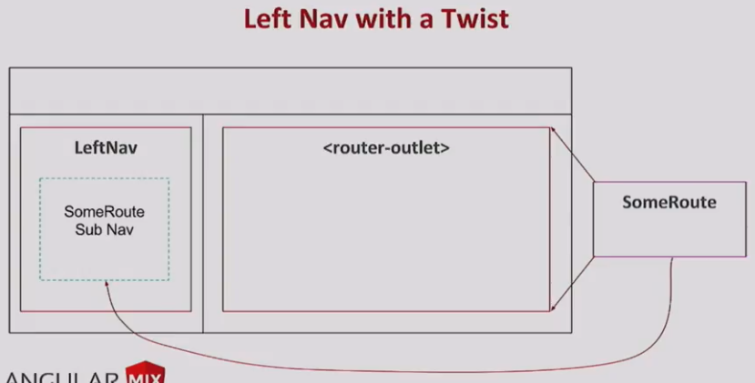
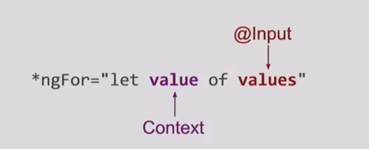
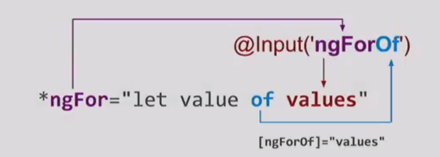

# Advanced Angular Concepts by Alex Rickabaugh
> https://www.youtube.com/watch?v=rKbY1t39dHU

## The <ng-template> & template directives

Rather tan do it in kind of an abstrct way , we want to talk about a couple of problems that can make use of these api's for solution , that's designing a left navigation Ui , where the current route can actually control some of the content in the left and then disigning a image carousel ,so we're going to both of those and make use of <ng-template></ng-template> and template directive 

## Left Nav 

Left navigation is a pretty common UX pattern in application ;

This design has kind of a twist to it , because we want the route to be able to dictate some some of the content that shows up in the left nav right outside of the <router-outlet></router-outlet> , you can imagine like a flight search right, where you search for you put in your cities and that happens in the main pane and then these controls move move over to the left nav and kind exist there as long as you're on that route 



We can do this with [innerHtml], we could have the route have some static HTML that it's going to send the service to the left nav and we just render it with an InnerHTML binding and that works if you want to accpet a couple different constraints , that HTML is static we can't have data binding , we also can't take any advantage of any angular components or directives . 

So we think a better is to use `Templates` for this and achieve the full power of angular . 

> `Templates are instructions on how to render `
So `template` kind of more formally is a chunk angular HTML that runs through ng see of ahead of time coplication and it gets turned those elements that you declare & the directive and the components and all the data binding gets turned into instructions to our view engine on how to render these things at the runtime 

> We mostly use `templates` indirectly with @Component 
Every template have a template and that template gets compiled and is used to display the components and so that looks kind of like this:

```ts
@Component({
    template: `
    <h1>This is a template</h1>
    <some-other-com *ngIf="showOther">...</some-other-cmp>
    `,
    ...
})

```

> there is a second kind of the template in angular and that is the <ng-template>
We can embed these in your component template and use them to do kind of more advanced things:

```ts 
@Component({
    template: `
        <h1>This is rendered with the component.</h1>
        <ng-template>
            <h2>This is a template. It's not rendered right away</h2>
        </ng-template>
    `
})

``` 

When we actually render the component that `<h2>` is nowhere to be found , it's not part of the instruction to display this <ng-component> and is keeping it for us on the side and we can tell it when and where we want to render that content;


## Designing a image carousel

In particular we want to design a directive that implements the logic of the carousel , we leave the UI up to the user , we only want to encode the mechanism of the carousel , let the user figure our how they want to display images , how the want to reat to next or previous events . So let's start by sketching this :

```html
<!-- we want to implement a directive called carousel , it's going to be a template directive, and the user is going to provide the template.  -->
<!-- The template will be the actual UI of the carousel , so the user decide how to render it right , we're going to have an image and a button to navigate next or previous  -->
<!--  We have a couple of questions here we have to answer . How the carousel get the its input ? How does it know what the the list of images that it want to loop over ? How the template know what the current url is ?  When something happens where we decide to advance carousel and how do we tell it to do that ?   -->
<div *carousel="?" >
    
    <button (click) ="?" > Next </button>
</div>

``` 

To answer above questions we can actually turn another built in angular directive called *ngFor , we use it so often that probably don't even think about the fact , it is kind of weird(奇怪) as far as directive go. Most binding to angular happen to an expression which produces a single value , this one has some syntax in there we have multiple identifiers , so it's kind of interesting and this is actually a feature of template directive called micro syntax  



```ts 
// We have to identifiers here as I mentioned and they're serving very different purpose 

// On the right we have values , which is a list of value that we're passing in that we want ngFor to iterate over and that's actually the input of the directive 

// the identifier on the left value is completely different , it's actually a variable declaration right , we're taking some value out of the directive that we can bind to or display inside our template 

*ngFor = " let value of values "

```  



On the right we have this 'of' keyword and it turn out the 'of' is not actually a keyword , it's the things called a binding key and what the angular is actually do is combining the name the name of the directive which is 'ngFor' with the binding key 'of' and creating a synthetic(合成) binding to an input . So as if we just wrote '[ngForOf]' is bound to values `@Input('ngForOf') <--> values` , `[ngForOf] = 'values'` 

We can even take this to an extrame  and imagine recreating an entire sql query inside inside of a template directive :

```bash
#
*sql = "let row selectFrom 'table' where cond orderBy 'foo' limit 10 "
```

 Here we have a binding key `selectFrom` which will be bound to the table , we have a binding key `where` which is bound to a condition function , orderBy and limit all of these would become inputs sql query form , sql where , sql orderBy , you can get very expressive in the domain specific language or DSL  that you can create inside you template directives . so we will do that with the carousel

 ```html
 <div *carousel="let source from images">
     

     <button (click)="?">Next</button>

 </div>
 
 ```

 Let imagine our carousel has the syntax `let source from images`, so the `images` is the array we want to iterate over and source will be the URL coming out that we want to bind to . How do we implement something like this :

 ```ts
 @Directive({ selector: '[carousel]' })
 export class Carousel {
     @Input('carouselFrom') images: ImageEntry[];
 }
 
 ```

 Inside our directive we need an @input , input is the name of the directive plus the binding key so it'll be `carouselFrom` 
 
 ```ts
 @Directive({selector: '[carousel]'})
 export class Carousel {
     @Input('carouselFrom') images: ImageEntry[];

     ngOnInit(): void {
         this.vcr.createEmbededView(this.tml, {
             source: images[0].source,
         })
     }
 }
 
 ```
 
We create our embedded view of the template that the user will give us , we pass out a `context` and the context contains all these properies that we want to make available for binding in the template. But there is a problem here `we actually don't know want variable name the users going put .  ` we said `let source from images ` they could said `let url from images `

```ts
@Directive({selector: '[carousel]'})
export class Carousel {
    @Input('carouselFrom') images: ImageEntity[];

    ngOnInit(): void {
        this.vcr.createEmbeddedView(this.tml, {
            $implicit: images[0].source,
        })
    }
}

```

So actually  we they say let source,  there's some hidden syntactic sugar going on here. They're actually saying `*carouse = let source = $implicit ` let source equal property called $implicit. So it's @implicit that we actually want to provide as part of the context .  

 And we can provide other things as well , so for example we could imaging the user invokes the carousel this way `*carousel = let source from images; let ctrl = controller >` , and ontroller is a property that we're going to pass out out of the *carousel in to the template, and it'll have methods like next(), previous() and actually be able to interact with the carousel and tell it what todo 

```html
<div *carousel = "let source from iamges; let ctrl = controller">
    </img [src] = "source">
    <button (click) ="ctrl.next()"> Next </button>
    
</div>

```

Here is our final solution to this, we have a div with the *carousel , `remember * means a template`, so every thing inside of it will be passed as a template to the directive . `let source from images` so source is the current url , it's a variable coming out. `images` passes in an input binding to the carousel giving it the list of images to iterate over . We also need another variable coming out  `let ctrl` which is going to equal to the context controller property that we've passed out. 

The ctrl let us reat to for example the button click , so we can say control.next() and that will in theory advance the carousel (促进carousel 向前走一侦) to the next image :

```ts
@Directive({selctor: '[carousel]'})
export class Carousel {
    @input('carouselFrom') images: ImageEntity[];
    ngOnInit(): void {
        this.vcr.createEmbededView(this.tmpl, {
            $implicit: this.images[0].source,
            controller: {
                next: () => this.next()
            }
        })
    }
    next():void {...}
}

```

We have a `carouselFrom` @input, we create an embedded view , we pass the $implicit to indicate what the current url is . When we pass this controller object which has a function on it that knows how to advance the carousel .

So that we build an image carousel as a template directive 