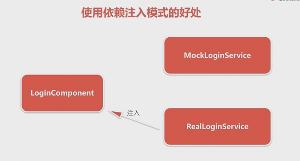
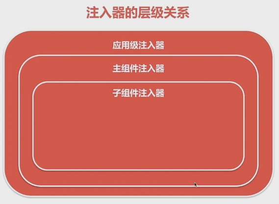

# chapter4 依赖注入

> angular 如何自动处理对象的创建过程，也就是依赖注入，任何一个angular程序，都是一堆组件、指令、以及一堆彼此依赖类的集合，虽然每个组件都可以明确的实例化自己的依赖，但是angular提供了一种依赖注入的机制，来完成这个工作,依赖注入是一种设计模式。

> 当我们理解了，什么是依赖注入的模式之后，我们才可能写出可重用的组件；而只有当我们写出可以重用的组件之后，我们才能真正叫做会使用angular框架了；

## 什么是依赖注入的模式，使用依赖注入的好处

### 依赖注入: Dependency injection 简称DJ

```ts
//1.1 假设我们写一个方法，方法的参数是一个对象，当我们调用该方法时，我们需要将该对象实例化，并将其传递给方法，假设我们的在线竞拍程序，发货中心，负责将我们买的的商品发给我们，那么在程序中我们可能去编写以下的代码；

//1.2 new一个商品，商品的信息在Product构造函数的参数里面
var product = new Product();
// 调用createShipment方法，将实例后的额商品传递到方法里面，将商品发送出去；
createShipment(product);

//1.3 createShipment()方法需要一个已经存在的class Procduct类的实例，换句话说createShipment()方法依赖Product这个类；creatShipment()方法本身并不知道如何去创建一个product实例；调用createShipment()方法的代码需要以某种方式来创建product实例，并将该product对象作为参数传递给createShipment方法;-->我们将实例化的对象传递给这个方法 也可以称为注入到这个方法中。

```

```ts
// 2.1 假如我们现在需要将Product类，换成Product的一个子类MockProduct 在我们的例子中，你只需要改一行代码：
var product = new MockProduct();
createShipment(product);

// 2.2 但是如果createShipment()方法需要三个参数，如发货的时候我除了需要知道商品的信息，还需要知道快递公司的信息，还需要知道订单的信息，而每个对象又有自己的依赖：如订单信息里面又有一个地址信息对象，那我们的代码就有可能会变成如下的样子：

// 商品信息
var product = new Product();
// 快递公司信息
var shipCompany = new shipCompany();
// 地址信息
var address = new Address();
// 订单信息
var order = new Order();
// 订单信息依赖地址信息
order.setAddress(address);
// 发货方法依赖商品信息，快递公司信息，订单信息
createShipment(product,shipCompany, order);


// 2.3 上面代码中有大量的手工实例化的代码，那么能不能有人帮我们创建createShipment()方法所依赖的对象，以及这些对象所依赖的对象，而我们只需要写一句createShipment(product, shipCompany,order)代码，而上面的东西，别人已经帮我们创建好了 ---- 而这就是依赖模式所要解决 的问题：
// 2.3 如果一个对象A 依赖一个 类型为B 的对象，那么对象A 不需要明确的去实例化B（var b = new B()），b会由外部的机制注入进来，对象A只需要声明： ”我需要一个B类型的对象，谁能给我一个么？“  这就是依赖注入要去解决的问题，

```
```ts

// 3.1 与依赖注入通常同时出现的另外一个概念，叫做控制反转 inversion of control 简称IOC; 控制反转的意思的将依赖的控制权从代码的内部，转到代码的外部，
// 3.2 如下方式编写代码，代码对外部的依赖，是由代码的内部来决定的；var product = new Product(); 这行代码 决定了我们的代码依赖Product , 如果我们想让依赖由Product改为MockProduct 我们就需要修改方法内部的代码，将上面一行代码改掉改为var product = new MockProduct(); 
// 3.3 如果实现了控制反转，则内部代码只需要声明:"我需要Product" 至于传进来的 至于传进来的是Product 还是 Product的子类 MockProduct是由代码的外部来决定的，这是代码的控制权由代码的内部转移到了代码的外部，这就是控制反转；
var product = new Product();
createShipment(product);

```
> 控制反转与依赖注入是一体两变，表达的是一个思想 控制反转侧重于描述目的，即目的是将依赖的控制权从代码的内部转移到代码的外部，而依赖注入则侧重于描述手段即如何去实现控制反转，使用的手段就是依赖注入；实现了控制反转模式的框架成为IOC(inversion of control)容器；而angular 框架就是一个IOC容器，angular实现控制反转的手段就是依赖注入

http://blog.csdn.net/bestone0213/article/details/47424255 写的很好，有时间去看一下；

### 使用依赖注入的好处

 简单来说依赖注入会让我们以一种松耦合的方式来编写代码，是我们的代码可测性与可重用性更高

 #### 一、松耦合和可重用
 假设我们有一个商品组件ProductComponent，在组件中我们要 使用一个商品服务 productService 来获取商品信息，如果没有依赖注入，在组件里面我们需要知道如何去实例化ProductService,有很多的方式可以做到这一点:

 ```ts
 var productService = new ProductService();
 ```
 但不论使用哪一种方式，我们的ProductComponent组件`将与ProductService类紧密的耦合在一起`；如果我们想在另外一个项目中重用ProductComponent组件，但我们要使用另外一个不同的服务对象来获取我们的商品信息，我们必须要修改ProductComponent组件代码中`var productService = new ProductService()` 将其改成：

 ```ts
//  用另外一个商品服务对象，来获取信息；
 var productService = new AnotherProductService();
 ```

 这代码我们的商品组件ProductComponent和商品服务ProductService是紧密的耦合在一起的，如果我们想在别的项目中使用商品组件，必须要改商品组件中的代码才可以去使用；而依赖注入可以解除ProductComponen组件与ProductService服务之间的这种紧耦合关系；从而可以使我们在不同的项目之中重用ProductComponent组件；而不用去修改其代码；

```ts
@NgModule({
    // 在angular中我们可以通过指定providers,来告诉angular那些对象需要进行依赖注入; 因为providers是一个数组 数组中的每一个元素称为provider; 一个provider定义了一个对象在被注入到对象或指令之前如何实例化：
    /*providers: [ProductService]等价于： 
    * providers:[{provide:ProductService, useClass:ProductService}]
    *上面一行代码涉及到angular的一个概念:token;一个token代表一个可被注入的对象的类型；token的类型有provider的配置对象的provide属性来决定；
    * 所以上面一行代码的意思是：注册一个类型是ProductService的token, 当有组件或指令声明自己需要一个类型为ProductService的token时，实例化一个ProductService, 并将其注入到目标对象；
    * 而组件或指令是如何声明自己需要一个类型为ProductService的token？就是用其构造函数：`constructor(productService: ProductService) {}` 意思就是我需要一个类型为ProductService的token;
    * angular 看到上面的声明之后，其就会去声明的providers数组中去找`{provide:ProductService, useClass:ProductService}` ProductService这个类型的token 对应的类是哪一个（useClass所指定的类）；
    * 然后angular会将useClass指定的类ProductService实例化，并注入到`constructor(productService: ProductService)`中的productService参数中（如requireJs一致）
    * ProductComponent组件本身并不知道传进来的是Productservice类的那个实现，更不需要明确的实例化这个ProductService类，其只需要去使用angular为它创建好的productService对象，并调用其getProduct()方法就可以了；
    * 如果我们想在其它的项目中去重用ProductComponent组件，而另外项目中有一个实现了ProductService的类，我们可以修改其@NgModule()中 providers的声明：
    * providers:[{provide:ProductService, useClass:AnotherProductService}]意思是我要注册一个类型是ProductService的token,当有组件或类声明”我需要ProductService“时，那么我就实例化一个AnotherProductService; 并将其注入到component组件里面；而ProductComponent组件本身并不需要任何的修改；
    * 这样就消除了ProductComponent与ProductService之间的紧耦合关系，从而提升了ProductComponent组件的重用性；
    * 这是使用依赖注入的第一个好处，松耦合与可重用；
    */ 
    providers: [ProductService]
    ...省略其它配置
})
export class AppModule {}

@Component({
    ...省略组件配置
})
export class ProductComponent {
    product: Product;
    constructor(productService: ProductService) {
        this.product = productService.getProduct();
    }
}

```
### 二、可测试性 

> 当真实的对象还不可以使用的时候，我们可以很方便的注入一个虚拟的对象，来测试我们组件；假设我们需要为我们的应用添加一个登陆功能；



* 我们可以创建一个LoginComponent来让用户填写用户名与密码；Login组件需要依赖一个Login服务,而Login服务应该链接一个身份认证服务器，并且检查用户提供的用户名与密码是否时正确的。但身份认证服务器时另外一个部门开发的并且现在还没有开发好，而我们已经将Login组件开发好了，但因为前面描述的无法控制的原因，导致我们没法去测试；而这时依赖注入可以帮我们很方便的去解决这个问题；

* 我们可以去创建一个MockLoginService, 这个服务并不会真正的去链接认证服务器，而是硬编码一段逻辑来判别是否可以登陆，譬如只有用户名是admin,密码是1234的时候才可以去登陆，其它情况都返回用户名与密码错误；

* 使用依赖注入将MockLoginService注入到LoginComponent组件，而不需要等真正的认证服务器开发完过一段时间；而当真正的认证服务器开发完成，我们只需要修改一行前面我们提到的代码`providers:[{provide:ProductService, useClass:AnotherProductService}]`就可以让angular注入真正的LoginService服务；

* 这就是使用依赖注入的另外一个好处提高可测试性；


## angular的依赖注入的实现：注入器与提供器 
> 通过实例展示angular事如何实现依赖注入模式的，编写一个可注入的服务。以及如何将该服务注入到其它的组件；我们会尝试将组件依赖的服务，替换成为另外一个实现；在这个过程中我们会发现，使用angular的依赖注入会有多么的方便；如直接实例化依赖的方式相比较， 使用依赖注入我们只需要使用一行的代码；

### 注入器

> 每一个组件都有一个注入器实例 负责注入组件需要的对象， 注入器是angular提供的一个服务类，一般情况下我们不需要直接去调用注入器的方法，注入器会自动的通过组件的构造函数，将组件所需要的对象注入到组件之中

```ts
constructor(private productService: ProductService){..}
// 在构造函数上面我们声明了一个productService属性 在属性上我们指明其类型是ProductService; angular的注入器看到这样一个构造函数声明的时候，其就会在整个angular应用中去寻找ProductService的实例，若其能找到这样一个实例，其就会将实例注入到productService这样一个对象里面，然后我们直接使用就可以了；

```

### 提供器

> 为了让注入器知道需要被注入的对象如何实例化，我们需要指定提供器

```ts

providers:[ProductService];
providers:[{provide:ProductService, useClass:ProductService}];

//1.1 一般情况下我们会通过组件或者模块的providers属性来声明provide,上面代码就声明了一个名为ProductService的provide; 
//1.2 上面两行代码的写法是等同的；即当provide属性与useClass一致时，可省略为第一行代码的写法；
//1.3 provide指定了提供器的token,若指定useClass说明我们的实例化方式是new; 也就是new一个ProductService;; token就是我们在构造函数中声明的属性的类型，当我们在构造函数中声明，我们需要一个ProductService这样一个类型的对象的时候，它会去找token是ProductService类型的provider的声明，当其看到声明的属性写的是useClass:ProductService 其就会去new ProductService()

providers:[{provide:ProductService, useClass:AnotherProductService}]
//2.1 而当我们的provider的属性是如上的方式声明的，即provide的类型是ProductService token是ProviderService ； 而useClass写的是AnotherProductService; 

constructor(private productService: ProductService){..}
// 2.2 那么当我在构造函数中去声明需要ProductService这样一个token的时候，我们实例化的就是AnotherProductService;;
// 2.3 即构造函数中属性声明的类型，与提供器provider的provide声明的token是一致的；即根据构造声明的属性类型与token的类型，来匹配使用某一个provider，而后会根据provider的useClass属性 来指定实例化某一个具体的类；useClass指定的是哪一个类，实例化的对象就是哪一个类；

providers:[{provide:ProductService, useFactory:()=>{...}}]
// 最后我们还可以利用最后一种方式，即不是通过useClass直接new一个类出来，而是通过一个工厂方法返回一个实例；其会将工厂方法useFactory()返回的实例注入到构造函数的productService属性中 在工厂函数中我们可以写一些代码，来对我们想要创建的ProductService的实例做一些初始化的工作
```

### 依赖注入的例子

```bash
ng new injection 
ng g component product1
# 因为我们的服务会在多个组件之间共享，所以我们将其生成到一个shared的文件夹中，
ng g service shared/product 
```

```ts
// product.service.ts中
import { Injectable } from '@angular/core';

@Injectable()
export class ProductService {

  constructor() { }
    //1.3 声明一个getProduct()方法，返回一个Product类型的实例
    getProduct() : Product {
        return new Product(0,'iphone7',5899,'最新款iphone7手机')
    }

}

//1.1 因为我们通过此服务要获取到的是商品信息，所以我们先来定义一个用来封装商品信息的Product类

export class Product {
    //1.2 利用构造函数来定义里面的字段，
    constructor(
        public id:number,
        public title:string,
        public price:number,
        public desc:string
    ){}
}

```

```ts
// app.module.ts中
@NgModule({
    declarations: [
        AppComponent,
    Product1Component
  ],
  imports: [
      BrowserModule
  ],
//2.1 修改模块的声明，将其声明到模块的providers数组里面，
  providers: [ProductService],
  bootstrap: [AppComponent]
})
export class AppModule { }

```

```ts
// product1.component.ts中

@Component({
  selector: 'app-product1',
  templateUrl: './product1.component.html',
  styleUrls: ['./product1.component.css']
})
export class Product1Component implements OnInit {
  public product: Product;
  //构造函数声明依赖；
  constructor(private productService: ProductService) { }

  ngOnInit() {
    //   使用注入对象上面的方法getProduct()来获取产品的信息；
    this.product = this.productService.getProduct();
  }

}

```

```html
<!-- product1.component.html中 -->
<div>
  <h3>商品名称：{{product.title}}</h3>
  <h3>商品价格：{{product.price}}</h3>
  <h3>商品描述：{{product.desc}}</h3>
</div>

```

```html

<!-- app.component.html中 -->
<app-product1></app-product1>

```

### 提供器的作用域
上面的例子中我们将提供器providers 声明在app.module.ts中，除了声明在模块之中 我们页可以将提供器providers设置在组件之中，而此处我们再生成一个组件product2, 与一个服务AnotherProductService 来演示这一个特性；

```bash
ng g component product2

ng g service shared/anotherProduct

```

```ts
// 在another-product.service.ts中
import { Injectable } from '@angular/core';
import { ProductService, Product } from './product.service';

@Injectable()
// 首先AnotherProductService要实现ProductService,这就意味着前者拥有与后者相同的方法，
export class AnotherProductService implements ProductService {

  getProduct(): Product {
    return new Product(2, 'iphone8', 8777, '17年最新款，最NB的手机' );
  }

  constructor() { }

}
```

```ts
// product2.component.ts中
@Component({
  selector: 'app-product2',
  templateUrl: './product2.component.html',
  styleUrls: ['./product2.component.css'],
  providers: [{
      provide: ProductService, useClass: AnotherProductService
  }]
})
//  而这个组件与product1.component.唯一的不同就是，其在组件的级别也声明了一个providers，在这个providers里面声明了一个与模块providers里面相同的token,但是其使用另外一个类
export class Product2Component implements OnInit {
  public product: Product;
  constructor(private productService: ProductService) { }

  ngOnInit() {
    this.product = this.productService.getProduct();
  }

}

```
```html
<!-- product1.component.html中 -->
<div>
  <h3>商品名称：{{product.title}}</h3>
  <h3>商品价格：{{product.price}}</h3>
  <h3>商品描述：{{product.desc}}</h3>
</div>

```

```html
<!-- app.component.html中 -->
<app-product1></app-product1>
<app-product2></app-product2>
```

> 提供器的作用域规则总结：

1. 当一个提供器声明在模块中的时候，其是对所有的组件可见的（所有的组件都可以去注入）；
2. 当一个提供器声明在组件中的时候，其仅对声明其的组件即子组件可见，其它组件不可以注入；
3. 当声明在模块中的提供器与声明在组件中的提供器具有相同的token的时候，声明在组件中的提供器会覆盖声明在模块中的提供器；
4. 一般情况下我们应该优先将服务提供器声明在模块中，只有服务应对声明组件之外的组件不可见的时候，才应该声明在组件之中，而这种情况是非常的罕见的；、

### 服务类的代码分析以及服务之间的相互注入；

```ts
import { Injectable } from '@angular/core';
// 装饰器@Injectable()指明 ProductService服务也可以通过构造函数去注入其它的服务；
// 注意其意思是：”该服务可以将其它的服务注入到该服务中来，并不是说这个服务可以注入到其它的地方; 而该服务能否注入到其它地方，是由其是否在模块中或其它组件中的providers中声明来决定的“

// @Injectable()仅指明其所修饰的类的构造函数中能否注入其它服务，只有被@injectable()修饰我们才可以将别的服务注入到该服务的构造函数中来。

@Injectable()
export class ProductService {

  constructor() { }
  getProduct(): Product {
      return new Product(0, 'iphone7', 5899, '最新款iphone7手机');
  }

}
export class Product {
  constructor(
      public id: number,
      public title: string,
      public price: number,
      public desc: string
  ) { }
}

```

> 服务之间的相互注入

```bash

ng g service shared/logger

```

```ts
// 在logger.service.ts中
import { Injectable } from '@angular/core';

@Injectable()
export class LoggerService {

  constructor() { }
  log(message: string) {
    console.log(message);
  }
}

```

```ts
// 在product.service.ts中
// 将logger.service.ts注入到product.service中

@Injectable()
export class ProductService {
// 注入。。。 注入的修饰符要用public进行修饰，要不然AnotherProductService没办法去实现ProductService
  constructor(public logger: LoggerService) { }
  getProduct(): Product {
    //   调用注入对象上面的方法
      this.logger.log('getProduct方法被调用');
      return new Product(0, 'iphone7', 5899, '最新款iphone7手机');
  }

}

```

> 但此时如果我们去运行，是打印不出来 `getProduct方法被调用`的，因为loggerService也是一种service, 如果想将其注入到其它的模块、组件、服务中，其也需要在提供器providers中去声明

```ts
// app.module.ts中
// 在angular中如果我们想要去注入一个服务的时候，首先我们要将其在providers里面去声明；
0@NgModule({
  declarations: [
    AppComponent,
    Product1Component,
    Product2Component
  ],
  imports: [
    BrowserModule
  ],
  providers: [ProductService, LoggerService],
  bootstrap: [AppComponent]
})

```

> 关于@injectable()要注意两点：
1. 只有声明@injectable()的服务才可以去注入其它的服务，所以建议对每一个服务类都添加@injectable()这个装饰器，包括严格来说并不需要注入其它服务的服务类;因为若以后我们想修改该服务添加依赖的时候，不要想着要添加@injectable()这样一个装饰器；另外一个好处就是一致性，所有的服务都遵循相同的规则，不需要考虑为什么有的服务类有装饰器，而另外一些服务类上面没有装饰器，实际上angular的命令行工具已经帮我们这样做了；
2. 组件没有@injectable()装饰器也能被注入服务，这是因为组件有一个@component()装饰器，而该装饰器包括后面我们要学到的管道装饰器，都是@injectable()装饰器的子类；所以当我们声明@component()装饰器的时候，实际上即已经声明了@injectable()装饰器了；所以能够在构造函数中去注入其需要的服务；
 
### 使用工厂方法与值声明来定义提供器

>  在前面我门使用如下的方法来定义一个提供器

```ts
// 在app.module.ts中
@NgModule({
  declarations: [
    AppComponent,
    Product1Component,
    Product2Component
  ],
  imports: [
    BrowserModule
  ],
  providers: [ProductService, LoggerService],
  //其意思是当有组件或者指令声明自己需要一个ProductService类型的token时，实例化一个ProductService的实例，在这里是指利用new操作符 new出来以恶搞ProductService的实例出来，在很多的时候我们的服务对象，并非简单的new一下就可以满足我们的需求的；如 有时我们可能要依据某些条件判别具体要实例化那个对象，也有可能在实例化对象时（调用构造函数时）需要去传递某些参数, 这时就需要去使用工厂提供器；
  bootstrap: [AppComponent]
})

```

#### 例子：如何指定一个工厂函数作为提供器

> 这个工厂函数会根据一个随机数来决定,是实例化ProductService还是AnotherProductService

* 首先我们去掉product2Component中的providers声明，至此poruct1Component 与product2Component公用appModule上的providers提供器； 即两者公用同一个账户来获取商品信息；下面我们去修改appModule中的提供其声明；

```ts
// 在app.module.ts中使用工厂函数作为提供器
@NgModule({
  declarations: [
    AppComponent,
    Product1Component, 
    Product2Component
  ],
  imports: [
    BrowserModule
  ],
  providers: [{
      provide: ProductService,
      useFactory: () => {
          let logger = new LoggerService();
        //   dev 指的是是否是开发环境，我们利用一个随机数对其进行赋值；根据随机数的不同我们每次使用的服务可能是不一样的；
          let dev = Math.random() > 0.5;
          if(dev){
              return new ProductService(logger);
          }else{
              return new AnotherProductService(logger);
          }
      }
  }, LoggerService],
  bootstrap: [AppComponent]
})
```
> 此处有一点需要注意，若有多个组件如product1Component与product2Component同时使用一个服务；若服务的provider指定的是使用工厂方法创建实例，则工厂方法创建的对象是一个单例对象； 工厂方法只会在需要创建第一个需要被注入的对象时被调用一次，然后在整个应用中所有需要被注 入工厂方法匹配的token 的实例，都是同一个对象；

> 上述的方式存在两个问题：

* 我们在工厂方法的内部通过new 操作符 实例化一个logger，这就意味着我们的工厂方法与LoggerService这个类是紧密的耦合在一起的；而实际上我们是有声明LoggerService的提供器的，那么如何在ProductService的工厂方法里面去使用LoggerService的提供器喃？我们需要声明provider的第三个参数deps;deps是一个数组，用来声明我们的工厂方法所需要依赖的参数，

```ts
// 在app.module.ts中
@NgModule({
  declarations: [
    AppComponent,
    Product1Component, 
    Product2Component
  ],
  imports: [
    BrowserModule
  ], 
  providers: [{
      provide: ProductService,
      useFactory: (logger: LoggerService) => {
        //   此时angualr将会使用LoggerService的提供器来实例化一个LoggerService的实例，并将其注入到提供器工厂方法的参数中去，
          let dev = Math.random() > 0.5;
          if(dev){
              return new ProductService(logger);
          }else{
              return new AnotherProductService(logger);
          }
      },
      deps:[LoggerService]
  }, LoggerService],
//   
  bootstrap: [AppComponent]
})
```

<!-- 好好努力，终将成为自己想成为的那个人 -->

* 问题二： 我们实例化哪一个对象，是由一个随机数来决定的，在真实的世界中我们是不能这样做的，我们可能回去依赖一个变量，来决定实现某一个实现类； 变量可能在不同的环境或则和项目中是不一样的，那么变量是否能像服务一样被依赖注入喃？答案是肯定的；

```ts
// 在app.module.ts中
@NgModule({
  declarations: [
    AppComponent,
    Product1Component, 
    Product2Component
  ],
  imports: [
    BrowserModule
  ], 
  providers: [{
      provide: ProductService,
      useFactory: (logger: LoggerService, isDev) => {
          let dev = Math.random() > 0.5;
          if(APP_CONFIG.isDev){
              return new ProductService(logger);
          }else{
              return new AnotherProductService(logger);
          }
      },
      deps:[LoggerService,'APP_CONFIG']
  }, LoggerService,{
    //  变量也需要先注入到提供器之中，且这个提供器的token不再是一个类型，而是一个字符串，提供器的第二个参数既不是useClass也不是uesFactory而是useValue; 即其要注入的就是一个明确的值而不是一个对象实例；
    // 若想注入到工厂函数中 需要在提供器中的第三个参数deps中声明；deps实际上就是提供器的声明所依赖的token
    // 不仅可以注入一个具体的值，也可以注入一个值对象；
    provide: 'APP_CONFIG',
    // useValue: false
    useValue: {isDev: false}
  }],
//   
  bootstrap: [AppComponent]
})
```


## 注入器的层级关系

> 在依赖注入实现里，提供器只是负责实例化所需的依赖对象，将实例化好的对象注入到所需组件的工作是注入器来完成的



 *  在应用启动时，angular首先会创建一个应用即的注入器，将模块中声明的提供器都注册到这个注入器之中；被注册的提供器，除了包括应用的主模块声明的提供器之外，还包括所有被引用的模块(如BrowserModule)中声明的提供器;
 *  然后angular会创建启动模块（appModule）所指定的主组件`bootstrap: [AppComponent]`,同时应用级的注入器会为这个主组件创建一个组件级的注入器--- 主组件注入器，并将组件中声明的提供器，注入到这个组件级的注入器上面（我们现在这个应用,主组件AppComponent上面并没有声明任何的提供器，所以在我们的这个程序里，主组件的这个注入器上时没有注册任何提供器的）；
 *  在主组件的模板中(app.component.html)会引入其子组件 `<app-product1></app-product1>` 这种引用可以使用选择器来引用，也可以按路由来引用，不管使用哪一种方式来引入的组件，都是当前AppComponent的子组件；
 *  当子组件被创建时，其父组件的注入器会为当前的子组件也创建一个注入器，然后将子组件声明的提供器注册上去
 *  以此类推，最后应用中 会形成一组注入器，这些注入器 会形成与组件上下级关系一样的层级关系，

### 注入器的行为分析

* 当angular发现Product1Component 声明了自己需要一个ProductService这样的依赖时，Product1Component这个组件的注入器首先会检查自身是否注册了token类型为ProductService的提供器，如果没有找到，则会去查找器父组件；
* 其父组件就是AppComponent，AppComponent注入器上面是否有合适的提供器，如果仍然没找到就继续向上面找，一致找到应用级的注入器AppModule
*  这是angular发现在应用级的注入器上面，发现了一个符合条件的提供器（也就是token类型为ProductService的provider），其会根据提供器的配置来实例化一个ProductService的实例，并且将其注入到product1Component的构造函数中
* 如果一直到应用级的注入器，都没有发现符合条件的提供器，则抛出异常
* 这就是angular依赖注入的整个工作方式

```ts
// 在product1Component中
import { Component, OnInit } from '@angular/core';
import { Product, ProductService } from '../shared/product.service';

@Component({
  selector: 'app-product1',
  templateUrl: './product1.component.html',
  styleUrls: ['./product1.component.css']
})
export class Product1Component implements OnInit {
  public product: Product;
  constructor(private productService: ProductService) { }

  ngOnInit() {
    this.product = this.productService.getProduct();
  }

}

```

> 一般情况下我们不需要编码来调用注入器的方法，angular可以通过构造函数的参数，自动注入所需要的依赖；这里需要注意的一点是： angular的依赖注入只有一个注入点，就是其构造函数，如果你看到一个组件声明了一个没有任何参数的构造函数，那么就可以断定这个组件没有被注入任何的东西；
> 之所以要强调这一点，是因为其它的IOC容器 (控制反转容器)提供多种的注入方式，在angular里面只有一种注入，就是构造函数注入，为了帮助大家理解，我们有一段手工使用注入器的代码；

### 手工使用angular的注入器

```ts

@Component({
  selector: 'app-product1',
  templateUrl: './product1.component.html',
  styleUrls: ['./product1.component.css']
})
export class Product1Component implements OnInit {
  public product: Product;

  private productService: ProductService;
  // angular将组件Product1Component本身的注入器，注入到了组件的构造函数当中，
  constructor(private injector: Injector) {
    
    this.productService = Injector.get(ProductService);
   }

  ngOnInit() {
    this.product = this.productService.getProduct();
  }

}

```

