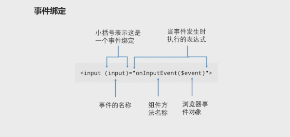

# chapter 5 数据绑定、响应式编程、管道

## 数据绑定

### 数据绑定的三种形式

```html
<!-- 使用插值表达式将一个表达式的值显示在模版上 -->
<h1>{{productTitle}}</h1>

<!-- 使用方括号将HTML标签的一个属性绑定到一个表达式上 -->


<!-- 使用小括号将组件控制器的一个方法绑定为模版上一个事件的处理器 -->
<button (click)="toProductDetail()">商品详情</button>

```

### angular默认采用单向的数据绑定 

* 在angular中默认的数据绑定市以单向方式实现的，所谓单向：要么将组件控制器属性的变化反应到模版上，要么将模板上的事件绑定到组件控制器的方法上；

```html
<h1>{{productTitle}}</h1>
<!-- 组件控制器的productTitle属性发生变化的时候，模板中的差值表达式中的productTitle会立刻自动的更新，但是如果我们使用jquery之类的库去改变h1标签中的内容时，并不会导致组件控制器上面那个个productTitle属性的值发生改变，这就是单向的绑定 -->
<!-- 在angularjs中，默认的数据绑定方式时双向绑定，也就是h1标签中内容的变化同时会导致productTitle的属性值发生变化，这也是angularjs在处理复杂页面会出现性能问题的根源，因为angularjs会在页面去维护一个存有所有数据表达式的列表，当一个浏览器事件发生时 会导致angularjs反复的去检查这个列表，直到其确定所有的东西都已经同步，这个过程时比较耗性能的 -->

<!-- 在angular中默认的数据绑定方式是单向绑定，虽然默认情况下其不使用双向的绑定 ，但我们依然可以使用明确指定的方式，来使用数据绑定，也就是双向绑定现在变成一个可选项，而不是框架的默认的行为 -->
```

#### angular中的事件绑定



```html
<input (input)="onInputEvent($event)" >
<!-- 上面是一段标准的事件绑定语法，为了给一个事件指定一个处理方法，我们需要在组件的模板中将事件的名字用()括起来，小括号表示此时一个angular事件绑定语法，小括号中的内容时事件的名称，当小括号中指定的事件被触发时，等号右侧 双引号中间的表达式会被执行，在上述的代码中这个表达式是组件控制器的一个方法，所以每次这个事件被触发时，onInputEvent方法就会被调用；如果事件的处理方法需要了解事件的属性，我们可以给事件处理方法添加一个$event参数，而这个参数时一个标准的浏览器事件对象，target属性指向事件产生的dom节点 -->

```

> 这里有两个需要注意：等号右边的表达式表达式可以不是一个函数调用，也可以是一个属性赋值 `<button (click)="saved=true">`这表示当按钮被点击时，组件控制器的saved的属性会被设置为true; 第二点需要注意的是 被绑定的事件既可以是标准的dom事件，也可以是任意的自定义事件，会在组件间通讯 演示自定义事件；


#### 对angular中的component以及directive的理解

1. 最简单的页面就是纯用html  写的页面；但html作为一个历史产物，使用其有限的标签，所能达到表现能力是有限的； 而angular给了我们一套构建标签的方法，通过这些方法，我们去diy一些标签，通过最原始的html书写方式，去完成我们的页面；

2. 如果requireJS 让自己学会，自己想做什么千万不要自己去做，而是自己去捏个会做这件事的人（define）,并将它叫到自己面前（injection）, 并把事情甩给他（call method）的逻辑； 则angular 则让自己学会 自己使用最简单的html标签去写页面（前端最开始就是这么办的），自己想要一个什么标签，就去自己diy一个标签，并将这个标签简单的排在自己的html文件中就行了；

3. 而angular给我们提供了两种diy标签的方式，一种是component 的方式 即按照html 标签的本质逻辑 去重构一个新的标签； 一种是directive 的方式 即顺着标签的逻辑 去人为的增设一些东西，其实就是一个新的标签，有别于原始的标签；

4. 我们要从这个纬度，去理解angular, 如现在我们去理解自定义事件；

#### 对html标签的理解
```css
html 就是语义层，但其并非事单纯的语义标注，其还带有一定的样式；
<p> 与 <h1> 用于标注不同的语义段落，而在浏览器中渲染出的样式是不一样的，其内在是包含不同的样式的；

/* user agent stylesheet  */
h1 {
    display: block;
    font-size: 2em;
    -webkit-margin-before: 0.67em;
    -webkit-margin-after: 0.67em;
    -webkit-margin-start: 0px;
    -webkit-margin-end: 0px;
    font-weight: bold;
}
p {
    display: block;
    -webkit-margin-before: 1em;
    -webkit-margin-after: 1em;
    -webkit-margin-start: 0px;
    -webkit-margin-end: 0px;
}
```

html标签有一定的行为： 如点击a标签其会跳转，点击button其会发送请求；

html 标签有属性，通过设置其属性，可以改变其状态；

html 标签有事件属性， 通过出发标签上的事件属性，可以去执行绑定的js脚本；

angular 将上面所述的特性逐一拆解，并通过多个维度 逐一实现；

#### directive实际模仿的也是html标签


#### 对组件事件绑定的理解 实际上模仿的就是html标签的事件属性

> 组件的自定义事件在angular的生态中是必须要存在的东西，因为组件实际上是对html标签的扩充，我们可以将一些dom事件属性onclick、onfucus、onmouseover等加到html标签上，但我们不能将这个dom属性加到我们diy的组件上面去：`<app-hero-detail onclick = dosometing() ></app-hero-detail>` , 而若门想实现这一点 就需要用到custom event了；实际上也是父子组件之间的一种交互通道； 以这个逻辑去理解；

```ts
// html: <button onclick="do()"> onclick是button的事件属性，

// 而 angular实现这个事件属性： creates an EventEmmiter and expose i as a property（事件属性）
deleteRequest = new EventEmitter<Hero>();

delete() {
    // html中事件属性可以被监听（绑定handler进行监听）与触发（通过user的action）

    // angular实现了自定义事件的触发，通过实例化的事件属性的方法；
  this.deleteRequest.emit(this.hero);
}

// Directives typically raise custom events with an Angular EventEmitter. The directive creates an EventEmitter and exposes it as a property. The directive calls EventEmitter.emit(payload) to fire an event, passing in a message payload, which can be anything. Parent directives listen for the event by binding to this property and accessing the payload through the $event object.

```

`<a href="http://" target="_blank" onclick="do()">`
href 与 onclick 的区别是一个是普通属性，一个是事件属性； angular 要模仿的就是事件属性，要能做到三点： 本质上是属性，可被监听，可触发事件；

`<app-hero-detail (deleteRequest)="deleteHero($event)"></app-hero-detail>`

> 理解事件绑定是从template到component的绑定，因为handler 是定义在component中的， 处理函数的运行肯定是后台组件中运行（这一点很好理解，想象一下自己进行断点调试，事件触发时肯定时蹦到component中的handler函数体中去了），而运行中所需要的参数是从前传到后的；`关键点在于理解handler 是在后台调用执行的`

> 依赖注入的逻辑是遇到事情就去安排个人去处理---是从上至下的(requireJS)，而事件绑定的逻辑是遇到事自己处理不了，将事情反馈给上级 让自己的上级去处理。---都是推诿

```html
<!-- src/app/hero-detail.component.ts (template) -->
<div>
  
  <span [style.text-decoration]="lineThrough">
    {{prefix}} {{hero?.name}}
  </span>
  <button (click)="delete()">Delete</button>
</div>
```

```ts
// src/app/hero-detail.component.ts (deleteRequest)
// This component makes a request but it can't actually delete a hero.
deleteRequest = new EventEmitter<Hero>();

delete() {
  this.deleteRequest.emit(this.hero);
}

//  Although the HeroDetailComponent has a delete button it doesn't know how to delete the hero itself. The best it can do is raise an event reporting the user's delete request.

```

```ts
// src/app/app.component.html (event-binding-to-component)
<app-hero-detail (deleteRequest)="deleteHero($event)" [hero]="currentHero"></app-hero-detail>
```

> 上面例子是官方文档的例子，整个流程类似于事件的“冒泡”， 将事件逐级向上提，直到有人能够处理；


#### promise逻辑的理解

> 一般异步的逻辑是“这个事我现在没法干，得先让‘小李干‘，等他干完了有结果了，我才能做。如果结果为a, 我就这样这样干；如果结果为b 我就那样那样干”- 对现在干不了的事情给领导说个计划，给个承诺；---- 都是满满的套路；而promise的出现就是对付这种套路（其无需等待）， 虽然现在具体结果还没有出来，但结果大概张什么样的自己肯定事心知肚明，就类似于我现在与后台配合做页面，伪说法是 后台需要等前台的页面做完其才能开始做，但现实是虽然页面还没有出来，但页面上将来要部署那些功能，需要那些接口，需不需要分页，都是明的，后台不需要等我页面完全出来，就可以去做这些工作了-------“上级：我知道这个事情现在你没法做，需要先等到小李做完，但你可以先将能做的都做了，并不一定非得等他将结果做出来，`可以将未知结果设置成为一个变量，利用这个变量 你该写你的逻辑写你的逻辑`, `等真实的结果出之后，直接将其传到逻辑中的变量中运行一遍事情就做完了`”  --- 假设未来，先做事，提升效率的逻辑；

```js         
function TimeOut (ms){
   return new Promise((resolve,reject)=>{
    //我： “首先这个事 立刻让 小李去做” Promise 构造函数的函数参数中的逻辑 就是小李做事的逻辑
       setTimeout(resolve,ms,'done');
   })
} 
// 我：“并不一定要等到他，将这个事情做完，我可以将未知的结果设置成为一个变量，然后该写我的逻辑，写我的逻辑”
TimeOut(200).then((value)=>{
    // 我： “等小李真的将事情做完了，他可以通过调用resole(data)方法的方式通知我，并将真实的结果传给我； 等到脚本所有的同步代码都运行完毕后（then中的函数必须等所有同步脚本，运行完毕后执行），我在运行一遍我的逻辑，事情就有结果了 ” then 方法函数参数中的逻辑事我的逻辑。
    console.log(value);
})

```

### Dom属性绑定

> 差值表达式与属性绑定其实是一个东西；在多数情况插值表达式更方便； 实际上在渲染页面之前，angular会将所有的差值表达式，翻译成相应的属性绑定，从技术上的角度来说没有哪一种形式比哪一种形式好，我们只需要按自己的喜好去选择一种风格，并尽量在代码中使用一种风格编写代码就可以了；插值表达式是dom属性绑定而不是html属性绑定；

```html
</br>

<!-- 两者等同 -->
```

> dom绑定的语法


* 第一步 当控制器的greeting属性发生变化的时候，其将触发angular的dom属性绑定机制，会采用单向绑定来修改input的dom属性，这个“单向”指的是从控制器的greeting属性，到dom的value属性，将dom 属性value的值 更改为组件 greeting属性的值；
* angular的dom属性绑定，不会更新html 元素的attribute, html属性里面value的值 会一直时空的
* 因为浏览器会保持UI与DOM的改变同步（浏览器引擎在本质上，仅仅负责在DOM树更新时承担重新渲染）； 所以 angular 在更新完DOM的value属性之后，新的value的值会被渲染到页面上
* dom value属性的改变不会更新与其相关的<input>标签的html属性
* 当用户在<input>标签中输东西的时候，浏览器也不会同步UI与html属性，用户看到的属性来自dom 而不是来自于html标签；
>  整个上面的过程就是angular的dom属性绑定，如果可能的话我们应该优先去使用该风格的属性绑定
> 需要注意的是： 如果我们忘记在 html模板上 忘记用[]将value括起来（value="greeting"）,angular不会将等号右侧的字符串 当成一个表达式来处理，并执行绑定，其只会将其当成一个字符串赋值给左侧的属性；---- 不要忘了[]!

#### 补充知识---对DOM property 与 html attribute的理解

#### 文档： https://javascript.info/dom-attributes-and-properties 关于attribute与　property同步更新的问题

When a standard attribute changes, the corresponding property is auto-updated, and (with some exceptions) vice versa.
In the example below id is modified as an attribute, and we can see the property changed too. And then the same backwards:

```html
<input>

<script>
  let input = document.querySelector('input');

  // attribute => property
  input.setAttribute('value', 'text');
  alert(input.value); // text

  // NOT property => attribute
  input.value = 'newValue';
  alert(input.getAttribute('value')); // text (not updated!)
</script>

```

But there are exclusions, for instance input.value synchronizes only from attribute → to property, but not back:

```html

<input>

<script>
  let input = document.querySelector('input');

  // attribute => property
  input.setAttribute('id', 'id');
  alert(input.id); // id (updated)

  // property => attribute
  input.id = 'newId';
  alert(input.getAttribute('id')); // newId (updated)
</script>
```
In the example above:
Changing the attribute value updates the property.
But the property change does not affect the attribute.

> 总结一下 就是对于某些属性，浏览器会同步attribute 与 property;;其实我们也可以理解为两者事绑定的，切通常是attribute-->的绑定；342

##### https://stackoverflow.com/questions/6003819/what-is-the-difference-between-properties-and-attributes-in-html

When writing HTML source code, you can define attributes on your HTML elements. Then, once the browser parses your code, a corresponding DOM node will be created. This node is an object, and therefore it has properties.
.... 还有很多，建议看一下

##### http://blog.csdn.net/bonjean/article/details/52741333 讲的很透

> 对于浏览器引擎而言，并不存在“HTML标签”这回事。其本质是DOM节点对象。也并不存在“HTML文档”这回事，其本质是DOM节点对象组成的文档树。浏览器引擎才是实际存储和渲染DOM节点对象的“大爷”。只是我们无法直接操作浏览器引擎，所以对这个本质并不熟悉（其实也不需要很熟悉，但是得知道）

> DOM节点对象是唯一的，但操作DOM节点对象的数据，却不止有一种方法。例如对于一个图像的宽度：

* HTML可以通过的width属性去定义；

* JavaScript可以通过element.width去读取和修改；

* 别忘了CSS，CSS也可以通过width属性去修改。

> HTML属性和JavaScript的DOM对象的属性，本质上都只是影响DOM节点对象数据的众多理由之一。

多个原因影响同一个DOM节点的实质数据（多对一），请务必记住这个本质理由。

HTML仅仅是文档树和节点对象的一种描述方法。

* 浏览器的解析器部分，根据HTML直接把DOM文档树，交给浏览器引擎。

* 用其他的方法，也可以描述DOM对象，例如JSX。（当然用其他方法描述DOM对象的时候，生成DOM文档树的过程，肯定会发生相应的修改）


> `JavaScript中的DOM对象，仅仅是一种操作浏览器引擎中DOM对象的接口`。

* JavaScript中的DOM对象，和浏览器引擎中存储的DOM节点，本质上不是一个东西。

* 用户实际上仅仅有权操作JavaScript中提供的DOM对象。

* JS引擎和浏览器引擎协作，确保了JavaScript的DOM对象，是引擎中DOM节点的一个原样映射。

* 这样用户就能通过操作JavaScript的DOM对象，透明的修改引擎中存储的DOM节点。

* 而`浏览器引擎在本质上，仅仅负责在DOM树更新时承担重新渲染`，实际上并不关心JS的存在。

* 你如果用其他办法修改了引擎使用的DOM树，也能更新文档结构。（当然这种办法基本上不存在…）

> 至于HTML属性名和JavaScript DOM对象的属性名大多相似或等同，这仅仅是人为的方便。JavaScript DOM对象属性名和HTML属性名的近似，是JavaScript给Web开发者的恩惠。

> 第二个要澄清的是 html属性与dom属性的区别：different between HTML attribute and DOM property.

```html 
<input value="Tom" (input)="doOnInput($event)">

``` 
当浏览器渲染`<input value="Tom" (input)="doOnInput($event)">`一个字符串的时候，岂会创建一个相应的dom节点，dom是一个类型为html input element类型的对象,每个dom都会有自己的属性与方法，以上面的代码为里dom对象的value属性会被初始化为"Tom"; 另外一个属性是html属性，html属性是不变的，即当input标签初始化的时候其值是什么，这个值就一直是什么， html属性指定了初始的值，dom的属性表明当前的值； html属性初始完dom属性，则他的使命就完成了； dom属性的值可以改变，而html属性的值是不可以改变，这就是两者的区别，这一点我们要明确的记在脑子里；

HTML属性的值指定了初始值；DOM属性的值表示当前的值。DOM属性的值可以改变；HTML属性的值不可以改变；

模板绑定是通过DOM属性和事件来工作的，而不是HTML属性；


## 响应式编程
> 来自同学笔记中的内容，后期资料自己慢慢补！

响应式编程 其实就是异步数据流编程观察者模式与Rxjs
可观察对象Observable(stream,数据生产者,可观察对象,被观察者):表示一组值或者事件的集合.
在可观察对象发射数据(流)并经过操作符操作后,接着就可以通过订阅(subscribe)这个数据(流)然后激活之前注册的Observable(观察者,一组回调的集合)的回调函数拿到最终结果(完成观察者对可观察对象的订阅)
订阅Subscription:表示一个可观察对象,主要用于取消订阅

具体实例实现：

```ts
constructor(){
    Observable.from([1,2,3,4])
        .filter( e => e%2 == 0)
        .map( e => e*e )
        .subscribe(
            e => console.log(e)
        )
}

// debounce是空闲时间的间隔控制

```

https://www.jianshu.com/p/925adede7c60

## 管道

用来格式化模版输出的可重用对象


> 同学的angular笔记： https://segmentfault.com/a/1190000011357579··