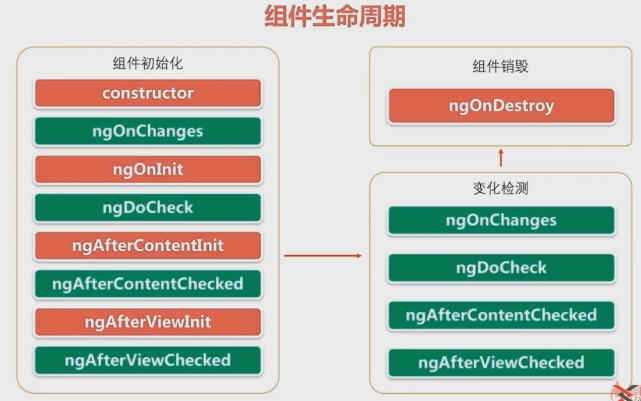
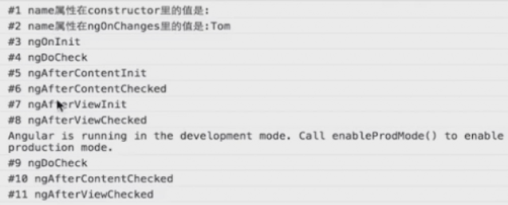
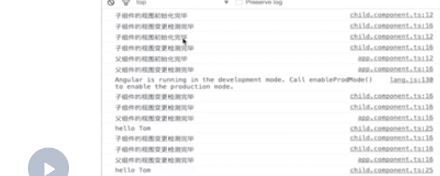
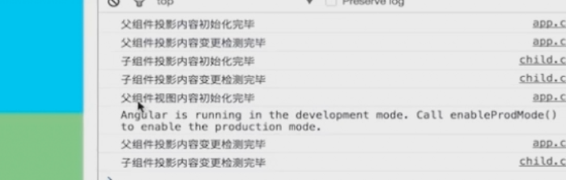
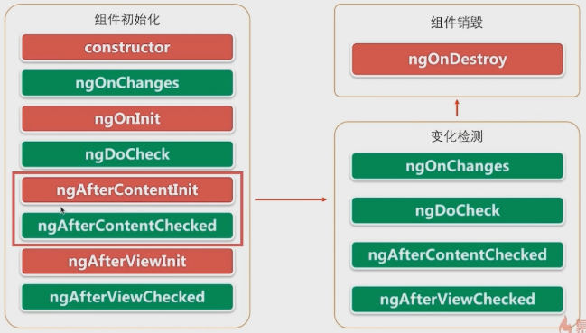
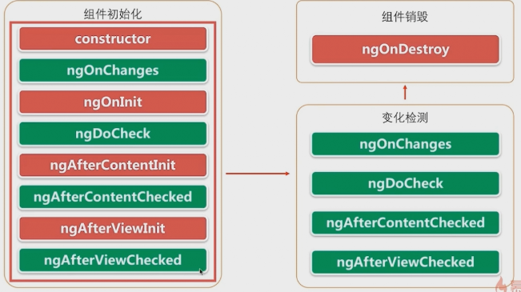

世界三大MOOC网站： Coursera、Udacity（有免费的D3可学）、edX 去找你需要的课程吧，小伙子

> 此文档中包含对 类的真意的理解；

# 组件间通


* angular的应用的核心就是组件，任何一个angular程序在本质上都是一个组件树，如图中所示 1号组件是整个组件树的‘根’ 一般就是我们的appComponent 其包含 2、3、6三个子组件，2号组件又包含4、5两个子组件，在设计一个组件时我们需要确保组件之间是‘松耦合’的，也就是说‘组件之间互相知道的越少越好’ 因为松耦合的组件 重用性才高；
* 假设我们点击组件4 模板里面的一个按钮的时候，应该触发组件5的一段初始化逻辑，按照传统的做法我们会在组件4的按钮点击事件里，调用组件5的一个方法，但是如果我们这样做 则组件4与组件5就会紧密的耦合在一起； 那么有没有可能在组件4不知道组件5存在的情况下，实现上面的需求
* 在之前我们学会使用 “依赖注入” 来实现“松耦合的组件” ，但是光有依赖注入是不够的，在这一章里我们将学习如何使用一种 松耦合 的方式 在组件之间来传递数据，是我们可以开发出 高重用性的组件，

## 组件的输入输出属性

> 黑盒模型、输入属性、输出属性、订阅

* 游戏机本身就是一个黑盒模型，我们看不到游戏机内部是如何去运转的，游戏机值暴露两个手柄给我们，而游戏机并不关心谁来操作这两个手柄，游戏机只关心一件事情 就是如果你按了a建，屏幕上应该去显示什么；就像它不关心谁在按手柄给其输入信息一样，它也不关心谁在看它的屏幕输出，甚至有没有看都无所谓，外面是一条狗还是一个人在玩游戏机，对游戏机来说是没有区别的，它只是规定好输入的格式（两个手柄），然后去输出外面可能会感兴趣的东西；
* 我们的组件就要设计成这样的黑盒模型，如果一个组件要从外部世界去接受一些东西，那么他应该使用输入属性声明它需要的东西，至于这些东西从哪里来，组件不需要知道，组件只需要知道 当这些它需要的东西 外部世界提供给它之后，它应该怎么去做；
* 同样一个组件想要将一些外部世界可能感兴趣的东西告诉外部世界，其应该通过其“输出属性”来发射事件，至于这些事件发射给谁，组件也不需要去知道
* 那些对组件发射东西感兴 趣的东西，应该自己来“订阅”组件发射的事件

### 组件的输入属性

组件的输入属性指的是用@input()装饰器注解的属性<注意首先其是一个property，输入知识一个修饰>，用来从父组件接受数据；

使用场景：在父组件中输一个我想买的股票的名字，通过输入属性将股票的名字传递给子组件，然后在子组件中显示出来

影响时单向的：父组件的值改变时，会影响子组件，子组件的值改变的时候 不会反过来影响父组件，

#### 两种向组件传递数据方式的对比：

到现在为止，我们已经讲了两种向组件传递数据的方式，一种时刚才看到的输入属性，还有一种时路由参数我们来对比一下这两种：

* 输入属性时通过`属性` 来传递数据的，并且这种传递只能在有父子关系的组件之间，由父组件向子组件来传递数据，

```html
<div>我是父组件</div>
<div>
  <input [(ngModel)]="stock">
  <!-- 在组件的模板中引用另一个组件的时候，他们两个实际上形成了一个父子关系，这个时候才能同组输入属性从父组件给子组件传递数据 -->
  <app-order [stockCode]="stock" [amonut]="100" ></app-order>
</div>

```

* 路由参数是通过构造函数来传递数据的，

```ts
export class OrderComponent implements OnInit {
  @Input()
  stockCode: string;
  @Input()
  amonut: number;
  // 在构造函数里面依赖注入一个ActivatedRoute类型的一个对象，然后通过这样一个对象的‘参数订阅’或者‘参数快照’外面传入的参数
  constructor(routeInfo: ActivatedRoute) { }

  ngOnInit() {
  }

}

```

### 组件的输出属性

angular组件可以使用EventEmit对象来发射自定义的事件，这些事件可以被其它组件处理，EventEmit是Rxjs库中Submit类的一个子类，在响应式编程中其即可以作为观察者也可以作为被观察者，换句话说EventEmitter对象既可以通过emit()方法来发射自定义事件，也可以通过其subscripe方法来订阅EventEmit对象所发射的事件流，我们主要集中在如何使用EventEmit来向外发送事件。

使用场景：假设我们要写一个组件，这个组件可以链接到股票交易所，并且实时显示变动的股票价格，为了让这个组件可以在不同金融类的项目中重用，除了显示股票价格之外，组件还应将最新的股票价格发送至组件之外，这样其它的组件就可以根据变动的股票价格来执行相应的业务逻辑

```bash
#  创建一个报价组件
ng g component priceQuote
```
```ts
// order.component.ts
import { Component, OnInit } from '@angular/core';
@Component({
  selector: 'app-order',
  templateUrl: './order.component.html',
  styleUrls: ['./order.component.css']
})
export class orderComponent implements OnInit {
  

  constructor() {
   }

  ngOnInit() {
  }

} 

```

> 上述注释中，包含对类的本意理解： 类就是类型，是用来描述一个对象的类型，而对于其所涵盖的对象，有些属性是一致的如人的本质属性都是‘人’，我们可以直接将其具体为一个值； 而对于某些属性人与人之间是不一样的，如性别 如年龄 如工作，我们描述人这个类型的时候，无法将其具体，只能说将其设置为一个变量： 将其放到构造函数的参数接口中，传入具体的实参，从而实例化一个具体的对象； 就是这样一个逻辑； 这也是构造函数参数存在的意义；

```js 
class human {
  catgory: string =  'animal';
  public work: string;
  public age: number;
  constructor(work,age){

  } 
}
```
```html
<!-- price-quote.component.html -->
<div>这里是报价组件</div>
<div>
  股票的代码是{{stockCode}},股票价格是{{price | number:'2,2-2'}}
</div>

```

```html
<!-- app.component.html -->
<!-- 4.2 内部子组件的信息现在并没有传到父组件上面，  现在我们要捕捉子组件所发射的事件，然后来处理； 捕捉用EventEmitter发射出来的事件与捕捉原生的DOM事件是一摸一样的， 绑定节点的事件属性即可; 事件的产生机制与什么时候会到来与父组件没有关系，父组件只需要利用一个事件处理函数去监听一下就可以了 ==>4.3 app.component.ts  -->
<app-price-quote (lastPrice)="priceQuoteHandler($event)">
</app-price-quote>
<div>
  这里是报价组件的外部，
  这里是股票的名称{{priceQuote.stackCode}},
  这里是股票的最新价格{{priceQuote.lastPrice}},
</div>


```

```ts
// app.component.ts
import { Component } from '@angular/core';

@Component({
  selector: 'app-root',
  templateUrl: './app.component.html',
  styleUrls: ['./app.component.css']
})
export class AppComponent {
 stock = '';

//  4.1 在父组件中我们首先也熬声明一个PriceQuote类型的变量，因为我们发射出来的事件是这个类型的，所以我们在父组件里面要声明这样类型的一个属性来接受我们在子组件中所发射的对象；---> app.compoennt.html
  priceQuote: PriceQuote = new PriceQuote("",0);//给其一个默认值

  // 4.3 将我们捕获到的对象 赋值给本地的对象;
  //在默认情况下，自定义事件的名字与子组件的输出属性的名字是一样的，如果我们想使用另外一个名字只需要修改其装饰器@Output中的元数据的name属性值就可以了 
  priceQuoteHandler(event: PriceQuote){
    this.priceQuote = event;
  }
  
}

```

 
## 使用中间人模式传递数据

> 我们已经学习了输出属性来向组件外面发射事件，并通过事件携带数据，但是现在这个事件只能由他的父组件的模板通过事件绑定的方式来捕获并处理，如果两个组件之间不存在类似的父子关系，那么我如何以松耦合的方式来传递数据？---->中间人模式；

> 我们在创建一个组件的时候，组件不应该去依赖外部已经存在的组件，要实现这样松耦合的组件需要使用“中间人模式” 如下图所示；


* 除了组件1之外每一个组件都有一个父组件，可以扮演中间人的角色，顶级的中间人就是组件1（app.component）它可以使组件2、3、6之间互相通讯，一次类推组件2是组件4\5的中间人，可以使组件4 组件5之间互相通讯；
* 中间人负责从一个组件中去接受数据，并将其传递给另外一个组件；
* 以我们之前的股票价格为例，假设有一个交易员在监视着报价组件的价格，当股票的的价格达到一定的值的时候，交易员会点一个购买按钮来购买股票；在报价组件上添加一个购买按钮很容易，但报价组件并不知道如何下单来买股票，其只是用来监控股票价格的；所以报价组件这个时候应该去通知下中间人（报价组件与交易组件的父组件），告诉它交易员要在某一个价位买了某一个股票；中间人应该知道那个组件可以买股下单，并将股票代码和当前的价格传给该组件
* 我们在上一节的代码中继续完成中间人模式的代码；

```html
<!-- price-quote.component.html -->
<div>这里是报价组件</div>
<div>
  股票的代码是{{stockCode}},股票价格是{{price | number:'2,2-2'}}
</div>

<!--1. 我们在报价组件上添加一个按钮，让其在某一个价格的时候，交易员可以去科技这个按钮去买股票 -->
<div>
  <input type="button" value="立即购买" (cclick)="buyStock($event)" >
</div>

```

```ts
// price-quote.component.ts

import { Component, OnInit } from '@angular/core';

@Component({
  selector: 'app-price-quote',
  templateUrl: './price-quote.component.html',
  styleUrls: ['./price-quote.component.css']
})
export class PriceQuoteComponent implements OnInit {
  stockCode: string = 'IBM';
  price: number;

  @Output()
  lastPrice: EventEmitter<PriceQuote> = new EventEmitter();

  // 2.2 实例化一个EventEmitter对象---输出属性buy
  @Output()
  buy: EventEmitter<PriceQuote> = new EventEmitter();

  constructor() {
    setInterval(()=>{
      let priceQuote: PriceQuote = new PriceQuote(this.stockCode, 100*Math.random());
      this.price = priceQuote.lastPrice;
      this.lastPrice.emit(priceQuote); 
    },1000)
   }
  ngOnInit() {
  }
  //2.1 在组件的控制器上 写buyStock() 当我们点击“立即购买”按钮的时候，我们应该是向外发送一个事件，告诉外部 说有人点击了该按钮了；并说明当按钮被点击的时候 股票的价格是多少钱，将这个事件给发射出去； 所以我们需要一个EventEmitter对象
  
  // 注意自定义的事件函数一般要写在，构造函数与生命周期的函数下面
  buyStock(event:any) {
    // 当按钮被点击之后，我们就应该将交易请求以及当前的股票价格给发送出去
    // **这就是报价组件应该做的事情，其只要将这个价格发送出去就可以了，而不用去关心到底是谁去接收**
    this.buy.emit(new PriceQuote(this.stockCode,this.price));   
  }
}
```

> **这就是报价组件应该做的事情，其只要将这个价格发送出去就可以了，而不用去关心到底是谁去接收** --- 思考一下我们的黑盒子模型； 

> 对于不属于自己业务范围内的事情，自己只负责传递消息（事件），不负责去执行，这个一个很重要的管理手段；一个人都做完了。就不是松耦合-可重用了； 至于发送的事件最终被谁所接收 以及最终被谁执行 自己根本不用去关心；做到这一步就够了， 做人也要这样，明白自己该做什么，不该做什么，做到哪一步就可以了；

```html
<!-- app.component.html -->

<!-- 在PriceQuote组件的父组件上 监听PriceQuote组件传递的信息（发送的事件）buy -->
<app-price-quote (buy)="buyHandler($event)">
</app-price-quote>

<!-- 父组件作为一个中间人，其要做的不是将报价组件所传递的信息，显示出来给我们看，而是要将这信息 传递给下单组件 ,告诉它 “使用此价格来买东西”-->

<!-- 通过属性绑定，将报价组件所传递过来的报价信息，传递给order组件 这就是中间人需要做的事情 -->
<app-order [priceQuote]="priceQuote">
</app-order>
```

```ts
// app.component.ts
import { Component } from '@angular/core';

@Component({
  selector: 'app-root',
  templateUrl: './app.component.html',
  styleUrls: ['./app.component.css']
})
export class AppComponent {
 stock = '';

  priceQuote: PriceQuote = new PriceQuote("",0);//给其一个默认值

  buyHandler(event: PriceQuote){
    this.priceQuote = event;
  }
  
}

```


```ts
// order.component.ts

import { Component, OnInit } from '@angular/core';

@Component({
  selector: 'app-order',
  templateUrl: './order.component.html',
  styleUrls: ['./order.component.css']
})
export class OrderComponent implements OnInit {

  // 使用一个输入属性，用来接受 从中间人传递过来的下单信息；
  @Input()
  priceQuote : PriceQuote

  constructor() {
   }
  ngOnInit() {
  }
  
}
```

```html
<!-- order.component.html -->
<!-- 当我们接收到中间人传递过来的PriceQuote之后将其显示到页面中 -->

<div>
买100手{{priceQuote.stockCode}}股票,买入的价格是{{priceQuote.lastPrice | number: '2.2-2'}}
</div>

```

> 这就是中间人模式了：在我们报价组件里面 我们没有与下单组件相关的任何一点代码，我们没有调下单里面的任何东西，我们甚至不知道有下单组件这面一个东西存在，我们只是将股票价格与股票代码发送出去； 我们下单组件里面 也没有任何与报价组件相关的代码，也就是说报价组件与订单组件，在彼此不知道对方存在的情况下，共同完成了一个股票下单的功能； 就向最开始图描述的东西一样 组件4根本不知道组件5的存在情况下，点4里面的按钮来触发5里面的一些功能，这就是中间人模式； 这样报价组件与下单组件就会有很高的重用性，我们在编写报价组件的时候，根本就不用考虑一会有个下单组件 要挂上；

### 非兄弟组件之间信息的传递

> 在上面的例子中我们使用了一个父组件appComponent来作为两个兄弟组件orderComponent、priceQuoteComponent的中间人,那么两个组件如果没有共同的父组件甚至不在同一时刻显示怎么办？ ----> 此时我们应该使用一个可注入的服务作为中间人，无论何时当组件被创建，这个中间人服务会被注入进来，然后组件可以订阅该服务发射的事件，在我们后面服务器通讯 我们会演示如何利用一个服务作为中间人

> 在我们使用angular开发一个应用前，我们应该首先设计好需要编写那些可以重用的组件，那些组件或服务用来做那些组件的中间人，组件的输入与输出，组件之间如何去通讯，将这些都考虑好之后，我们再去开始编写代码；angular在开始之前必须要去深入的思考如何设计的问题；

## 组件生命周期以及angular的变化发现机制

在一个组件声明周期中会发生各种事件，从组件被创建开始 angular的变更检测机制就会开始去监控组件，组件被创建之后会被添加到dom树里面，并且使浏览器渲染出来 使用户去看到，在这之后组件的属性可能会发生变化，这回导致组件被重新渲染，最后组件会被销毁



* 上图展示了所有的组件生命周期钩子，使用这些钩子，我们可以在特定的组件生命周期事件发生时执行我们需要的业务逻辑，图中“红色”的方法只会被调用一次，而绿色的方法则会被多次去调用；
* 这些钩子被分布在生命周期的三个阶段： 初始化阶段---> 变更检测阶段--->销毁阶段； 用户会在初始化完成阶段看到组件； 变化检测机制会保证组件的属性会与页面保持同步； 如果由于路由等操作 组件被从dom树上移除，则angular回去执行组件的销毁阶段；
* 应该注意的地方是：变更检测里面执行的绿色的方法，与初始化的时候执行的绿色的方法是一个方法，并不是两个方法；

### 使用实例描述所有钩子的调用机制与常见的场景

```bash
# 生成life组件 演示生命周期钩子
ng g component life
```

```ts
// life.component.ts
import { Component, OnInit } from '@angular/core';

@Component({
  selector: 'app-life',
  templateUrl: './life.component.html',
  styleUrls: ['./life.component.css']
})
// tslint:disable-next-line:max-line-length
// 刚生成的lifeComponent上面已经实现了一个OnInit接口，每一个钩子都是@angualr/core 库里面定义的接口，每一个都有一个唯一的钩子方法，他们的名字是由接口的名字加上ng前缀构成的； 从技术角度上来说“接口”对javascript与typescript的开发者都是可选的；
// javascript语言本身并没有接口，angular的运行时看不到typescript接口，因为接口在被编译成javascript的时候已经消失了
// tslint:disable-next-line:max-line-length
// 幸运的是他们也不是必须的，我们不需要在组件或者指令上添加生命周期钩子接口，就能获取钩子带来的好处；angular回去检查我们组件的类 一旦发现钩子方法被定义了就会去调用它； angular会找到并调用像ngOnInit()这样的钩子方法，有没有这个接口无所谓`implements OnInit`
// 但我们建议在typescript的类定义中去添加接口
export class LifeComponent implements OnInit {

  constructor() { }

  ngOnInit() {
  }

}

```




* 当一个组件被创建的时候，其构造函数首先会被调用，在构造函数的代码执行完毕后,angular会以此调用上述的；构造函数存在的，所以一定会被调用；我们在程序开发中，根据我们的实际需要去实现相应的钩子接口，若上述图中的钩子方法没有定义，angular执行时会自动跳过； 若我们定义了相应的钩子方法，angular在周期事件发生时，会去调用组件内部定义的钩子方法;

* 首先是调用构造方法，然后是ngOnchanges; ngOnchanges是当一个父组件修改或初始化一个子组件的输入属性被调用的，如果一个组件没有输入属性，则ngOnChanges这个方法永远不会被调用，而它的首次调用肯定是发生在ngOnInit方法之前； 而且ngOnChanges方法肯定是会被多次调用的，每次输入属性发生变化的时候，都会被执行；
* 再后面是ngOnInit(),若组件存在输入属性 则在ngOnChanges方法首次调用后被调用，用来初始化组件或者指令；`ngOnInit是在初始化时候用的`，之所以不在构造函数中初始化，是因为`组件的输入属性`在构造函数执行时是没有值的（其依赖于父组件的传值），输入属性是在首次调用ngOnChanges方法是被初始化了的，所以`当我们的组件的初始化逻辑，需要依赖输入属性的值，则这些初始化逻辑一定要写在ngOnInit()里面`而不要写在构造函数里面；

* ngOnCheck 是用来检测的是在angular的每次的变更检测周期中被调用的

### onChanges钩子

> 是在父组件修改或者初始化子组件的输入参数时被调用，为了理解ngOnChanges为什么被调用，或者为什么不会被调用，我们需要可变对象与不可变对象

```ts
export class AppComponent {
  title ="tom";
  constructor(){
    //1.1 在js中 字符串是一个不可变对象，这就意味着当一个字符串在内存中被创建出来以后，其值永远不会发生改变
    //1.2第一行代码 在内存中创建一个值为'Hello'的字符串
    var greeting = "Hello";
    //1.3 第二行代码 并不改变第一行内存中的值，而是在内存中重新创建一个值为"Hello World"的字符串，现在在内存中存在两个字符串，而且每个字符串都是不可变的，
    //1.4 而对于greeting这个变量来说其值是改变的，因为其只想的内存中的地址，从第一个字符串的地址，改为第二个字符串的地址
    greeting = "Hello World"

    // 2.1 在js中对象是可以发生变化的，这就一位这当一个对象的实例在内存中被创建以后，即使其属性变化了，其也会一致保存在固定的内存地址l；

    var user = {name: 'Tom'};
    user.name = 'Jerry';
    // 对象的name属性指向内存中值为Tom的字符串，地执行第二行代码时另一个值为‘Jerry’的字符串，在另外一个内存地址中被创建，并且user.name指向这个新的地址；当user变量本身依然指向对象刚开始创建时的内存地址，换句话说我们修改的时user变量指向的内存地址的对象的内容，而地址并没有发生改变
  }
}

```

```bash
# ng g component child

```

```ts
// child.component.ts中
export class ChildComponent implements OnInit {
  @Input()
  greeting: string;

  @Input()
  user: {name: string};

  message = '初始化消息';

  constructor() { }

  ngOnInit() {
  }

}

```
```html
<!-- child.component.html -->

<div>
  <h2>我是子组件</h2>
  <div>问候语：{{greeting}}</div>
  <div>姓名：{{user.name}}</div>
  <div>消息:<input type="text" [(ngModel)]="message"></div>
</div>

```


### view钩子

#### @ViewChild()装饰器

一个angular应用实际上就是一个组件树，在组件树上面 父组件可以去绑定子组件的输入属性来向子组件传递数据，但在某些情况下，父组件需要去调用子组件的方法；--》如何在父组件的模版与控制器里面去调用子组件的api

```ts
// child.component.ts

export class ChildComponent implements OnInit(){
  constructor() {}

  ngOnInit() {
  }
  //子组件的一个方法，一会我们会使用父组件来去调用该方法
  greeting(name: string){
    console.log('hello' + name)
  }
}

```

```html
<!-- app.compoment.html -->

<!-- 因为等下要利用两种方式来演示调用子组件 api的方式 所以此处写两个childComponent -->
<app-child #child1> </app-child>

<!-- 在父组件的模版中去调用子组件的方法 -->
<app-child #child2> </app-child>
<button (click)="child2.greeting('jerry')">调用child2的greeting方法</button>

```

```ts
// app.component.ts
// 在父组件的控制器里面 由@ViewChild()装饰器装饰的变量
// 使用该装饰器我们可以在父组件上面 获取一个子组件的引用，获取子组件引用之后我们就可以在父组件的任一方法里，调用被引用子组件的方法；

export class AppCoponent implements ngOnInit {
  @ViewChild('child1')
  child1: ChildComponent;

  constructor() {}
  ngOnInit():void {
    this.child1.greeting('Tom')
  }
// 上面的代码中 angular通过模版变量#child1 找到相应的子组件，并将其赋值给child1变量，
}

```

> 上面我们已经了解了，如何在一个父组件上面去调用一个子组件的方法，在这个基础之上我们来看一下两个view钩子

```ts
// app.component.ts中
export class AppCoponent implements OnInit, AfterViewInit, AfterVIewChecked {
  // 两个view钩子，是在组件的模版所有的内容都被组装完成之后，组件的模版已经呈现给用户的动作完成之后，两个方法才会被调用

  ngAfterViewInit(): void {
    console.log('父组件的视图初始化完毕')；
  }
  ngAfterViewCHecked(): void {
    console.log('父组件的视图变更检测完毕')
  }

  @ViewChild('child1')
  child1: ChildComponent;

  constructor() {}
  ngOnInit():void {
    // 不直接去调用而是通过一个定时器去调用
    setIniterval(()=>{
    this.child1.greeting('Tom')
    },5000)
  }
}

```

```ts
// child.component.ts 同样去实现两个view钩子

export class ChildComponent implements OnInit, AfterViewInit, AfterViewChecked{

   ngAfterViewInit(): void {
    console.log('子组件的视图初始化完毕')；
  }
  ngAfterViewCHecked(): void {
    console.log('子组件的视图变更检测完毕')
  }

  constructor() {}

  ngOnInit() {
  }
  greeting(name: string){
    console.log('hello' + name)
  }
}

```



* 首先子组件的视图初始化完毕，子组件的视图变更检测完毕，着说明init方法是先于checked方法调用的
* 因为我们在父组件的模版上面声明了两个子组件，我们可以在输出日志里面看到两个子组件的初始化动作，
* 当两个子组件都初始化并且做变更检测完毕之后，父组件的初始化方法与变更检测方法才会被去调用，这说明父组件的视图想要被完全组装好，那么首先所有子组件的视图需事先先被组装好
* 另外 在视图初始化完毕之后，ngAfterView()方法只会在组件视图初始化的时候被调用一次；然后就再也不会被调用了
* 而当父组件每隔5秒中去调用子组件的其中一个方法（greeting）的时候，可能会触发我们整个视图的变更，因为angualr没办法判断我们调子组件的方法，是否会造成视图的改变，但是我们调用方法的动作就会触发angular的变更检测机制，然后其就会将所有组件上面实现了ngAfterViewChecked()的方法都会调用一遍；
* 每次触发变更检测之后，两个子组件以及父组件的ngAfterViewChecked()方法都会被调用，这种事情发生在即是我们的视图没有发生一点变化，也会被调用
* 结论就是若我们想实现变更检测的钩子，实现一定要尽可能的精简；


```ts
export class AppCoponent implements OnInit, AfterViewInit, AfterVIewChecked {

  // 在父组件上声明一个普通变量message 并将其绑定到模版中
  message: string;

  ngAfterViewInit(): void {
    console.log('父组件的视图初始化完毕')；

    // 在viewInit()钩子方法里面去改变已经绑定给视图的message属性的值
    this.message = "hanmeimei";

    // angular会抛出一个异常，这是因为在变更检测周期中，angular是禁止在一个视图在已经被组装好之后，再去更新此视图，这是angular自身的规定
    // 而ngAterViewInit()钩子 正好是在组件的视图刚被组装好之后触发的，同样ngAfterView()也是在视图被组装好之后运行的；所以我们在这两个钩子中去更新模版中被绑定的属性，去触发组件视图的变化，angular就会去抛出异常；；
    // 解决这个异常也很简单就是将其放到另一个js运行周期去运行就行了：即将更改属性的代码放到一个setTimeout()方法中；
    setTimeout(()=>{
      this.message = "Hello";
    },0)
  }
  ngAfterViewCHecked(): void {
    console.log('父组件的视图变更检测完毕')
  }

  @ViewChild('child1')
  child1: ChildComponent;

  constructor() {}
  ngOnInit():void {
    setIniterval(()=>{
    this.child1.greeting('Tom')
    },5000)
  }
}

```


### content钩子

#### 投影的概念

在介绍content钩子之前我们要介绍angular的一个新的概念：投影

在某些情况下 我们会希望组件在运行时 动态的改变模版的内容；

```html

<!-- 我们这里有两个div 我们可能会希望第一个div会根据运行时的参数，有时候是一个图片二另外一些时候是一个表格 -->
<!-- 一般的做法时利用路由，生成两个组件，配一个路由来显示不同的内容，因为路由时一个相对来说麻烦的东西；我们要做的其实没那么复杂 -->
<!-- 这里就要用到angular提供的新的特性===投影，在angular里面我们可以适用ngContent指令将父组件，模版中的任意片段投影到子组件上面 -->
<!-- 整个过程很简单，只需要两步： -->
<div> </div>
<div> </div>
```

实例：投影的运用

1. 在子组件中标记投影点

```html
<!-- child.component.html -->

<!-- 在子组件的模版中，我们使用ngContent指令用来标记一个投影点， -->
<div class="wrapper">
<h2>我是子组件</h2>
<div>这个div定义在子组件中</div>
<ng-content></ng-content>
</div>

```

2. 在父组件中，将要投影到子组件的投影点的html片段写到子组件<app-child>的标签中

```html
<!-- app.component.html  -->

<div class="wrapper">
  <h2>我是父组件</h2>
  <div>这个div是定义在父组件中</div>

  <app-child>
    <!-- 在程序运行的时候下面的div就会被投影到,子组件中<ng-content标签指定的投影点上面> -->
    <div>这个div是父组件投影到子组件的 </div>
  </app-child>
</div>

```
3. 一个组件可以在其模版上面声明多个 <ng-content>标签

```html
<!-- child.component.html -->

<div class="wrapper">
<h2>我是子组件</h2>
<ng-content select=".first"></ng-content>
<div>这个div定义在子组件中</div>
<ng-content select=".second"></ng-content>
</div>

```

```html
<!-- app.component.html  -->

<div class="wrapper">
  <h2>我是父组件</h2>
  <div>这个div是定义在父组件中</div>

  <app-child>
  <!--  分别指定两个类名，以便ng-content标签选择器使用；即用来指定哪一个div投影到哪一个ng-content上面的 -->
  <!-- 同时利用插值表达式 将父组件的属性绑定到要投影到子组件的html片段上面 -->
    <div class="first">这个div是父组件投影到第一个ng-content的{{title}} </div>
    <div class="second">这个div是父组件投影到第二个ng-content的 </div>
  </app-child>
</div>

```
4. 结果就是两个div会被分别投影到正确的位置上面，而且 父组件的title属性也被传递到了子组件当中，我们需要注意的是在父组件的模版中，我们编写的投影内容所使用的插值表达式，只能绑定父组件中的属性，虽然内容会被投影到子组件中，

5. 除了上述使用angular还可以利用属性绑定的方式，很方便的插入一段html

```html
<!-- app.component.html  -->

<div class="wrapper">
  <h2>我是父组件</h2>
  <div>这个div是定义在父组件中</div>
  <app-child>
    <div class="first">这个div是父组件投影到第一个ng-content的{{title}} </div>
    <div class="second">这个div是父组件投影到第二个ng-content的 </div>
  </app-child>
</div>

<!-- 父组件中： -->
<!-- divContent="<div>我是传入的html</div>" -->
<div [innerHTML]="divContent"></div>

```

6. 上述两种方式： 利用ng-content来投影和利用innerHTML做属性绑定各有利弊； innerHTML是一个浏览器特定的api, 也就是说绑定innerHTML属性的方式只能在浏览器里面使用，而<ng-content>方式时与平台无关的，所以开发app是只能使用<ng-content>的方式；

7. 优先使用<ng-content>动态生成html


#### ngAfterContentInit与ngAfterContentChecked钩子

> 与ngAfterViewInit与ngAfterViewChecked类似，只不过view钩子是在组件的全部视图都组装完毕之后调用的，而两个Conten钩子是在被投影进来的内容被组装完成之后被调用的，

```ts
// 父组件app.component.ts中

export class AppComponent implements AfterContentInit,AfterContentChecked, AfterVIewInit{
  ngAfterContentInit():void {
    console.log('父组件投影内容初始化完毕')
  }
  ngAfterContentChecked():void {
    console.log('父组件投影内容变更检测完毕')

  }
  ngAfterViewInit():void {
    console.log('父组件视图初始化完毕')

  }
  title = "app works";
} 

```

```ts
// 子组件child.component.ts中

export class ChildComponent implements OnInit, AfterContentInit, AfterContentChecked {
   ngAfterContentInit():void {
    console.log('子组件投影内容初始化完毕')
  }
  ngAfterContentChecked():void {
    console.log('子组件投影内容变更检测完毕')

  }
}

```



这说明 在组装整个视图的时候，首先组装的是投影进来的内容，然后组装组装子组件视图的内容；

> AfterContentInit与AfterVIewInit两者需要注意的地方
* AfterVIewInit：在组件的模板整个被组装完成之后,是不能再去更改模板里的内容去再去引起模板内容的变化的； 这点事angular规定的 就是模板组装完毕后，在同一个组件周期内是不能改变模板里面的内容；
* 而在AfterContentInit中是可以该改变，因为钩子方法被调用的时候整个视图还没有组合完毕，只是投影进来的内容被组装完毕了，所以钩子方法中是可以改变其内容的；


### OnDestrory钩子


## 总结

### 属性初始化阶段


* constructor 构造函数用来初始化对象, ngOnChanges初始化输入属性，ngOnInit是用来初始化除了输入属性之外的其它属性，ngDoCheck做第一次变更检查
* 属性初始化阶段完成之后，组件的所有属性，都应该被赋予需要被赋予的值

### 组件视图渲染阶段



* 属性初始化完毕之后，开始渲染组件的视图，首先渲染投影进来的内容; 投影进来的内容渲染完毕之后 会调用ngAfterContentInit()方法与ngAfterContentChecked()方法；

* 上面两个方法执行过之后，若有子组件会去执行子组件一整套逻辑（即组件初始化的8条项目）；
* 子组件的那一整套执行完毕之后，或者其没有子组件，即整个组件的视图都组装完毕之后，就会去调用组件ngAfterViewInit()方法与ngAfterViewChecked()； 上面的两个方法执行完毕之后，整个组件初始化过程都执行完毕了；这是组件就会整个呈现给用户，用户就可以进行一些交互；

* 而用户做的交互，如鼠标点击、键盘输入 任何一件事，都可以去触发angular的变更检测机制
* 一旦检测到变更发生，在当前组件树上，所有的活动组件上被实现的、带有check关键字的方法 都会被调用 用来检查当前组件的一些变化
* 如果某一个变化 导致了当前某一个组件的输入属性发生变化，则相应组件上面定义的ngOnChanges方法也会被调用

* 最终当组件被销毁的时候，会调用ngOnDestrory

### 组件什么时候会被销毁

> 在路由的时候，当从一个路由地址跳往另外一个路由地址的时候，前一个路由地址对应的组件会被销毁，然后后一个路由地址对应的组件 会被创建


 


世界三大MOOC网站： Coursera、Udacity、edX 去找你需要的课程吧，小伙子

angular是一个框架，我们应该去两个 体系内的各部分 在体系中的位置，发挥的作用，这就是入门需要思考的问题； 类似于以前学习微积分 ，极限 函数 导数是同一个微积分体系的三个重要的组成部分，了解这三部分各自的位置 与发挥的作用 至关重要；  这也是最顶层的最大的东西；