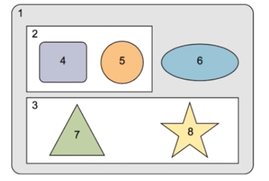

世界三大MOOC网站： Coursera、Udacity（有免费的D3可学）、edX 去找你需要的课程吧，小伙子

# 组件间通

* angular的应用的核心就是组件，任何一个angular程序在本质上都是一个组件树，如图中所示 1号组件是整个组件树的‘根’ 一般就是我们的appComponent 其包含 2、3、6三个子组件，2号组件又包含4、5两个子组件，在设计一个组件时我们需要确保组件之间是‘松耦合’的，也就是说‘组件之间互相知道的越少越好’ 因为松耦合的组件 重用性才高；
* 假设我们点击组件4 模板里面的一个按钮的时候，应该触发组件5的一段初始化逻辑，按照传统的做法我们会在组件4的按钮点击事件里，调用组件5的一个方法，但是如果我们这样做 则组件4与组件5就会紧密的耦合在一起； 那么有没有可能在组件4不知道组件5存在的情况下，实现上面的需求
* 在之前我们学会使用 “依赖注入” 来实现“松耦合的组件” ，但是光有依赖注入是不够的，在这一章里我们将学习如何使用一种 松耦合 的方式 在组件之间来传递数据，是我们可以开发出 高重用性的组件，

## 组件的输入输出属性

在两个具有父子关系的组件之间来传递数据
 
## 使用中间人模式传递数据

介绍中间人模式以及实现中间人模式，以便在没有父子关系的组件之间传递数据

## 组件生命周期以及angular的变化发现机制

世界三大MOOC网站： Coursera、Udacity、edX 去找你需要的课程吧，小伙子
