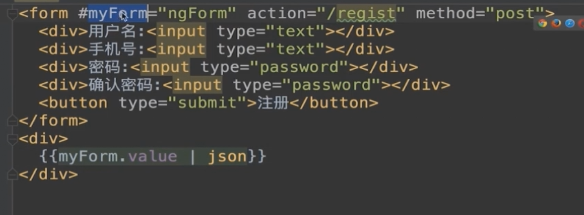
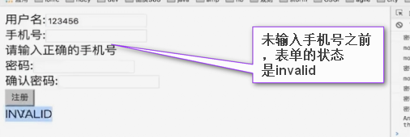
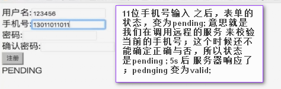
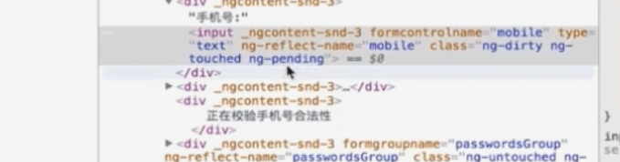

# angular表单处理

> html提供了一系列基本的表单功能: 显示表单项、校验用户输入的值、将表单数据提供到服务器上的某一个服务器地址上面去; 但是html表单对于真实世界的业务逻辑来说并不足够， 我们需要更好的方式来处理用户输入的数据，自定义一系列校验规则，显示对用户来说友好的错误信息、并可以去选择服务器提交到后台的方式与格式；
> 在对一个系统做web框架的技术选型的时候，如何处理表单应该是最重要的考虑因素之一；我们将描述一组现代的web应用应该满足的用户体验需求，并且看一下标准的html表单与angular是如何支持这些体验的；

> 我们可能会感觉奇怪，如果html已经给我们提供了表单校验， 和提交的功能；对于表单来说，除了框架给我们提供了数据的双向绑定，我们还希望框架给我们提供什么喃？

## 纯html表单

<form action="/registry" method="post">
    <div>用户名：<input type="text"> </div>
    <div>手机号：<input type="text"> </div>
    <div>密码：<input type="password"> </div>
    <div>确认密码：<input type="password"> </div>
    <div><button type="submit">注册</button></div>
</form>

> 对于一个spa单页面程序来说，纯的html表单不能满足我们的要求，一般情况下我们需要我们的表单具有以下的功能：

* 第一： 每一个输入的字段 都应该可以独立的指定一系列的校验规则；
* 第二： 如果用户的输入不符合校验规则，则应该在出问题的输入框旁边，显示错误信息；
* 第三： 彼此依赖的字段（输入密码与再次输入密码），应该被一起校验
* 第四： 应用应该可以控制，提交到服务器表单中的值；也就是说当点击按钮的时候，应用应该去调用一个事件处理方法，将表单中的数据，传给此方法； 这个方法可以在服务器数据，真正被发送到服务器之前，校验这些数据的合法性，或者去改变这些数据的格式，
* 应用 应该可以控制这些数据，是如何被提交到数据库之中的；可以是一个http请求，也1可以是一个ajax异步的请求，也可以是一个web socket消息

### angular两种表单

> 在angular中存在两种不同的表单处理方式，一种的模板驱动方式我们简称模板式，另一种是响应式编程的方式我们简称响应式；在angular中这两种方式 表现成两种不同的api：

* 模板式表单： 表单的数据模型时通过组件模板中的相关指令来定义的，因为使用这种方式定义表单的数据模型的时候，我们会受限与HTML语法，所以模板驱动的方式只适合用于一些简单的场景。

* 响应式表单： 使用响应式表单时，我们通过编写Typescript代码而不是HTML代码来创建一个底层数据模型，在这个模型定义好之后，我们使用一些特定的指令，将模板上的html元素与底层的数据模型连接在一起；

> 两种表单的区别

1. 不管时那种表单，都有一个对应的数据模型来存储表单的数据。在模板式表单中，数据模型是由angular给予你的组件模板中的指令 隐式创建的。 而在响应式表单中，你通过编码明确的创建数据模型，然后将模板上的html元素与底层数据模型连接在一起； 
2. 数据模型并不是一个任意的对象，它是一个由angular/forms模块中一些特定的类，如FormControl、FormGroup、FormArray等组成。在模板式表单中，你是不能直接访问到这些类的；而在响应式表单中我们要去直接用这些类去写代码；
3. 响应式表单并不会替你生成HTML,模板仍然需要你自己来编写。
4. 不管使用哪一种表单都应该在angular中引入相应的表单模块 FormsModule（模板式表单） ReactiveFormsModule（响应式表单）


## 模板式表单

> 使用指令来定义数据模型，有那些指令可以使用喃？NgForm、NgModel、NgModelGroup指令；这些指令都来源于FormsModule模块；

### NgForm  

> NgForm指令用来代表整个表单，在angular应用中 其会被`自动的`添加到每一个<form>标签上面，即默认的情况下angular会为<form>标签挂一个NgForm指令，然后其就会将整个form的处理给接管了，也就是我们写在form上的`<form action="/registry" method="post">`action与method都没有用了， 即我们若此时再去点击页面上的submit按钮其是什么反应都没有的；

NgForm指令：其隐式的创建了一个FormGroup类的实例，FormGroup类用来代表表单的数据模型，并且存储表单的数据；标有ngForm指令的html标签，`会自动发现其所有标有ngModel指令的子元素，并将他们的值自动添加到表单的数据模型中`；

> 需要注意的地方：

1. ngForm标签可以在<form>标签之外使用：`<div ngForm></div>`等同于`<form></form>`
2. 如果我们不希望由angular来自动处理我们的表单，我们需要在<form>标签上明确的添加ngNoForm指令，则angular就不会去接管这个表单，即其行为会是一个标准的html行为

> 两个特性


1. ngForm指令可以被一个模板的本地变量所引用，以便在模板中去访问ngForm对象的实例
2. ngForm指令会拦截标准的html表单数据提交事件，阻止表单的自动提交，因为表单的自动提交会导致页面刷新，而我们是一个单页应用页面是永远不刷新的； angular会利用一个自定义的叫ngSubmit的事件来代替表单的提交；

```html

<!-- 我们可以利用事件绑定语法来绑定angular提供的onSubmit事件，将器绑定到组件的自定义方法上来处理，并且使用模版变量#myForm.value属性将表单的值传输给方法 -->
<form #myForm="ngForm" (ngSubmit)="onSubmit(myForm.value)">
    <div>用户名：<input type="text"> </div>
    <div>手机号：<input type="text"> </div>
    <div>密码：<input type="password"> </div>
    <div>确认密码：<input type="password"> </div>
    <div><button type="submit">注册</button></div>
</form>

<div>
    {{myForm.value | json}}
    <!-- 此时在渲染出来的浏览器页面上，无论我们在上面输入框中怎么输，下面对象输出的json里面都不会发生变化，也就是我们输入的值并没有反应到对象上面，这是因为我们的input标签上都没有标注ngModel指令，而FormGroup类的实例会自动发现标有ngModel -->
</div>

```   


### NgModel 除了数据的双向绑定，还用来标注一个html元素，应该成为表单数据模型的一部分；

在angular的表单api中，ngModule指令代表表单中的一个字段，该指令会为其附着的input隐式的创建FormControl对象的实例 代表字段的数据模型，并利用FormControl这个模型 来存储字段的值；

需要注意的是， 在标有ngForm指令的html元素内（form表单的子元素上），使用ngModel指令的时候是不需要使用方括号或这小括号将其括起来的，也不用去指定将ngModel绑定到组件的某一个属性上 直接写一个ngModule就可以了； 但是我们需要为指定了ngModule指令的元素去指定一个'name'属性； name属性的值会成为ngForm.value对象上面的一个属性；

与ngForm指令类似，ngModule指令创建的对象也可以通过一个模版变量来引用， 并通过模版变量的value属性来访问字段的值，

```html
<form #myForm="ngForm" (ngSubmit)="onSubmit(myForm.value)">
    <div>用户名：<input #username="ngModule" ngModule name="username" type="text"> </div>
    <div>手机号：<input type="text"> </div>
    <div>密码：<input type="password"> </div>
    <div>确认密码：<input type="password"> </div>
    <div><button type="submit">注册</button></div>
</form>

<div>{{username.value}}</div>

```

### NgModelGroup

NgModuleGroup代表的是表单中的一部分， 器允许我们将一些表单的字段组织在一起形成更清晰的层次关系，与NgForm指令类似NgModuleGroup指令 也会创建一个FormGroup类的实例，这个对象会在NgForm.value的对象中表现成为一个嵌套的对象即 NgModuleGroup的子属性，都会变成嵌套对象的子属性

```html
<form #myForm="ngForm" (ngSubmit)="onSubmit(myForm.value)">
  <div NgModuleGroup="userInfo">
    <div>用户名：<input #username="ngModule" ngModule name="username" type="text"> </div>
    <div>手机号：<input type="text"> </div>
  </div>
    <div>密码：<input type="password"> </div>
    <div>确认密码：<input type="password"> </div>
    <div><button type="submit">注册</button></div>
</form>

<div>{{username.value}}</div>

<!-- 
    {"userInfo":{
        "username": ""
    }} 即形成了一个嵌套的关系
 -->

```
### 实例

```html
<form #myForm="ngForm" (ngSubmit)="onSubmit(myForm.value)">
    <div>用户名：<input ngModule name="username" type="text"> </div>
    <div>手机号：<input ngModule name="mobile" type="number"> </div>

    <!-- 由于两个密码字段是联动的，最终我们提交的时候也只会提交其中一个字段， 所以很自然的我们应该将他们放到一个group中去 -->
    <!-- 这样当我们在做校验的时候，我们可以利用一个叫 passwordsGroup的对象，来方便的处理所有密码相关的字段 -->
  <div ngModelGroup="passwordsGroup">
    <div>密码：<input ngModel name="password" type="password"> </div>
    <div>确认密码：<input ngModel name="pconfirm" type="password"> </div>
  </div>

    <div><button type="submit">注册</button></div>
</form>


```

### 模版式表单的总结

在上面的例子中，我们模版表单的数据模型是由模版中的指令来控制的，angular给<form>标签自动的添加了一个NgForm 指令，创建了一个FormGroup对象


## 响应式表单

与模版式表单不同，创建一个响应式表单需要两步： 首先我们需要编码来创建一个数据模型，然后我们需要使用指令 将模版中的html元素连接到数据模型上面

### 创建一个数据模型

数据模型指的是用来存储表单数据的数据结构，简称模型；它由angular定义在forms模块中的三个类组成： Formcontrol FormGroup FormArray

1. FormControl:  构成表单的基本单位，通常情况下代表一个input元素，但是其也可以代指一个更复杂的Ui组件，如 日历  下拉选择框， FormControl保存着与其关联的html元素当前的值以及元素的校验状态、元素是否被修改过等信息，

> 创建一个formcontrol的实例

```bash
ng g component reactiveForm
```

```ts
// reactive-form.component.ts中
export class ReactiveFormComponent implements OnInit{
    // FormControl的构造函数会接收一个参数，这个参数是用来指定FormControl的初始值； 如下面传参'aaa’ 若我们将实例化过的username与页面上的<input>连接之后，则<input>的初始值就是'aaa'
    // 模版式表单中的ngModel指令实际上就是为其附着的<input>创建一个FormControl的实例
    username: FormControl = new FormControl('aaa');
}

```

2. FormGroup

FormGroup即可以代表表单中的一部分，也可以用来代表整个表单，其是多个FormControl的集合，其将多个FormControl的值与状态聚合在一起；

在表单校验中，如果FormGroup中的其中一个FormControl是无效的，则整个FormGroup就是无效的，在管理表单多个相关联的字段的时候，FormGroup是很方便的，如：一个日期范围在表单中一般会表现为两个input字段，一个起始日期与一个截止日期，则这两个input就可以被放到同一个 FormGroup里面，这样当两个日期字段中的任何一个值无效的时候都会显示一个错误的信息；

```ts
// reactive-form.component.ts中
export class ReactiveFormComponent implements OnInit{
    username: FormControl = new FormControl('aaa');

    // FormGroup的构造函数 接收一个对象，
    formMdel: FormGroup = new FormGroup({
        // 在这个FormGroup的实例中 存有两个字段(FormControl的实例)，一个是from一个是to；
        from: new FormControl(),
        to: new FormControl()
    })
}

```

3. FormArray

FormArray与FormGroup  类似，但是其有一个额外的长度属性， 一般来说FormGroup用来代表整个表单，或者表单字段的一个固定的子集，而FormArray通常是代表一个可以增长的字段的集合； 举例说： 表单中我们可能会有email的一块区域，一个用户可能会有多个email,这个时候我们就可以使用FormArray来让用户去输入，任意数量的email的地址

```ts
// reactive-form.component.ts中
export class ReactiveFormComponent implements OnInit{
    username: FormControl = new FormControl('aaa');

    formMdel: FormGroup = new FormGroup({
        from: new FormControl(),
        to: new FormControl()
    })；

    // FormArray的构造函数接收一个数组，数组中的每一个元素都是一个字段， 
    emails:FormArray = new FormArray([
        // 字段的构造函数中接受的参数就是字段的初始值；
        new FormControl('a@a.com')，
        new FormControl('b@b.com')
    ])
    // 值得一提的是FormArray与FormGroup不一样的地方在于，前者的字段FormControl是没有一个相关的key的，我们只能通过序号来访问FormArray中的元素；
}

```

### 响应式表单指令

响应式表单使用了一组与模版式表单完全不同的一套指令，这些指令都来源于ReactiveFormsModule 模块

在下面的表单中第二列是使用`属性绑定`中使用的指令，指令的名称与类名相同，首字母小写，需要注意FormArray是不能使用属性绑定指令来绑定； 第三列是可以属性名字来连接数据模型与dom元素的

|    类名     |    指令1    |      指令2      |
|:-----------:|:-----------:|:---------------:|
|  FormGroup  |  formGroup  |  formGroupName  |
| FormControl | formControl | formControlName |
|  FormArray  |             |  formArrayName  |


> formControlName必须声明在一个FormGroup之内，来链接FormGroup中的FromControl和页面上的Dom元素；
> formArrayName与FormControlName一样 必须用在 formGroup这样一个指令范围之内；
> formControl 在响应式表单中 `不能用在`FormFroup的里面，而只能使用在FormGroup外面而单独的和一个input字段 绑定在一块


```html
<input [formCont rol]="username" >
<!-- 但是在后台中username属性 并不在表单的数据模型里面； -->
<!-- 而若想将username放到 表单的数据模型里面去，那么绑定的时候，我们要将其放到模板的 FormGroup里面去 -->
<form [formGroup]="formModel" (submit)="onSubmit">
    <!-- 但是我们绑定的时候，就不能使用如下的方式去绑定， -->
    <!-- <input [formControl]="username" >    -->
    <!-- 在formGroup内部使用formControlName来单独绑定一个字段； -->
    <input formControlName="username">
    
</form>

```

> 需要注意的点：

1. 响应式表单所有的指令都是以form开头的，所以我们可以很容易通过查看组件的模版，来区分表单的处理方式 是模版式表单还是响应式表单；
2. 与模版式表单不同 响应式表单中的这些form开头的指令是不可以引用的，也就是不能使用`<form #myForm="ngForm">`的方式通过自定义模版本地变量来引用指令的实例，在angular中 其是故意这么做的，目的是明确的区分这两种表单的处理方式： 
    + 前面说的模版式表单中，我们是不能访问数据模型相关的类的，在组件的事件处理方法中不能拿到FormControl、FormGroup 、FormArray的引用，我们只能拿到表单最终的一个数据（由模版通过事件参数传递）； 但是我们可以在模版中 通过模版的本地变量来操作 数据模型的实例
    + 在响应式表单中，我们可以去直接去访问数据模型的相关的类，但是由于它们是不可以被本地变量所引用的，我们是不可以在模版中去操作数据模型的，只能在代码中去操作，所以这两者是完全相反的： 一个是只能在模版中操作，一个是只能在代码中去操作；


```html
<!-- reactive-form-html中 -->

<!-- 2. 在模板中使用formGroup指令，绑定后台的FormGroup类对象的实例 ； 绑定后整个表单的处理方式，就变为了一个响应式表单的处理方式 ->3 -->
<!-- 3. 表单的提交 是利用dom元素自带的submit事件属性，绑定到后台的handler方法中去处理 ->4 -->
<form [formGroup]='formModel' (submit)="onSubmit()" > 
    <!-- 5.1 利用formGroupName指令去链接一个FormGroup -->
    <!-- 5.3 在模板中使用formGroupName指令去绑定后台自定义的FromGroup的实例dateRange -->
    <div formGroupName="dateRange">
        <!-- 6. formControlName必须声明在一个FormGroup之内，来链接FormGroup中的FromControl和页面上的Dom元素 -->
        <!-- 6.1  formControlName的值依然是一个字符串（属性的名字），所以不要使用属性绑定语法-->
        起始日期：<input type="date" formControlName="from">
        截止日期：<input type="date" formControlName"to" >
    </div>
    <div>
        <!-- formArrayName与FormControlName一样 必须用在 formGroup这样一个指令范围之内；下面是在最外层的 formGroup指令下面-->
        <ul formArrayName="emails" >
        <!-- 前面我们已经说过FormArray中的FromControl没有key，只有顺序号，所以一般情况下 我们会与ngFor指令阿里一起使用forArrayName指令 -->
            <li *ngFor="let e of this.formModel.get('emails').controls; let i=index;" >
                <!-- 在 字段中我们使用formControlName 将其与循环下标绑定在一块，注意此处需要使用属性绑定的语法 -->
                <input type="text" [formControlName]="i">
            </li>
        </ul>
        <button type="button"  (click)="addEmail()">增加email<button>
    </div>
    <div>
        <button type="submit">保存</button>
    </div> 

</form>

```

> `<form [formGroup]='formModel' (submit)="onSubmit()" >  <div formGroupName="dateRange">` 这里需要注意的 formGroup绑定的是后台的一个属性，所以要使用属性绑定的方括号的语法；而formGroupName的值是一个字符串，所以不要使用属性绑定语法，直接使用属性名称的字符串就可以了；

> `<form>`标签默认时被angular模板式表单中中的ngForm指令来接管的，而在reactive 表单中 我们要让FormGroup去接管；通常情况下我们会利用绑定到`<form></form>`标签的FormGroup对象来代表整个表单，

```ts
// reactive-form-component.ts中

export class ReactiveFormComponent implements OnInit{
    //1.  创建一个FromGroup类的对象的实例formModel,用以表示整个表单的数据，在页面上使用上表中介绍的formgroup指令 ->2
    formModel: FormGroup = new FormGroup({
        //5.2 首先我们要在组件中去声明一个FormGroup
        dateRange: new FormGroup({
            from: new FormControl(),
            to: new FormControl()
        }),

        emails:  new FormArray([
            new FormControl('a@a.com')，
            new FormControl('b@b.com')
        ])
    })；
    
    username: FormControl = new FormControl('aaa');


    constructor(){
        
        
    }
    
    ngOnInit (){
        
    }
    
    onSubmit(){
        //4.  在handler中 将此时的扁担数据模型 打印出来；
        console.log(this.formModel.value);
    }

    addEmail(){
        let emails = this.formModel.get("emails") as FromArray;
        emails.push(new FormControl());
    }
} 

```

> `总结：` 所有的指令都是以form开头的，如果指令以Name结尾， 则不需要使用属性绑定语法的方括号，只需要指定属性绑定的名字； 反之则需要使用属性绑定的语法，绑定到一个属性上；  以Name为结尾的属性,只能使用在FormGroup覆盖的范围之内， 反之第二列不能用在内部；

### 响应式表单的重构

```html
<!-- 纯html的表单  -->

<form action="/registry" method="post">
    <div>用户名：<input type="text"> </div>
    <div>手机号：<input type="text"> </div>
    <div>密码：<input type="password"> </div>
    <div>确认密码：<input type="password"> </div>
    <div><button type="submit">注册</button></div>
</form>

```


```ts

// reactive-form-component.ts中 构建表单的数据模型；

export class ReactiveFormComponent implements OnInit{

    formModel: FormGroup;

    constructor(){
        this.formModel = new FormGroup({
            username: new FormControl(),
            mobile: new FormControl(),
            passWordsGroup: new FormGroup({
                password: new FormControl(),
                pconfirm: new FormControl()
            })
        })
    }

    ngOnInit() {}

    onSubmit() {
       console.log(this.forModel.value)
    }
    
} 

``` 

```html
<!-- reactive-form-component.html中   -->

<form [formGroup]="formModel" (submit)="onSubmit()" >
    <div>用户名：<input type="text" formControlName="username"> </div>
    <div>手机号：<input type="text" formControlName="mobile"> </div>
    <div formGroupName="passWordsGroup" >
        <div>密码：<input type="password" formControlName="password"> </div>
        <div>确认密码：<input type="password" formControlName="pconfirm" > </div>
    </div>
    <div><button type="submit">注册</button></div>
</form>

```

>  模板式表单与响应式表单的行为是完全一致的，但是内部的实现是不同的，现在的问题是响应式表单比模板式表单的代码量要多不少，因为其需要通过编码来构建表单的数据模型----angualr 提供FormBuild类来简化表单模型的构建过程；

> FormBuild是angular提供的一个工具，其本身并没有提供任何新的功能，但是其简化了 定义表单数据结构的语法，相对于直接使用FormControl、FormGroup等类，使用FormBuild可以使我们使用少量的代码来构建同样的数据结构：

```ts

// reactive-form-component.ts中 构建表单的数据模型；

export class ReactiveFormComponent implements OnInit{

    formModel: FormGroup;
    // 注入FormBuild类
    constructor(fb:FormBUilder){
        this.formModel = fb.froup({
            username:[''],
            mobile:[''],
            passwordsGroup: fb.group({
                password:[''],
                pconfirm:['']
            })
        })
    }

} 

```

> 使用FormBuild来配置表单的数据模型 比直接使用new操作符 来实例化表单模型相关的类，代码量要少了很多，此外FormBuild还可以提供一些额外的配置，如group() 方法，可以接收一个额外的参数，在参数中可以去校验FormGroup的实例；此外FormBuild可允许直接利用数组来实例化一个FormControl的实例，数组的第一个元素是字段的初始值，第二个元素是一个校验方法，第三个元素是一个异步的校验方法； 


## 表单校验

表单API的优势就是 其具有校验的能力，这种校验能力在两种表单处理上面都是可以使用的

### Angular的校验器

其实就是一个普通的方法，方法接收一个参数，参数的类型必须是AbstractControl,必须要有一个返回值，返回值可以是一个任意结构的一个对象， 对这个对象只有一个要求，就是其key 必须是string类型的，值可以是任意的类型的`xxx(control: AbstractControl): {[key: string]: any}{return null}`

#### angular提供的一组预定义的校验器；
预定义的校验器 都是定义在angular Forms模块中的Validators的类里面的；一旦我们拥有一个已经预定好的校验器 我们就可以去通过配置表单模型来使用；

```ts

// 在响应式表单模型里面；

export class ReactiveFormComponent implements OnInit{

    formModel: FormGroup;
    //  在响应式表单中我们可以将校验器作为模型类的构造函数的参数传入到模型类中，
    constructor(fb:FormBUilder){
        this.formModel = fb.froup({
            // username所属的模型类是FormControl, 在其构造函数中 第一个是其默认值，第二个就是我们的校验器；
            // 我们加上Validitor.required校验器，则username这个字段现在就是必填的项了；且我们可以同时提供一组校验器，来同时校验一个字段；
            // 为某一个字段定义好校验器之后，我们就可以通过字段的valid属性，来判断字段当前的值是否合法；this.formModel.get('username').valid:boolean
            username:['',[Validators.required, Validators.minLength(6)]],
            mobile:[''],
            passwordsGroup: fb.group({
                password:[''],
                pconfirm:['']
            })
        })
    }

    onSubmit(){
        // 通过字段的额valid属性，获取字段信息的校验结果；
        // 同时可以通过errors属性，获取导致校验没通过的具体的错误信息；通过这些错误信息，我们可以了解详细的错误原因，也可以显示一个“用户良好的”错误提示；
        
        let isValid:boolean = this.formModel.get("username").valid;
        let errors:any = this.formModel.grt("username").errors;
        console.log( JSON.stringify(errors));
        console.log(this.formModel.value);
        
    }

} 

``` 

#### 自定义angular的校验器

angular提供的标准的校验器，器在校验一些基本的类型的时候是比较方便的，如字符串或数字； 如果我们要去校验的是一个更为复杂的数据类型， 我们可能需要去创建一个自己的校验器；

校验器其实就是一个符合特定签名的方法，方法接收一个参数，参数的类型必须是AbstractControl（可以是FormControl FormGroup FormArray类型中的任意一种）,必须要有一个返回值，返回值可以是一个任意结构的一个对象， 对这个对象只有一个要求，就是其key 必须是string类型的，值可以是任意的类型的`xxx(control: AbstractControl): {[key: string]: any}{return null}`， 返回的对象 是用来描述 错误信息；

任何时候，当一个校验器返回null的时候，说明其校验通过了；

```ts

export class ReactiveFormComponent implements OnInit{

    formModel: FormGroup;
    constructor(fb:FormBUilder){

        this.formModel = fb.froup({
            username:['',[Validators.required, Validators.minLength(6)]],
            //1.6 将我们自定义的校验器放到我们要校验的字段上面去；
            //1.7 这样每次当我们在字段的input便签上输入时，绑定在上面的校验器都会被执行
            mobile:['',this.mobileValidator],

            // 将我们自定义的校验FormGroup的校验器equalValidator,绑定到我们想校验的FormGroup上去；与绑定单个FormControl不同（直接写在第二个参数处，多个写在数组中 放到第二个参数位置处）； 校验FormGroup的校验器 需放到一个{}中；{validator: this.equalValidator}
            passwordsGroup: fb.group({
                password:[''],
                pconfirm:['']
            },{valitator: this.equalValidator})
        })
    }

    //1.0 自定义手机号码 校验器 （校验一个单一的字段）
    //1.2 前面已经说过自定义的校验器方法接受的参数必须是AbstractControl 类型，即FromControl FormGroup FormArray中的一种； 而又由于我们要校验的字段<input formControlName="mobile" >是FormControl 类型； 所以我们此处校验器的方法接受的参数是FormControl类型；
    mobileValidator(control: FormControl):any {
        //1.3 自定义一个正则表达式，用于验证我们的手机号是否正确；
        var myreg = /^(((13[0-9]{1})|(15[0-9]{1})|(18[0-9]{1}))+\d{8})$/;
        //1.4 control.value引用我们输进去的值；
        let valid = myreg.test(control.value);
        console.log('mobile的校验结果是'+valid);
        //1.5 当我们的校验结果是通过的时候，即valid的值为true的时候 我们应该返回一个null(angular校验通过一般都返回一个null),否则返回一个对象，用来携带错误信息；
        return valid ? null : {mobile: true};

    }

    // mobileValidator是我们自定义的用来校验单一字段的校验器，但有时候我们需要同时去校验 多个字段，为了满足这个需求 angular允许我们 为我们的FormGroup来定义校验器；
    // 因为校验的对象是一个FormGroup对象，所以自定义的校验方法接收到的参数是FormGroup类型；
    equalValidator(group: FormGroup) : any {
        let password: FormControl = group.get("password") as FormControl;
        let pconfirm: FormControl = group.get("pconform") as FormControl;
        let valid:boolean = (password.value === pconfirm.value);
        console.log("密码校验结果为" + valid);
        return valid? null : {equal : true};
    }


    onSubmit(){
        let isValid:boolean = this.formModel.get("username").valid;
        let errors:any = this.formModel.get("username").errors;
        console.log( JSON.stringify(errors));
        console.log(this.formModel.value);
        
    }

} 

``` 

> 我们应该注意上述的我们校验器的方法 是我们写在控制器里面的；事实上 其可以单独提取出来 写在一个单独的js文件里面；并通过`export` 关键字暴露出来, 这样我们就可以将应用中通用的校验器 都写在一个文件里面，然后再不同的组件中去服用 文件中的校验器；

```bash
# 再src/app目录下面新建 validator/validator.ts
+-- app
| +-- validator
| | +-- validator.ts

```

```ts
// validator.ts中

// 将在上述组件中自定义的两个方法 挪到validator.ts文件里面；但需要注意 一旦从组件里挪出来，其就不再是typecript 类里面的方法了，而是全局的一个typescript函数，我们需要使用function来声明，然后要通过export 关键字来将方法暴露出去；这样我们就声明了两个全局的方法，这样我们就可以在组件中去引用这两个全局的方法；
 export function mobileValidator(control: FormControl):any {
    var myreg = /^(((13[0-9]{1})|(15[0-9]{1})|(18[0-9]{1}))+\d{8})$/;
    let valid = myreg.test(control.value);
    console.log('mobile的校验结果是'+valid);
    return valid ? null : {mobile: true};

}

export function equalValidator(group: FormGroup) : any {
    let password: FormControl = group.get("password") as FormControl;
    let pconfirm: FormControl = group.get("pconform") as FormControl;
    let valid:boolean = (password.value === pconfirm.value);
    console.log("密码校验结果为" + valid);
    return valid? null : {equal : true};
}


```

> 将组件的方法 单独拉出来 放到一个文件中，然后再组件中去引用 这意味着我们所有的组件，都是可以通过这种方式 来共用一些 相同逻辑的校验器，

> 现在我们已经给我们的表单字段 加上了一些校验器，这时候我们就可以通过FormModel的valid属性 来判断整个表单的所有字段的值，是否都是合法的；只有当这个FormModel 里面所有的字段的valid值都是合法的，则Formmodel 的valid属性`this.formModel.valid`才是true;
> 只有在表单模型中所有的字段，都校验通过，我们才会去执行某些动作，如将数据发送至服务器，或者将表单模型打印出来；

```ts
// 在组件的表单数据模型中
export class ReactiveFormComponent implements OnInit{

    formModel: FormGroup;
    constructor(fb:FormBUilder){
        this.formModel = fb.froup({
            username:['',[Validators.required, Validators.minLength(6)]],
            // 可以去全局引用 这两个自定义的方法；
            mobile:['',mobileValidator],
            passwordsGroup: fb.group({
                password:[''],
                pconfirm:['']
            },{valitator: equalValidator})
        })
    }

    onSubmit(){
        // let isValid:boolean = this.formModel.get("username").valid;
        // let errors:any = this.formModel.get("username").errors;
        // console.log( JSON.stringify(errors));
        if(this.formModel.valid) {
            // 只有在所有的字段 都合法之后 我们才回去执行一些动作；如将表单模型打印出来；
            console.log(this.formModel.value);
        }
        
    }

} 

``` 

> 在前面的代码中我们可以很清楚的看到，在响应式表单中 控制校验器 我们只需要修改 控制器的代码就可以了，不需要去写 任何的html代码；但是但我们校验失败的时候，我们会希望可以显示错误信息 给用户；而这个时候 我们就必须去更改我们的模板了（因为我们的错误信息是显示在模板上面的）；


```html
<!-- reactive-form-component.html中   -->

<form [formGroup]="formModel" (submit)="onSubmit()" >
    <div>用户名：<input type="text" formControlName="username"> </div>
    <!-- 我们在用户名字段下面加上一句话，我们希望当我们的用户 没有填写 ‘用户名’字段的时候，去显示，否则 隐藏； 而显示与不显示 是由div的  [hidden]属性 来控制的, 若hidden属性是true 则div 就隐藏起来不显示，否则就显示 -->
    <!-- 我们通过将[hidden]属性 去绑定到一个表达式上面去 formModel.hasError() ； 表达式方法 接收两个参数，第一个参数是我们希望校验的错误，如我们现在去校验其是否必填 所以我们传一个`reuqired`, 注意此处的'required' 不是校验器的名字， 而是我们校验器 失败了之后， 返回对象里面的key，而不是校验器方法的名字 ；另外一点 只要 这个返回的对象的对象的key 有值，则angular 就会认为 校验是失败的， 所以我们去传回一个true 与传回来一个对象的效果是一样的； -->
    <!-- {required : true} 不管对象中require 的key 的值 是不是true , 只要其有值，作用是和true 没有任何区别的： {require: false} 也一样是表达校验没有通过 -->
    <!-- formModel.hasError('required','username') 方法的第二个参数 是我们想检查字段的名字 --> 
    <div [hidden]= "!formModel.hasError('required','username')">用户名是必填项</div>
    <div [hidden]= "!formModel.hasError('minlength','username')">用户名的最小长度是6</div>
    
    <div>手机号：<input type="text" formControlName="mobile"> </div>
      <div [hidden]= "!formModel.hasError('mobile','mobile')">请输入正确的手机号</div>
    <div formGroupName="passWordsGroup" >
        <div>密码：<input type="password" formControlName="password"> </div>
        <!-- 注意点： 如果我们要检查的字段是嵌套在另外一个FormFroup里面的话，则第二个参数（指定校验字段） 要去传一个数组进去 -->
        <!-- 如此处我们想要校验的对象是password 其是嵌套在 passWordsGroup里面的， 所以第二个参数 我们就不能直接的去写password , 因为在整个passWordsGroup里面 其不是第一级的属性，而是一个嵌套的属性；所以我们要去写一个数组，这个数组 第一个元素 是我们第一级的属性(相对于formModel来说，因为hasError方法是formModel调用的) passWordsGroup 第二个元素 是我们要校验的字段第二级属性password） -->
        <div [hidden]= "formModel.hasError('minlength', ['passWordsGroup', 'password'])">密码的最小长度是6</div>
        
        <div>确认密码：<input type="password" formControlName="pconfirm" > </div>
         <div [hidden]= "!formModel.hasError('equal','passWordsGroup')">密码与确认密码不匹配</div>
    </div>
    <div><button type="submit">注册</button></div>
</form>

```

> 上面的例子中我们将错误消息，我们是通过`硬编码`写在模板上面的，实际上其也可以是由校验器来提供的：

```ts
// validator.ts中

export function equalValidator(group: FormGroup) : any {
    let password: FormControl = group.get("password") as FormControl;
    let pconfirm: FormControl = group.get("pconform") as FormControl;
    let valid:boolean = (password.value === pconfirm.value);
    console.log("密码校验结果为" + valid);
    // return valid? null : {equal : true};
    // 我们不去返回true了，而是去返回一个descxx: 注意desc是一个关键字 不能直接拿来用；
    return valid ? null : {equal: {descxx: "密码和确认密码不匹配"}}
}

```
> 在模板中通过formModel.getError()方法 ， 将desc信息 绑定到模板中；这样我们的错误信息，就不是通过硬编码在模板上的，而是直接写在校验器里面的，

```html
<!-- reactive-form-component.html中   -->

<form [formGroup]="formModel" (submit)="onSubmit()" >
    <div>用户名：<input type="text" formControlName="username"> </div>
    <div [hidden]= "!formModel.hasError('required','username')">用户名是必填项</div>
    <div [hidden]= "!formModel.hasError('minlength','username')">用户名的最小长度是6</div>
    
    <div>手机号：<input type="text" formControlName="mobile"> </div>
      <div [hidden]= "!formModel.hasError('mobile','mobile')">请输入正确的手机号</div>
    <div formGroupName="passWordsGroup" >
         <div>密码：<input type="password" formControlName="password"> </div>
         <div [hidden]= "formModel.hasError('minlength', ['passWordsGroup', 'password'])">密码的最小长度是6</div>
        
         <div>确认密码：<input type="password" formControlName="pconfirm" > </div>
         <div [hidden]= "!formModel.hasError('equal','passWordsGroup')">
            {{ formModel.getError('equal', 'passwordsGroup')?.desc }}
         </div>
    </div>
    <div><button type="submit">注册</button></div>
</form>

```

#### 异步校验器

 angular的表单API 还支持一个特殊的校验器，叫做异步校验器，异步校验器 可以`调用远程的服务来检查表单字段的值`；与普通校验器相同 异步校验器 也是一个普通的方法， 唯一不同的是 异步校验器返回的不是一个对象，而是一个`可观测的流`--- 将前面的mobileValidator改成一个异步的校验器：
 
```ts
// validator.ts中

 export function mobileValidator(control: FormControl):any {
    var myreg = /^(((13[0-9]{1})|(15[0-9]{1})|(18[0-9]{1}))+\d{8})$/;
    let valid = myreg.test(control.value);
    console.log('mobile的校验结果是'+valid);
    return valid ? null : {mobile: true};

}

 export function mobileAsyncValidator(control: FormControl):any {
    var myreg = /^(((13[0-9]{1})|(15[0-9]{1})|(18[0-9]{1}))+\d{8})$/;
    let valid = myreg.test(control.value);
    console.log('mobile的校验结果是'+valid);
    // return valid ? null : {mobile: true};
    // 逻辑与普通的校验器一样，只不过在最后返回的时候，返回的不是一个对象，而是一个Observable流
    // delay(5000) 是为了模拟一下服务器，服务器处理5s之后 才返回，这么一个效果；
    return Observable.of(valid? null : {mobile : true}).delay(5000);

}

```

> 在响应式表单的后台数据模型里面，异步的校验器，可以作为FormControl构造函数的第三个参数，来传到模型里面

```ts
// 在组件的表单数据模型中
export class ReactiveFormComponent implements OnInit{

    formModel: FormGroup;
    constructor(fb:FormBUilder){
        this.formModel = fb.froup({
            username:['',[Validators.required, Validators.minLength(6)]],
            //异步校验器作为第三个参数y
            mobile:['',mobileValidator,mobileAsyncValidator],
            passwordsGroup: fb.group({
                password:[''],
                pconfirm:['']
            },{valitator: equalValidator})
        })
    }

    onSubmit(){
        if(this.formModel.valid) {
            console.log(this.formModel.value);
        }
        
    }
} 

``` 

```html
<!-- reactive-form-component.html中   -->

<form [formGroup]="formModel" (submit)="onSubmit()" >
    <div>用户名：<input type="text" formControlName="username"> </div>
    <div [hidden]= "!formModel.hasError('required','username')">用户名是必填项</div>
    <div [hidden]= "!formModel.hasError('minlength','username')">用户名的最小长度是6</div>
    
    <div>手机号：<input type="text" formControlName="mobile"> </div>
      <div [hidden]= "!formModel.hasError('mobile','mobile')">请输入正确的手机号</div>
    <div formGroupName="passWordsGroup" >
         <div>密码：<input type="password" formControlName="password"> </div>
         <div [hidden]= "formModel.hasError('minlength', ['passWordsGroup', 'password'])">密码的最小长度是6</div>
        
         <div>确认密码：<input type="password" formControlName="pconfirm" > </div>
         <div [hidden]= "!formModel.hasError('equal','passWordsGroup')">
            {{ formModel.getError('equal', 'passwordsGroup')?.desc }}
         </div>
    </div>
    <div><button type="submit">注册</button></div>
</form>

<!-- 我们写一个div 用来显示表单当前的状态 -->

<div>
    {{formModel.status}}
</div>
```






### 状态字段

在上述的例子中，我们可以显示一些错误信息，给用户； 但是例子存在一些问题： 如用户名字段，器其是一个非空的字段，而在页面初始化之后，其本身的值，就是空的，所以页面刚初始化，其值就是非法的；但是用户还从来没有访问过这个字段；这个时候也许我们不应该去显示一个错误信息给用户（因为这时候 用户什么都没做，什么错都还没犯 我们不应该去显示一个错误信息 给他）； 为了解决这样一个问题，angular提供了许多的 状态字段：

1. touched 和 untouched

用来判用户是否已经 访问过 某一个字段，也就是这个字段是否曾经 获取过焦点；如果一个字段 曾经获取过焦点 则其touched状态 就是true, untouched就是false 反则 相反；这两个字段一般就是控制错误信息的显示；

2. pristine 和 dirty

如果一个的值 从来没有被改变过，则其pristine的状态就是 true 而 dirty 就是false; 反之若一个字段的值被修改过 则其pristine的值就是 false 

pristine 与 dirty 所关注的是字段的值，有没有发生过变化，touched 与 untouched 关注的是字段有没有获取过焦点，他两个的共同点就是，对于整个表单来说 如果有任何一个字段是touched  则整个的表单formModel就是touched; 只有表单内所有的字段的状态是untouched的时候，整个表单的untouched才是true;  同样 如果有任何一个字段是dirty 则整个表单的状态就是dirty， 只有当表单内的所有的字段的状态都是pristine的时候，整个表单的pristine才是true ;

3. pending  

pending 指的是当一个字段正处于 异步校验的时候，字段的pending属性为true, `这个时候我们 我们可以去显示一段文字 或者一张图片 来让用户知道 我们正在校验；  

```html
<!-- reactive-form-component.html中   -->

<form [formGroup]="formModel" (submit)="onSubmit()" >
    <div>用户名：<input type="text" formControlName="username"> </div>
        <!-- 在用户必填项 与 最小长度的错误信息之外 去套一层div 来整体的控制 错误信息是否显示； -->
        <!--1. 在username字段 校验通过的情况下 或者 字段曾经没获取过焦点的情况下；将绑定的div隐藏 -->
    <div [hidden]="formModel.get('username').valid || formModel.get('username').untouched">
        <div [hidden]= "!formModel.hasError('required','username')">用户名是必填项</div>
        <div [hidden]= "!formModel.hasError('minlength','username')">用户名的最小长度是6</div>
    </div>
    
    <div>手机号：<input type="text" formControlName="mobile"> </div>
        <!--2.  只有在字段的值校验不合法，或者 字段的初始值被修改过之后，才会显示错误信息 -->
        <div [hidden]="formModel.get('mobile').valid || formModel.get('mobile').pristine">
            <div [hidden]= "!formModel.hasError('mobile','mobile')">请输入正确的手机号</div>
        </div>
        <!-- 3. 当字段的pending 为true的时候，说明我们正在通过异步来校验 字段的合法性，此时我们就应该将下面的话显示出来，就hidden 取反  -->
        <div [hidden]="!formModel.get('mobile').pending">
            正在校验手机号的合法性
        </div>
    <div formGroupName="passWordsGroup" >
         <div>密码：<input type="password" formControlName="password"> </div>
         <div [hidden]= "formModel.hasError('minlength', ['passWordsGroup', 'password'])">密码的最小长度是6</div>
        
         <div>确认密码：<input type="password" formControlName="pconfirm" > </div>
         <div [hidden]= "!formModel.hasError('equal','passWordsGroup')">
            {{ formModel.getError('equal', 'passwordsGroup')?.desc }}
         </div>
    </div>
    <div><button type="submit">注册</button></div>
</form>
 
```

> 注意 ： 针对所有的字段 angular都会自动根据其状态 为其添加一些样式， 我们可以通过自定义样式 来定制dom元素 在不同状态下的外观     ； 根其会据当前字段的状态 而 不断的去改变 当前字段附加的样式（通过为字段不同的状态添加不同的类的方式）； 我们可以去自定义这些默认类的样式，达到diy样式的目的

                           

> 特别的: 我们可以去自己 根据 字段的不同状态，去手动的加上我们自定的类；而不是让angular 自动的去加上一些默认的类；方式如下

```css                                                                                                      .hasError {
        border: 1px solid red;
    }                                    
```                           

```html
<!-- reactive-form-component.html中   -->

<form [formGroup]="formModel" (submit)="onSubmit()" >
    <!-- 利用类绑定将.hasError 类绑定到 username字段 -->
    <!-- 当username字段无效，并且用户名这个字段已经被用户碰过了，这个时候我们就给其一个hasError的样式 -->
    <div>用户名：<input [class.hasError]="formModel.get('username').invalid && formModel.get('username').touched" type="text" formControlName="username"> </div>
    <div [hidden]="formModel.get('username').valid || formModel.get('username').untouched">
        <div [hidden]= "!formModel.hasError('required','username')">用户名是必填项</div>
        <div [hidden]= "!formModel.hasError('minlength','username')">用户名的最小长度是6</div>
    </div>
    
    <div>手机号：<input type="text" formControlName="mobile"> </div>
        <div [hidden]="formModel.get('mobile').valid || formModel.get('mobile').pristine">
            <div [hidden]= "!formModel.hasError('mobile','mobile')">请输入正确的手机号</div>
        </div>
        <div [hidden]="!formModel.get('mobile').pending">
            正在校验手机号的合法性
        </div>
    <div formGroupName="passWordsGroup" >
         <div>密码：<input type="password" formControlName="password"> </div>
         <div [hidden]= "formModel.hasError('minlength', ['passWordsGroup', 'password'])">密码的最小长度是6</div>
        
         <div>确认密码：<input type="password" formControlName="pconfirm" > </div>
         <div [hidden]= "!formModel.hasError('equal','passWordsGroup')">
            {{ formModel.getError('equal', 'passwordsGroup')?.desc }}
         </div>
    </div>
    <div><button type="submit">注册</button></div>
</form>
 
```
                                                                                                    

### 校验模板式表单

在响应式表单中，我们的后台会有一个编码的数据模型，只需要将字段的校验方法，挂接到指定的字段上面就可以了；但是在模板式表单中 后台是没有这样一个数据模型的，指令是我们唯一可以使用的东西，所以首先我们需要将我们的校验器方法`包装成一个个指令`然后才能在模板中去使用；

对于angular 预定义的校验器，都已经有对应的指令，我们可以在模板中直接去用就可以了

```html
<!-- 2. 为了让angular 知道required是一个指令而不是一个html属性， 避免干扰angular的校验  -->
<!-- 为了避免干扰， 在form标签中使用 novalidate 不要启动浏览器默认的表单校验 -->
<form #myForm="ngForm" (ngSubmit)="onSubmit(myForm.value)"   novalidate >
    <!--1. required 并不是html的属性required 而是angular的一个校验器指令 -->
    <div>用户名：<input ngModule required name="username" type="text"> </div>
    <div>手机号：<input ngModule name="mobile" type="number"> </div>

  <div ngModelGroup="passwordsGroup">
    <div>密码：<input ngModel name="password" type="password"> </div>
    <div>确认密码：<input ngModel name="pconfirm" type="password"> </div>
  </div>

    <div><button type="submit">注册</button></div>
</form>


```

#### 封装自定义的校验器；

> 将mobilevalidator 校验器方法 封装成一个指令； 

```bash
# 生成一个空白指令 
ng g directive directives/mobileValidator

+ app/
| + directives/
| | + mobile-validator-directive.ts

```

> 指令与组件 其实就是一个东西，它们之间有一个区别 就是指令是没有模板的，所以我们可以简单的将指令理解为一个没有模板的组件；它与组件能做的事情都是一样的；下面我们要将之前在 响应式表单中使用的校验器mobileValidator 封装在一个指令当中：

```ts
// mobile-validator-directive.ts中

import { Directive } from '@angular/core';

@Directive({
    //1.0 在组件里面selector是一个字符串，而在指令里面selector 使用[] 括起来的，这就意味着 指令可以作为html的属性来使用的；
    //1.1 组件是用标签来使用的<app-template-form></app-template-form> 而  指令是被当作标签属性来使用的，
//   selector: '[appMobileValidator]'
     selector: '[mobile]' // 这样我们就得到了一个名为mobile的属性；

    //2.0 我们需要一个providers提供器； 首先我们声明一个provide token  ，而angualr中校验器的包装指令的token 是固定的 就是NG_VALIDATORS, 它是@angular/forms 模块中提供的一个常量
    // mobileValidator是我们已经暴漏在全局的一个函数；
    // 这样 我们就将mobileValidator 包装成为一个mobile指令

    // multi: true 意思就是说同一个 provide token  下面可以挂 多个不同的useValue , 因为前面已经说过，所有的检验器指令都共用同一个token; 所以就会导致同一个NG_VALIDATORS 下面就挂了多个不同的useValue
     providers: [{provide: NG_VALIDATORS, useValue: mobileValidator, multi: true }]
})
export class MobileValidatorDirective {

  constructor() { }

}

```

> 为我们的表单 添加各种校验

```html
<form #myForm="ngForm" (ngSubmit)="onSubmit(myForm.value)"   novalidate >
    <div>用户名：<input ngModule required minLength="6" name="username" type="text"> </div>
    <div>手机号：<input ngModule mobile name="mobile" type="number"> </div>

  <div ngModelGroup="passwordsGroup" equal>
    <div>密码：<input ngModel minLength="6" name="password" type="password"> </div>
    <div>确认密码：<input ngModel name="pconfirm" type="password"> </div>
  </div>

    <div><button type="submit">注册</button></div>
</form>


```


